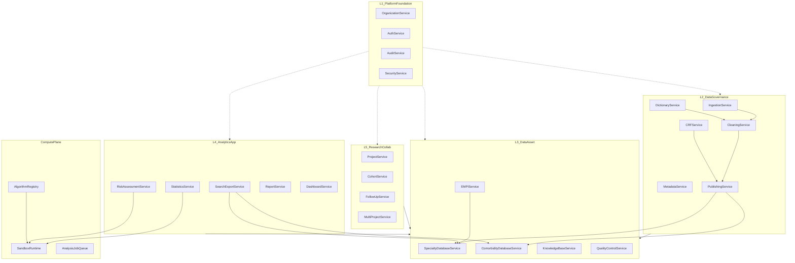
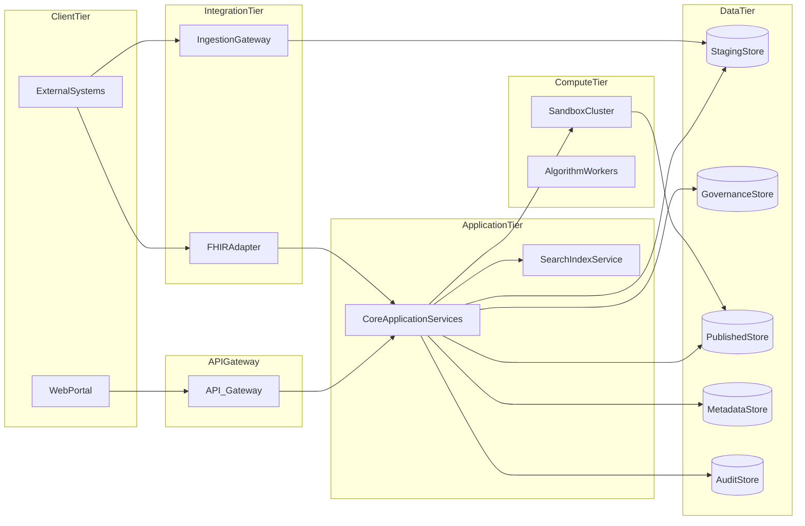

# 总体架构设计

> **文档编号**：FD-01  
> **上游文档**：[00-功能设计总览](./00-功能设计总览.md) · [业务功能需求.md](../业务功能需求.md)

---

## 1. 架构目标

构建面向代谢性、心脑血管、呼吸性三类疾病及共病科研场景的**一体化数据平台**，实现：

1. 多源异构数据的统一采集与治理
2. 专病库与共病库的标准化资产沉淀
3. 科研队列、随访、检索、分析的全流程支撑
4. 数据不出库的安全合规计算

---

## 2. 五层业务架构

沿用业务需求五层模型，自底向上依赖关系如下：

```
┌─────────────────────────────────────────────────────────────┐
│  L5 科研协作层    Project / Cohort / FollowUp / MultiProject │
├─────────────────────────────────────────────────────────────┤
│  L4 分析应用层    Search / Stats / Risk / Report / Dashboard │
├─────────────────────────────────────────────────────────────┤
│  L3 数据资产层    SpecialtyDB / ComorbidityDB / EMPI / QC    │
├─────────────────────────────────────────────────────────────┤
│  L2 数据治理层    Ingest / CRF / Dict / Clean / Publish      │
├─────────────────────────────────────────────────────────────┤
│  L1 基础支撑层    Org / User / Auth / Audit / Security       │
└─────────────────────────────────────────────────────────────┘
         ┌──────────────────────────────────────┐
         │  ComputePlane（横切，与 L3 同域隔离）   │
         └──────────────────────────────────────┘
```

| 层级 | 职责 | 覆盖 BR |
| --- | --- | --- |
| L1 基础支撑层 | 机构、用户、权限、审计、密钥 | BR-20-01, BR-05-11 |
| L2 数据治理层 | 采集、CRF、字典、清洗、入库 | BR-01-* , BR-05-07 |
| L3 数据资产层 | 专病库、共病库、EMPI、质控、知识库 | BR-05-01~06, BR-05-09 |
| L4 分析应用层 | 检索、统计、预警、报告、可视化 | BR-10~14, BR-13 |
| L5 科研协作层 | 项目、队列、随访、多项目协作 | BR-17~19 |
| ComputePlane | 沙箱计算、算法注册、Python 执行 | BR-11-03, BR-14-* |

---

## 3. 逻辑子系统

### 3.1 子系统全景



### 3.2 子系统职责表

| 子系统 | 所属层 | 核心职责 | 关键 BR |
| --- | --- | --- | --- |
| OrganizationService | L1 | 机构 CRUD、层级树、中心/分中心关系 | BR-20-01 |
| AuthService | L1 | 认证、RBAC、数据权限校验 | BR-20-01, BR-05-11 |
| AuditService | L1 | 操作审计日志、不可篡改存储 | BR-05-11 |
| SecurityService | L1 | 加解密、密钥轮换、传输安全 | BR-05-11 |
| IngestionService | L2 | 多源对接、同步调度、Staging 写入 | BR-01-01 |
| CRFService | L2 | 表单设计、录入、计分、校验 | BR-01-02 |
| DictionaryService | L2 | 字典/术语/映射规则管理 | BR-01-03 |
| CleaningService | L2 | 清洗规则执行、质量概览 | BR-01-03 |
| PublishingService | L2 | 入库规则、主题域、发布至 Published | BR-05-07 |
| MetadataService | L2 | 元数据、版本比对、血缘 | BR-05-08 |
| EMPIService | L3 | 主索引匹配、合并、规则引擎 | BR-01-04 |
| SpecialtyDatabaseService | L3 | 三类专病库 CRUD、概览、360 视图 | BR-05-02~04, BR-05-06 |
| ComorbidityDatabaseService | L3 | 共病规则、视图、跨病种详情 | BR-05-05 |
| KnowledgeBaseService | L3 | 指南/文献、检索、图谱 | BR-05-01 |
| QualityControlService | L3 | 六维质控、抽样、复核、报告 | BR-05-09, BR-05-10 |
| SearchExportService | L4 | 多维检索、导出任务、CDISC | BR-10-* |
| StatisticsService | L4 | 统计建模、图表、独立数据集 | BR-14-01 |
| RiskAssessmentService | L4 | 10 个风险模型、共病网络 | BR-11-01, BR-11-02 |
| ReportService | L4 | PDF 报告、图表嵌入 | BR-13-01 |
| DashboardService | L4 | 驾驶舱、自定义看板 | BR-05-06, BR-14-04 |
| ProjectService | L5 | 项目生命周期、模板、归档 | BR-17-01 |
| CohortService | L5 | 队列、纳排、随机分组 | BR-18-01 |
| FollowUpService | L5 | 随访阶段、任务、状态 | BR-18-02 |
| MultiProjectService | L5 | 多项目进度、提醒 | BR-19-01 |
| SandboxRuntime | CP | 隔离执行、资源配额、结果脱敏 | BR-11-03 |
| AlgorithmRegistry | CP | 算法包注册、版本、验证 | BR-11-03 |
| AnalysisJobQueue | CP | 分析任务排队、调度 | NFR-01 |

---

## 4. 部署逻辑视图

技术无关的逻辑部署单元：



| 部署单元 | 说明 |
| --- | --- |
| WebPortal | 科研人员、录入员、管理员统一入口 |
| API Gateway | 鉴权、限流、路由、审计拦截 |
| CoreApplicationServices | L1~L5 业务服务（可单体或模块化部署） |
| IngestionGateway | HL7/FHIR/DICOM/JDBC/文件适配器 |
| SearchIndexService | 检索索引（从 Published 异步同步） |
| SandboxCluster | 隔离计算环境，无出站数据 API |
| PublishedStore | 专病库/共病库正式数据 |

---

## 5. 核心数据流

### 5.1 主数据流（DC-01）

```
外部系统/上传 → IngestionGateway → Staging
                                      ↓
                              CleaningService
                                      ↓
                               EMPIService（匹配）
                                      ↓
                              PublishingService（入库规则）
                                      ↓
                               Published（专病库）
                                      ↓
                         ComorbidityDB（规则刷新视图）
                                      ↓
                              SearchIndex（异步）
```

**禁止路径**：外部系统 → Published（绕过 Staging/Governance）

### 5.2 分析数据流（DC-04）

```
用户请求分析 → StatisticsService / RiskAssessmentService
                        ↓
              AnalysisJobQueue（排队）
                        ↓
              SandboxRuntime（就地读取 Published，仅内存）
                        ↓
              脱敏聚合结果 → 返回用户
```

**禁止路径**：Sandbox → 原始数据文件导出 / 外部 API

---

## 6. 组件依赖矩阵

| 消费者 → 提供者 | Org | Auth | Ingest | Clean | EMPI | Publish | Specialty | Search | Sandbox |
| --- | --- | --- | --- | --- | --- | --- | --- | --- | --- |
| IngestionService | ✓ | ✓ | | | | | | | |
| CleaningService | | ✓ | | | ✓ | | | | |
| PublishingService | ✓ | ✓ | | ✓ | ✓ | | ✓ | | |
| CRFService | | ✓ | | | ✓ | ✓ | | | |
| SpecialtyDatabaseService | ✓ | ✓ | | | ✓ | | | ✓ | |
| SearchExportService | ✓ | ✓ | | | | | ✓ | | |
| StatisticsService | ✓ | ✓ | | | | | ✓ | | ✓ |
| ProjectService | ✓ | ✓ | | | | | ✓ | | |
| QualityControlService | ✓ | ✓ | | | | | ✓ | | |

---

## 7. 非功能需求设计对策

| NFR | 要求 | 设计对策 |
| --- | --- | --- |
| NFR-01 | ≥300 人同时在线 | ComputePlane 独立水平扩展；AnalysisJobQueue 异步排队；SearchIndex 读写分离 |
| NFR-02 | 数据不出库 | Sandbox 无 export/download API；结果仅脱敏聚合；网络策略隔离 |
| NFR-03 | AES-256/SM4 加密 | SecurityService 统一加解密；字段级加密策略配置 |
| NFR-04 | 全操作可审计 | AuditService 切面拦截；append-only 审计存储 |
| NFR-05 | EMPI ≥99.8% | 多标识精确匹配 + 模糊匹配置信度 + 人工确认队列 |
| NFR-06 | 质控阈值 92%/99% | QualityControlService 可配置阈值 + 实时仪表盘 |
| NFR-07 | CRF ≥10 题型 | CRFService 元数据驱动表单引擎 |
| NFR-08 | HL7/FHIR/DICOM | IngestionGateway 协议适配器插件化 |
| NFR-09 | 动态字段扩展 | extended_fields JSON + disease_template 驱动 |
| NFR-10 | CDISC 导出 | SearchExportService 输出适配层 |

---

## 8. 扩展性设计

### 8.1 协议适配器插件

IngestionGateway 采用适配器模式，新增数据源只需实现：

- `connect()` / `disconnect()`
- `fetchFull()` / `fetchIncremental(since)`
- `mapToStagingSchema(raw)`

### 8.2 专病类型扩展

新增专病类型只需：

1. 在 `specialty_type` 枚举增加类型
2. 配置 `disease_template` 模板
3. 无需修改底层表结构（extended_fields）

### 8.3 算法包扩展

AlgorithmRegistry 支持注册新算法包：

- 输入 schema 声明
- 输出 schema 声明
- 安全扫描 + 版本号

---

## 9. 与需求追溯

| 设计章节 | 覆盖 BR | 覆盖 REQ 范围 |
| --- | --- | --- |
| §2 五层架构 | 全部 30 BR | 全部 233 REQ |
| §3 逻辑子系统 | 全部 30 BR | 按子系统见 07 文档 |
| §5 数据流 | BR-01-01, BR-11-03 | REQ-01-01-*, REQ-11-03-* |
| §7 NFR | — | NFR-01~10 |
