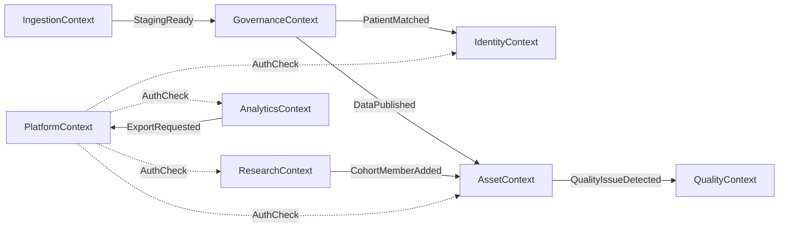
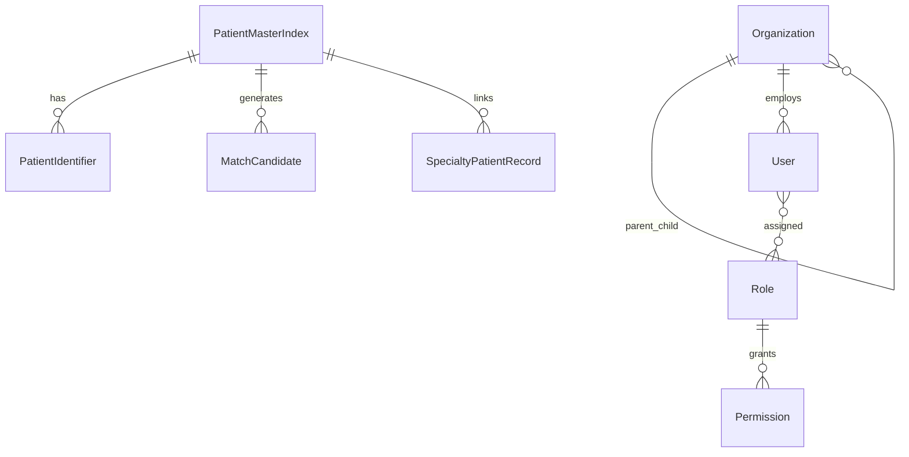
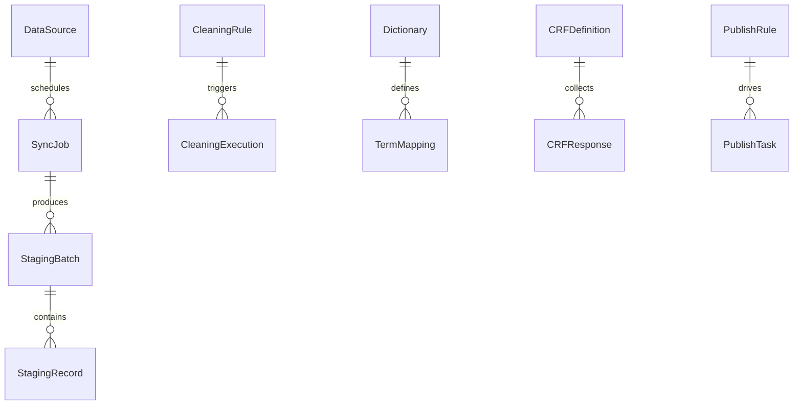
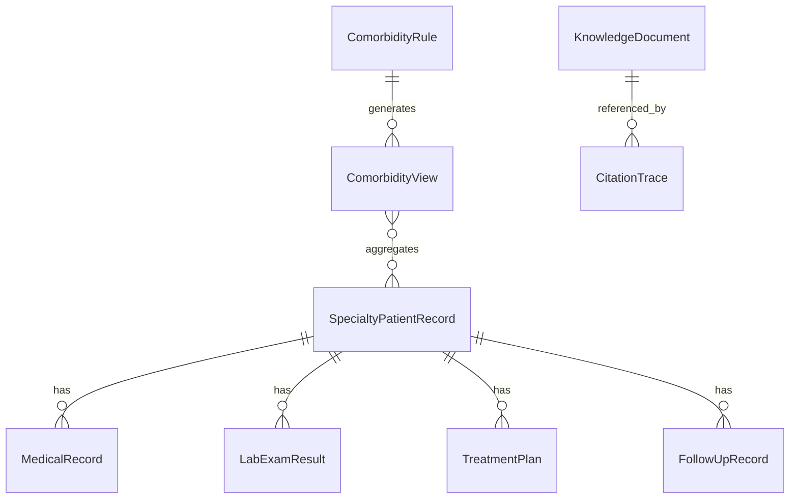
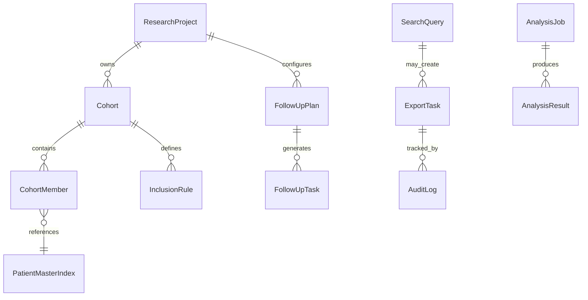

# 领域模型设计

> **文档编号**：FD-02  
> **上游文档**：[01-总体架构设计](./01-总体架构设计.md)

---

## 1. 限界上下文

系统划分为 8 个限界上下文，上下文间通过领域事件或应用服务协作：



| 上下文 | 聚合根 | 覆盖 BR |
| --- | --- | --- |
| Platform | Organization, User, Role | BR-20-01, BR-05-11 |
| Identity | PatientMasterIndex | BR-01-04 |
| Ingestion | DataSource, SyncJob, StagingBatch | BR-01-01 |
| Governance | CleaningRule, Dictionary, CRFDefinition, PublishRule | BR-01-02, BR-01-03, BR-05-07 |
| Asset | SpecialtyPatientRecord, ComorbidityRule, KnowledgeDocument | BR-05-01~06 |
| Quality | QualityIssue, ReviewTask | BR-05-09, BR-05-10 |
| Research | ResearchProject, Cohort, FollowUpPlan | BR-17~19, BR-18-* |
| Analytics | SearchQuery, ExportTask, AnalysisJob | BR-10~14, BR-11-*, BR-13 |

---

## 2. 核心实体关系

### 2.1 平台与身份



**Organization**

| 属性 | 类型 | 说明 |
| --- | --- | --- |
| org_id | ID | 主键 |
| org_code | String | 机构编码 |
| org_name | String | 机构名称 |
| org_type | Enum | CENTER / SUB_CENTER |
| parent_org_id | ID | 上级机构 |
| level | Enum | PROVINCE / CITY / DISTRICT |
| status | Enum | ACTIVE / INACTIVE |

**User**

| 属性 | 类型 | 说明 |
| --- | --- | --- |
| user_id | ID | 主键 |
| org_id | ID | 所属机构 |
| username | String | 登录名 |
| employee_no | String | 工号 |
| status | Enum | ENABLED / DISABLED / FROZEN |
| role_ids | List<ID> | 角色列表 |

**PatientMasterIndex**

| 属性 | 类型 | 说明 |
| --- | --- | --- |
| empi_id | ID | 主索引 ID |
| merge_status | Enum | ACTIVE / MERGED / SPLIT |
| confidence_score | Decimal | 匹配置信度 |
| created_at | DateTime | 创建时间 |

**PatientIdentifier**

| 属性 | 类型 | 说明 |
| --- | --- | --- |
| identifier_id | ID | 主键 |
| empi_id | ID | 关联主索引 |
| id_type | Enum | ID_CARD / MEDICAL_INSURANCE / HEALTH_CODE / OTHER |
| id_value | String | 标识值（加密存储） |
| source_system | String | 来源系统 |
| is_primary | Boolean | 是否主标识 |

---

### 2.2 采集与治理



**DataSource**

| 属性 | 类型 | 说明 |
| --- | --- | --- |
| source_id | ID | 主键 |
| source_name | String | 数据源名称 |
| source_type | Enum | HIS / LIS / PACS / EMR / EXTERNAL / FILE |
| protocol | Enum | HL7 / FHIR / DICOM / JDBC / API / FILE |
| org_id | ID | 所属机构 |
| sync_strategy | Enum | T7 / T1 / NEAR_REALTIME |
| config | JSON | 连接配置（加密） |

**SyncJob**

| 属性 | 类型 | 说明 |
| --- | --- | --- |
| job_id | ID | 主键 |
| source_id | ID | 数据源 |
| job_type | Enum | FULL / INCREMENTAL |
| schedule_cron | String | 调度表达式 |
| status | Enum | 见状态机 §3.1 |
| last_run_at | DateTime | 上次执行 |
| next_run_at | DateTime | 下次执行 |

**StagingBatch**

| 属性 | 类型 | 说明 |
| --- | --- | --- |
| batch_id | ID | 主键 |
| job_id | ID | 同步任务 |
| record_count | Integer | 记录数 |
| status | Enum | 见状态机 §3.2 |
| source_system | String | 来源标识 |

**CRFDefinition**

| 属性 | 类型 | 说明 |
| --- | --- | --- |
| form_id | ID | 主键 |
| form_name | String | 表单名称 |
| specialty_type | Enum | 专病类型 |
| version | Integer | 版本号 |
| schema | JSON | 题目结构（题型/逻辑/布局） |
| score_rules | JSON | 量表计分规则 |
| status | Enum | DRAFT / PUBLISHED / ARCHIVED |

**CRFResponse**

| 属性 | 类型 | 说明 |
| --- | --- | --- |
| response_id | ID | 主键 |
| form_id | ID | 表单定义 |
| form_version | Integer | 版本 |
| empi_id | ID | 患者 |
| project_id | ID | 可选，关联项目 |
| cohort_id | ID | 可选，关联队列 |
| answers | JSON | 答案数据 |
| score_results | JSON | 计分结果 |
| submit_status | Enum | DRAFT / SUBMITTED / APPROVED / REJECTED |

---

### 2.3 数据资产



**SpecialtyPatientRecord**（专病库患者记录，按 specialty_type 分库逻辑隔离）

| 属性 | 类型 | 说明 |
| --- | --- | --- |
| record_id | ID | 主键 |
| empi_id | ID | 主索引 |
| specialty_type | Enum | METABOLIC / CARDIO_CEREBROVascular / RESPIRATORY |
| org_id | ID | 所属机构 |
| core_fields | JSON | 核心固定字段 |
| extended_fields | JSON | 动态扩展字段 |
| inclusion_status | Enum | CANDIDATE / INCLUDED / EXCLUDED |
| first_diagnosis_date | Date | 首次确诊 |
| last_updated_at | DateTime | 最后更新 |

**LabExamResult**

| 属性 | 类型 | 说明 |
| --- | --- | --- |
| result_id | ID | 主键 |
| record_id | ID | 专病记录 |
| exam_type | String | 检查类型 |
| exam_code | String | LOINC/本地编码 |
| result_value | String | 结果值 |
| unit | String | 单位 |
| reference_range | String | 参考范围 |
| exam_time | DateTime | 检查时间 |
| source_ref | String | 源系统单据 ID |
| is_abnormal | Boolean | 是否异常 |

**ComorbidityRule**

| 属性 | 类型 | 说明 |
| --- | --- | --- |
| rule_id | ID | 主键 |
| rule_name | String | 规则名称 |
| expression | JSON | 逻辑表达式（AND/OR/NOT + 时间窗） |
| specialty_types | List<Enum> | 涉及病种 |
| status | Enum | ACTIVE / INACTIVE |

**ComorbidityView**（物化视图元数据）

| 属性 | 类型 | 说明 |
| --- | --- | --- |
| view_id | ID | 主键 |
| rule_id | ID | 关联规则 |
| patient_count | Integer | 队列人数 |
| last_refresh_at | DateTime | 最后刷新 |
| refresh_status | Enum | SYNCING / READY / FAILED |

---

### 2.4 科研与分析



**ResearchProject**

| 属性 | 类型 | 说明 |
| --- | --- | --- |
| project_id | ID | 主键 |
| project_name | String | 课题名称 |
| principal_investigator | ID | 负责人 |
| org_id | ID | 牵头机构 |
| design_type | Enum | PROSPECTIVE / RETROSPECTIVE / CASE_CONTROL / CUSTOM |
| status | Enum | 见状态机 §3.6 |
| start_date / end_date | Date | 起止时间 |

**Cohort**

| 属性 | 类型 | 说明 |
| --- | --- | --- |
| cohort_id | ID | 主键 |
| project_id | ID | 所属项目 |
| cohort_name | String | 队列名称 |
| inclusion_rules | JSON | 纳入规则 |
| exclusion_rules | JSON | 排除规则 |
| member_count | Integer | 成员数 |

**CohortMember**

| 属性 | 类型 | 说明 |
| --- | --- | --- |
| member_id | ID | 主键 |
| cohort_id | ID | 队列 |
| empi_id | ID | 患者 |
| group_label | String | 分组标签（试验组/对照组等） |
| enroll_date | Date | 入组日期 |
| status | Enum | ACTIVE / REMOVED / COMPLETED |

**FollowUpTask**

| 属性 | 类型 | 说明 |
| --- | --- | --- |
| task_id | ID | 主键 |
| plan_id | ID | 随访计划 |
| empi_id | ID | 患者 |
| due_date | Date | 应随访日期 |
| status | Enum | 见状态机 §3.5 |
| follow_up_method | Enum | PHONE / SMS / VISIT / ONLINE |

**ExportTask**

| 属性 | 类型 | 说明 |
| --- | --- | --- |
| export_id | ID | 主键 |
| creator_id | ID | 创建人 |
| query_snapshot | JSON | 检索条件快照 |
| export_scope | JSON | 导出范围 |
| format | Enum | EXCEL / CSV / CDISC |
| status | Enum | 见状态机 §3.4 |
| approver_id | ID | 审核人 |
| patient_count | Integer | 涉及患者数 |

**AnalysisJob**

| 属性 | 类型 | 说明 |
| --- | --- | --- |
| job_id | ID | 主键 |
| job_type | Enum | STATS / RISK / SCRIPT / NETWORK |
| input_config | JSON | 分析配置 |
| sandbox_id | String | 沙箱实例 |
| status | Enum | QUEUED / RUNNING / COMPLETED / FAILED |
| result_ref | String | 脱敏结果引用 |

---

## 3. 状态机

### 3.1 SyncJob

```
Draft → Scheduled → Running → Success
                    Running → Failed → Retry → Running
Scheduled → Paused → Scheduled
```

| 状态 | 说明 | 允许操作 |
| --- | --- | --- |
| Draft | 草稿 | 编辑、启用 |
| Scheduled | 已调度 | 暂停、立即执行 |
| Running | 执行中 | — |
| Success | 成功 | 查看日志 |
| Failed | 失败 | 重试、查看错误 |
| Paused | 暂停 | 恢复 |
| Retry | 重试中 | — |

### 3.2 StagingBatch

```
Received → Cleaning → Matched → ReadyToPublish → Published
Received → Cleaning → Rejected
ReadyToPublish → Rejected（入库规则不通过）
```

### 3.3 QualityIssue

```
Detected → PendingReview → Confirmed → Closed
Detected → PendingReview → Rejected → Closed
```

### 3.4 ExportTask

```
Created → PendingApproval → Approved → Exporting → Completed
Created → PendingApproval → Rejected
Exporting → Failed → Exporting（重试）
```

### 3.5 FollowUpTask

```
Pending → InProgress → Completed
Pending → Overdue（系统自动，due_date 过期）
Overdue → InProgress → Completed
```

### 3.6 ResearchProject

```
Planning → Active → Suspended → Active
Active → Closed → Archived
Suspended → Closed
```

---

## 4. 领域事件

| 事件 | 发布者 | 订阅者 | 触发动作 |
| --- | --- | --- | --- |
| StagingBatchReceived | Ingestion | Governance | 启动清洗 |
| CleaningCompleted | Governance | Identity, Publishing | EMPI 匹配、入库评估 |
| PatientMerged | Identity | Asset, Research | 更新关联记录 |
| DataPublished | Publishing | Asset, Comorbidity | 刷新专病库、共病视图 |
| ComorbidityViewRefreshed | Asset | SearchIndex | 更新检索索引 |
| QualityIssueDetected | Quality | Notification | 通知质控员 |
| CohortMemberEnrolled | Research | Asset | 标记队列归属 |
| ExportApproved | Analytics | Audit | 记录审计、执行导出 |
| AnalysisJobCompleted | Analytics | Audit | 记录审计、通知用户 |

---

## 5. 聚合边界与不变量

| 聚合根 | 不变量 |
| --- | --- |
| PatientMasterIndex | 同一 id_type+id_value 不可映射到多个 ACTIVE 主索引；合并须留 merge 历史 |
| StagingBatch | 仅 Received 状态可进入 Cleaning；Published 后不可修改 |
| CRFDefinition | 已 PUBLISHED 版本不可修改，只能新版本；引用中的版本不可 ARCHIVED |
| SpecialtyPatientRecord | empi_id + specialty_type + org_id 唯一；extended_fields 须符合 template |
| ComorbidityRule | expression 须语法合法；ACTIVE 规则变更触发视图刷新 |
| Cohort | 成员 empi_id 在队列内唯一；REMOVED 成员保留历史 |
| ExportTask | 未经 Approved 不可 Exporting；导出须记录 patient_count |

---

## 6. 与需求追溯

| 实体/上下文 | 主要 REQ |
| --- | --- |
| DataSource, SyncJob | REQ-01-01-* |
| CRFDefinition, CRFResponse | REQ-01-02-* |
| CleaningRule, Dictionary | REQ-01-03-* |
| PatientMasterIndex | REQ-01-04-* |
| SpecialtyPatientRecord | REQ-05-02-* |
| ComorbidityRule | REQ-05-02-10~18 |
| QualityIssue | REQ-05-05-*, REQ-05-06-* |
| ResearchProject, Cohort | REQ-17-*, REQ-18-* |
| SearchQuery, ExportTask | REQ-10-* |
| AnalysisJob | REQ-11-*, REQ-14-* |
