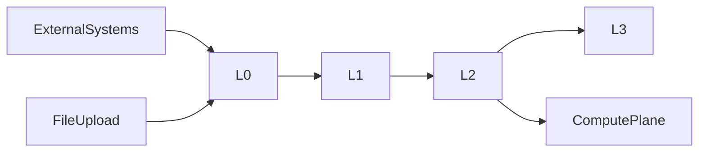

# 数据架构设计

> **文档编号**：FD-03  
> **上游文档**：[02-领域模型设计](./02-领域模型设计.md)

---

## 1. 数据分层

### 1.1 四层存储模型

| 层 | 名称 | 用途 | 写入方 | 读取方 |
| --- | --- | --- | --- | --- |
| L0 | Staging | 原始/半结构化数据暂存 | IngestionService | CleaningService |
| L1 | Governance | 清洗中间结果、匹配候选、规则日志 | CleaningService, EMPIService | PublishingService |
| L2 | Published | 专病库/共病库正式数据 | PublishingService | 全部业务层 |
| L3 | Index | 检索/统计索引 | 异步同步任务 | SearchExportService |



### 1.2 层间流转规则

- L0 数据保留原始 payload + source_ref，不可修改，仅可标记 Rejected
- L1 存储清洗后标准化记录 + 规则执行 trace
- L2 为业务权威数据源（Source of Truth）
- L3 为 L2 的派生数据，可重建

---

## 2. Staging 层设计

### 2.1 staging_batch

| 字段 | 类型 | 说明 |
| --- | --- | --- |
| batch_id | PK | 批次 ID |
| source_id | FK | 数据源 |
| job_id | FK | 同步任务 |
| org_id | FK | 机构 |
| received_at | DateTime | 接收时间 |
| record_count | Integer | 记录数 |
| status | Enum | Received/Cleaning/Matched/ReadyToPublish/Published/Rejected |

### 2.2 staging_record

| 字段 | 类型 | 说明 |
| --- | --- | --- |
| record_id | PK | 记录 ID |
| batch_id | FK | 批次 |
| domain | Enum | PATIENT/ENCOUNTER/LAB/ORDER/IMAGE/OTHER |
| raw_payload | JSON/Text | 原始数据 |
| source_ref | String | 源系统唯一键 |
| parse_status | Enum | OK/PARSE_ERROR |

---

## 3. EMPI 数据设计

### 3.1 empi_master

| 字段 | 类型 | 说明 |
| --- | --- | --- |
| empi_id | PK | 主索引 ID |
| display_name | String | 脱敏展示名 |
| gender | Enum | 性别 |
| birth_date | Date | 出生日期 |
| merge_status | Enum | ACTIVE/MERGED |
| merged_to_empi_id | FK | 合并目标 |
| match_confidence | Decimal | 匹配置信度 |
| created_at | DateTime | 创建时间 |

### 3.2 empi_identifier

| 字段 | 类型 | 说明 |
| --- | --- | --- |
| identifier_id | PK | |
| empi_id | FK | |
| id_type | Enum | ID_CARD/MEDICAL_INSURANCE/HEALTH_CODE |
| id_value_enc | String | 加密存储 |
| id_hash | String | 哈希索引（精确匹配） |
| source_system | String | |
| is_primary | Boolean | |

### 3.3 empi_match_candidate

| 字段 | 类型 | 说明 |
| --- | --- | --- |
| candidate_id | PK | |
| source_record_id | FK | Staging 记录 |
| candidate_empi_id | FK | 候选主索引 |
| match_score | Decimal | 匹配分数 |
| match_features | JSON | 匹配特征明细 |
| review_status | Enum | PENDING/CONFIRMED/REJECTED |
| reviewer_id | FK | 审核人 |

### 3.4 匹配策略

1. **精确匹配**：id_hash 命中 → confidence=1.0
2. **多标识交叉**：身份证+姓名+出生日期 → confidence≥0.99
3. **模糊匹配**：姓名+电话+地址加权 → confidence 可配置阈值
4. **人工确认**：confidence < 阈值 → empi_match_candidate 待审核

---

## 4. CRF 数据设计

### 4.1 crf_form_definition

| 字段 | 类型 | 说明 |
| --- | --- | --- |
| form_id | PK | |
| form_code | String | 表单编码 |
| form_name | String | |
| specialty_type | Enum | |
| version | Integer | |
| schema_json | JSON | 题目/逻辑/布局/题型 |
| score_rules_json | JSON | 计分规则 |
| status | Enum | DRAFT/PUBLISHED/ARCHIVED |
| published_at | DateTime | |

**schema_json 结构示例**：

```json
{
  "groups": [{"id": "g1", "title": "基本信息", "layout": "two_column"}],
  "questions": [
    {
      "id": "q1", "type": "single_choice", "label": "性别",
      "options": ["男", "女"], "required": true,
      "visibility_rule": null
    }
  ]
}
```

### 4.2 crf_response

| 字段 | 类型 | 说明 |
| --- | --- | --- |
| response_id | PK | |
| form_id + version | FK | |
| empi_id | FK | |
| project_id | FK nullable | |
| answers_json | JSON | |
| scores_json | JSON | |
| status | Enum | DRAFT/SUBMITTED/APPROVED/REJECTED |
| submitted_by | FK | |
| approved_by | FK nullable | |

---

## 5. 字典与术语数据设计

### 5.1 字典分类

| 表 | 用途 |
| --- | --- |
| dict_diagnosis | 临床诊断（ICD-10/11） |
| dict_treatment | 治疗方案 |
| dict_lab_exam | 检验检查（LOINC） |
| dict_symptom | 症状体征 |
| term_mapping | 跨标准映射规则 |
| term_synonym | 非标准术语同义词 |
| cleaning_rule | 清洗规则模板 |
| cleaning_rule_template | 公共规则模板 |

### 5.2 dict_field_metadata（字段元数据）

| 字段 | 类型 | 说明 |
| --- | --- | --- |
| field_id | PK | |
| field_code | String | 标准字段编码 |
| field_name_zh | String | 中文名 |
| field_name_en | String | 英文名 |
| value_domain | JSON | 值域定义 |
| data_type | Enum | STRING/NUMBER/DATE/ENUM |
| crf_question_type | Enum | 默认 CRF 题型 |
| crf_options | JSON | 默认选项 |
| extract_rule | JSON | 源系统抽取规则 |
| specialty_types | Array | 适用病种 |

---

## 6. 知识库数据设计

| 表 | 用途 |
| --- | --- |
| knowledge_document | 指南/文献文档 |
| knowledge_citation | 引用溯源 |
| knowledge_author | 作者信息 |
| knowledge_tag | 主题/疾病标签 |

**knowledge_document** 核心字段：doc_id, title, doc_type(GUIDELINE/LITERATURE), file_ref, publish_year, import_batch_id

---

## 7. 专病库统一 Schema

三类专病库共用逻辑模型，通过 `specialty_type` 分区/分表：

### 7.1 specialty_patient_record

| 字段 | 类型 | 说明 |
| --- | --- | --- |
| record_id | PK | |
| empi_id | FK | |
| specialty_type | Enum | METABOLIC/CARDIO_CEREBROVascular/RESPIRATORY |
| org_id | FK | |
| template_id | FK | 专病模板 |
| core_fields | JSON | 固定核心字段 |
| extended_fields | JSON | 动态扩展字段 |
| status | Enum | ACTIVE/ARCHIVED |
| first_diagnosis_date | Date | |
| created_at / updated_at | DateTime | |

**core_fields 示例（代谢病）**：

```json
{
  "height_cm": 170, "weight_kg": 75, "bmi": 26.0,
  "waist_cm": 90, "hba1c": 7.2, "diagnosis_code": "E11"
}
```

### 7.2 七类子域表

| 表名 | 说明 | 关键字段 |
| --- | --- | --- |
| specialty_medical_record | 病历资料 | record_id, record_type, content_text, index_text |
| specialty_lab_exam | 检验检查 | record_id, exam_code, result_value, unit, exam_time, is_abnormal |
| specialty_treatment | 治疗方案 | record_id, treatment_type, drug_code, dosage, frequency |
| specialty_follow_up | 随访记录 | record_id, follow_up_date, method, content |
| specialty_template | 专病模板 | specialty_type, field_schema_json |
| specialty_external_writeback | 外部回传 | record_id, source_system, result_json |
| specialty_attachment | 附件 | record_id, file_ref, file_type |

### 7.3 动态字段方案（NFR-09）

```
disease_template.field_schema_json 定义字段
        ↓
specialty_patient_record.extended_fields 存储值
        ↓
dict_field_metadata 提供元数据/校验
```

- 新增字段：更新 template + metadata，无需 ALTER 核心表
- 校验：PublishingService 发布时按 template 校验 extended_fields

---

## 8. 共病库数据设计

### 8.1 comorbidity_rule

| 字段 | 类型 | 说明 |
| --- | --- | --- |
| rule_id | PK | |
| rule_name | String | |
| expression_json | JSON | 逻辑表达式 |
| time_window | JSON | 时间窗约束 |
| status | Enum | ACTIVE/INACTIVE |

**expression_json 示例**：

```json
{
  "operator": "AND",
  "conditions": [
    {"specialty": "METABOLIC", "diagnosis_code": "E11", "within_years": null},
    {"specialty": "CARDIO_CEREBROVascular", "diagnosis_code": "I25",
     "within_years": 5, "after": "condition_0"}
  ]
}
```

### 8.2 comorbidity_view（物化）

| 字段 | 类型 | 说明 |
| --- | --- | --- |
| view_id | PK | |
| rule_id | FK | |
| empi_id | FK | 共病患者 |
| specialty_record_ids | JSON | 各专病 record_id 映射 |
| comorbidity_labels | JSON | 共病标签 |
| refresh_version | Integer | 刷新版本 |
| refreshed_at | DateTime | |

### 8.3 刷新机制

- **触发**：Published 层专病记录变更 → 发布 `DataPublished` 事件
- **策略**：增量刷新涉及 empi_id 的共病视图
- **查询**：跨病种详情 = 联邦查询各 specialty_* 表 + comorbidity_view 关联

---

## 9. 元数据与血缘

### 9.1 metadata_catalog

| 字段 | 类型 | 说明 |
| --- | --- | --- |
| catalog_id | PK | |
| object_type | Enum | TABLE/FIELD/VIEW |
| object_name | String | |
| version | Integer | |
| attributes_json | JSON | 字段属性 |
| effective_from | DateTime | |

### 9.2 metadata_lineage_edge

| 字段 | 类型 | 说明 |
| --- | --- | --- |
| edge_id | PK | |
| source_system | String | HIS/LIS/... |
| source_field | String | |
| transform_rule | String | 转换规则 ID |
| target_table | String | |
| target_field | String | |

---

## 10. 主题域模型（Publishing）

| 主题域 | 包含实体 | 说明 |
| --- | --- | --- |
| Patient | empi_master, specialty_patient_record | 患者 |
| Encounter | specialty_medical_record | 诊疗 |
| Lab | specialty_lab_exam | 检验 |
| Medication | specialty_treatment | 用药 |
| FollowUp | specialty_follow_up | 随访 |

**publish_rule** 纳入标准示例：

```json
{
  "specialty_type": "METABOLIC",
  "conditions": [
    {"field": "diagnosis_code", "op": "in", "value": ["E10","E11","E13","E14"]},
    {"field": "hba1c", "op": ">=", "value": 6.5}
  ]
}
```

---

## 11. 科研域数据设计

| 表 | 说明 |
| --- | --- |
| research_project | 科研项目 |
| project_archive | 项目归档包 |
| cohort | 队列 |
| cohort_member | 队列成员 |
| cohort_inclusion_rule | 纳排规则 |
| randomization_record | 随机分组记录 |
| follow_up_plan | 随访计划 |
| follow_up_task | 随访任务 |
| follow_up_crf_binding | 阶段-表单绑定 |

---

## 12. 索引层设计

### 12.1 search_document

从 Published 层异步构建，支持全文检索与多维过滤：

| 字段 | 说明 |
| --- | --- |
| doc_id | 文档 ID |
| empi_id | 患者 |
| specialty_types | 病种数组 |
| org_id | 机构 |
| diagnosis_codes | ICD 数组 |
| lab_values | 嵌套检验指标（如 hba1c:7.2） |
| demographics | 年龄/性别/BMI 等 |
| completeness_score | 完整性评分 |
| updated_at | 索引更新时间 |

### 12.2 同步策略

- 增量：Published 变更 → 消息队列 → Index Worker
- 全量：定时重建（如每日凌晨）

---

## 13. 审计与加密

### 13.1 audit_log（append-only）

| 字段 | 说明 |
| --- | --- |
| log_id | |
| user_id | 操作人 |
| action | QUERY/EXPORT/UPDATE/DELETE/DECRYPT |
| resource_type | 资源类型 |
| resource_id | 资源 ID |
| detail_json | 操作详情 |
| ip_address | |
| created_at | 不可修改 |

### 13.2 加密字段分级

| 级别 | 算法 | 字段示例 |
| --- | --- | --- |
| L1 | AES-256 | 身份证、电话、住址 |
| L2 | SM4 | 基因、介入记录、胰岛素核心数据 |
| L3 | SM4 + 访问日志 | 跨病种联合指标 |

---

## 14. 与需求追溯

| 章节 | 覆盖 REQ |
| --- | --- |
| §2 Staging | REQ-01-01-*, REQ-05-03-* |
| §3 EMPI | REQ-01-04-* |
| §4 CRF | REQ-01-02-* |
| §5 字典 | REQ-01-03-* |
| §6 知识库 | REQ-05-01-* |
| §7 专病库 | REQ-05-02-01~09 |
| §8 共病库 | REQ-05-02-10~18 |
| §9 元数据 | REQ-05-04-* |
| §11 科研 | REQ-17-*, REQ-18-* |
| §12 索引 | REQ-10-* |
