# 业务流程设计

> **文档编号**：FD-05  
> **上游文档**：[04-接口设计](./04-接口设计.md)  
> **下游**：[DD-05 模块业务规则与流程总览](../detail/05-模块业务规则与流程总览.md)

---

## 1. 流程总览

| 编号 | 流程名称 | 涉及 BR | 主责模块 | 触发角色 |
| --- | --- | --- | --- | --- |
| BP-01 | 多源采集与入库 | BR-01-01, BR-01-03, BR-01-04, BR-05-07 | ingestion → governance → asset | 数据管理员 |
| BP-02 | CRF 录入与补录 | BR-01-02, BR-05-10 | governance, asset | 临床录入员、质控员 |
| BP-03 | 质控复核闭环 | BR-05-09 | asset | 质控审核员 |
| BP-04 | 检索与数据导出 | BR-10-01, BR-10-02 | analytics | 科研人员 |
| BP-05 | 科研队列与随访 | BR-17-01, BR-18-01, BR-18-02, BR-19-01 | research | 项目负责人、录入员 |
| BP-06 | 沙箱分析 | BR-11-03, BR-14-01, BR-14-02 | analytics, sandbox | 科研人员 |
| BP-07 | 风险评估与评估报告 | BR-11-01, BR-13-01 | analytics, sandbox, asset | 科研人员 |
| BP-08 | 外部集成与结果回传 | BR-13-01 | integration, analytics, asset | 系统管理员、科研人员 |
| BP-09 | 知识库与患者全景 | BR-05-01, BR-05-06 | asset, platform | 数据管理员、科研人员 |

---

## 2. BP-01 多源采集与入库

### 2.1 主流程

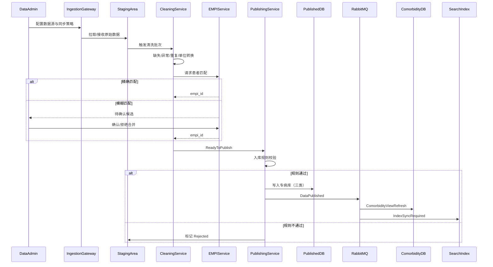

### 2.2 同步策略分支

| 策略 | 触发条件 | 行为 |
| --- | --- | --- |
| T+7 | 历史归档数据源 | 周级 Cron，全量或增量；支持 HL7 v2 适配 |
| T+1 | 日常诊疗数据 | 日级 Cron，增量快照 |
| 历史批量 | 回顾性队列导入 | 批量预审后入 Staging |
| 准实时 | Webhook / 日志监听 | 触发 RealtimeBatchReceived，分钟级入 Staging |
| DICOM | 影像元数据 | DicomAdapter 解析元数据入 Staging |
| 多中心 | 分中心上传 | integration upload → Staging |

### 2.3 异常分支

| 异常 | 处理 |
| --- | --- |
| 连接失败 | SyncJob → Failed，告警通知，支持重试 |
| 解析错误 | staging_record.parse_status=PARSE_ERROR，跳过或人工修正 |
| EMPI 无匹配且无候选 | 创建新 empi_id |
| EMPI 多候选 | 进入 match_candidate 待审核队列 |
| 入库规则不通过 | StagingBatch → Rejected，记录原因 |
| 映射失败 | 保留失败明细，支持人工修正后重试 |

### 2.4 领域事件与异步（RabbitMQ）

| 事件 | 消费者 | 行为 |
| --- | --- | --- |
| StagingBatchReceived | governance | 触发清洗流水线 |
| CleaningCompleted | governance | 进入发布前校验 |
| DataPublished | asset | 共病规则引擎刷新物化视图 |
| DataPublished | analytics | ES/MySQL 索引增量同步 |
| DictionaryChanged | asset, analytics | 缓存失效、索引字段映射更新 |
| RealtimeBatchReceived | ingestion | 准实时批次入 Staging |

详见 [DD-04 领域事件与异步设计](../detail/04-领域事件与异步设计.md)。

---

## 3. BP-02 CRF 录入与补录

### 3.1 主流程

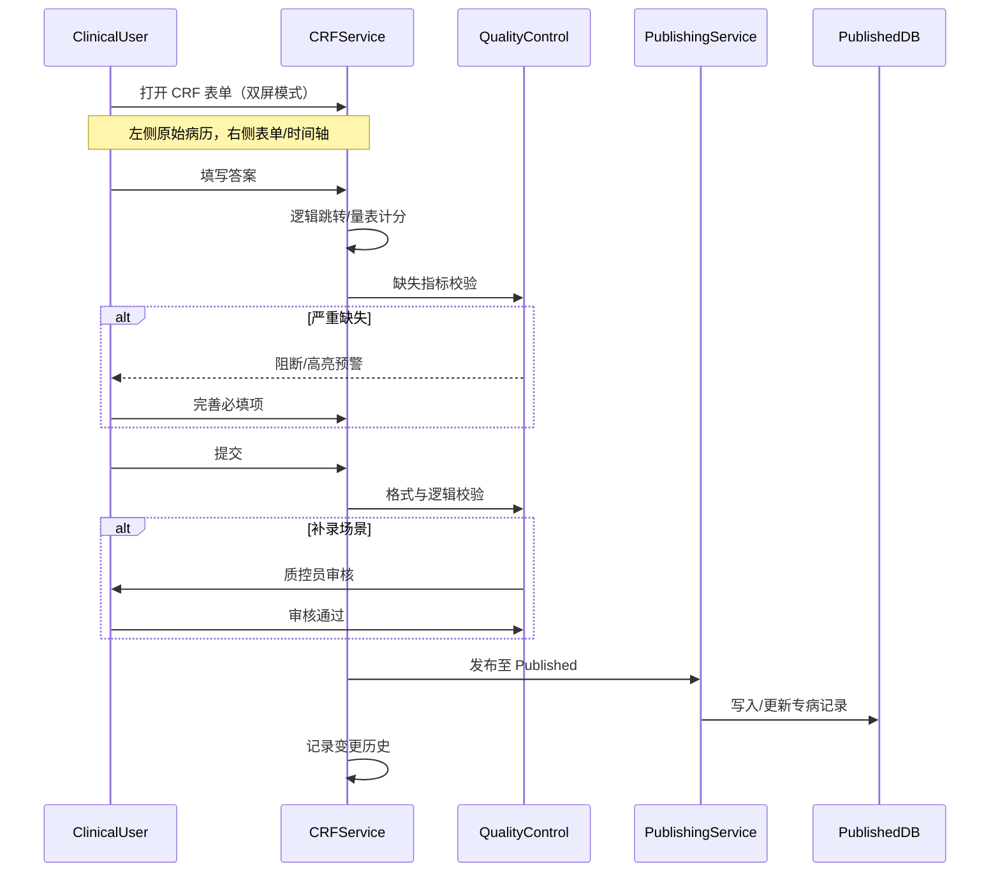

### 3.2 补录权限分支

| 角色 | 数据范围 |
| --- | --- |
| 分中心协调员 | 仅本分中心 org_id |
| 中心录入员 | 本机构及授权范围 |
| 质控员 | 审核权限，无直接写入 |

### 3.3 异常分支

| 异常 | 处理 |
| --- | --- |
| 表单版本过期 | 提示升级到新版本，草稿迁移 |
| 附件格式不支持 | 拒绝上传，提示支持格式 |
| 审核驳回 | 状态 → REJECTED，退回修改 |
| 越权补录 | 403，审计记录 |

---

## 4. BP-03 质控复核闭环

### 4.1 主流程

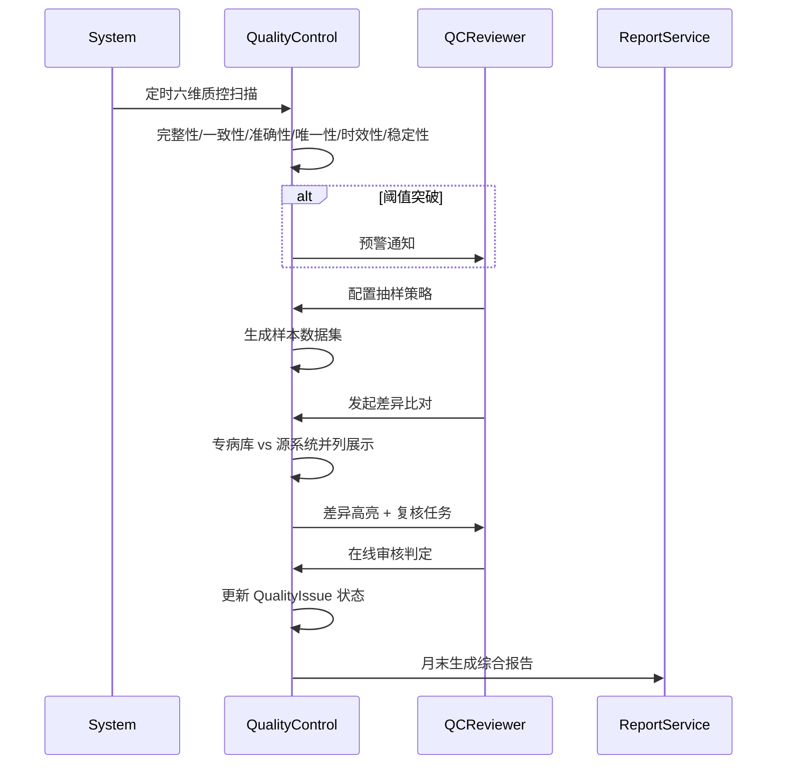

### 4.2 六维质控指标

| 维度 | 检测内容 | 默认阈值 |
| --- | --- | --- |
| 完整性 | 必填字段缺失 | 完整率 < 92% 预警 |
| 一致性 | 跨表/跨系统冲突 | 可配置 |
| 准确性 | 数值异常/逻辑错误 | 准确率 < 99% 预警 |
| 唯一性 | 重复患者/记录 | 可配置 |
| 时效性 | 数据更新延迟 | 可配置 |
| 稳定性 | 分布漂移 | 可配置 |

### 4.3 与下游流程衔接

| 质控结论 | 后续流程 |
| --- | --- |
| 需补录修正 | → BP-02 双屏补录 |
| 需重新采集 | → BP-01 定向重同步 |
| 跨专病差异 | 三类专病库并列比对（REQ-05-05-05） |

---

## 5. BP-04 检索与数据导出

### 5.1 主流程

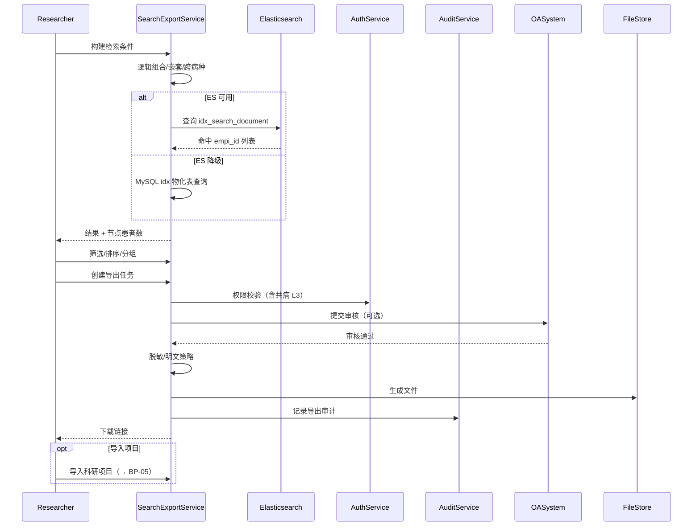

### 5.2 导出格式分支

| 格式 | 用途 |
| --- | --- |
| Excel/CSV | 常规科研分析 |
| CDISC SDTM/ODM | 国际临床试验标准互操作 |
| 时间序列 | 全病程指标导出 |

### 5.3 异常分支

| 异常 | 处理 |
| --- | --- |
| 审核驳回 | ExportTask → Rejected |
| 超量导出 | 分批或拒绝，需更高级权限 |
| 无数据权限 | 403 |
| 导出失败 | Failed，支持重试 |
| ES 不可用 | 自动降级 MySQL，记录告警 |

### 5.4 Elasticsearch 检索与索引同步

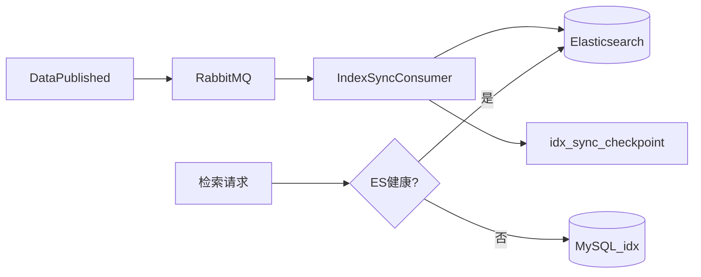

- 索引命名：`nanda-search-{orgId}`
- 全量重建：XXL-JOB `indexFullRebuild`（维护窗口）
- 与 BP-01 发布流水线通过 `IndexSyncRequired` 事件衔接

---

## 6. BP-05 科研队列与随访

### 6.1 主流程

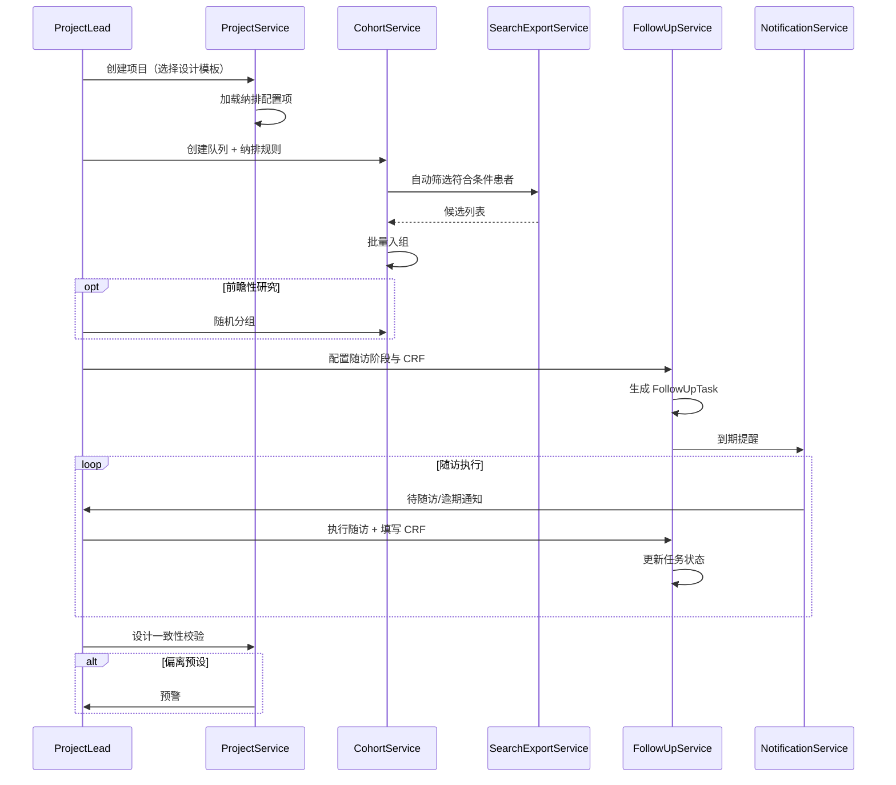

### 6.2 队列动态维护

- 专病库数据更新 → 自动同步 cohort_member 关联数据
- 纳排规则变更 → 可选重新筛选（新增/移除提示）

### 6.3 异常分支

| 异常 | 处理 |
| --- | --- |
| 纳排结果为空 | 提示调整规则 |
| 随机分组失败 | 人数不足告警 |
| 随访逾期 | 状态 → Overdue，通知升级 |
| 设计偏离 | 项目预警，不阻断但记录 |

### 6.4 多项目协作（BR-19）

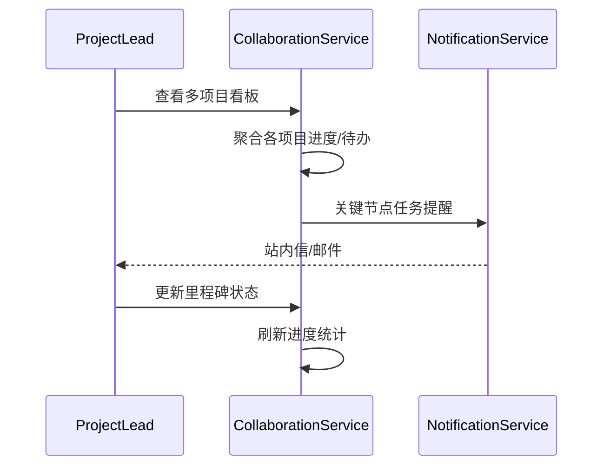

| 能力 | REQ |
| --- | --- |
| 多项目并行 | REQ-19-01-01 |
| 节点任务提醒 | REQ-19-01-02 |
| 进度统计 | REQ-19-01-03 |

---

## 7. BP-06 沙箱分析

> **边界**：通用统计工作台、Notebook 探索、个性化脚本；**结构化风险模型与 PDF 报告**见 BP-07。

### 7.1 主流程

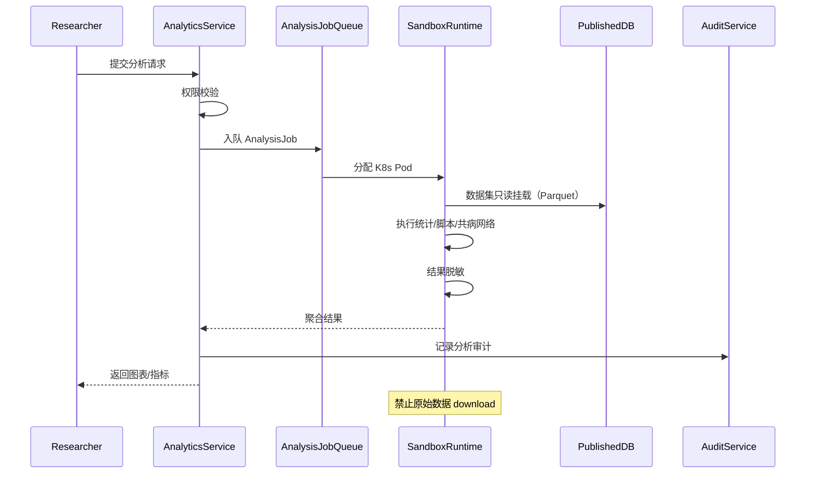

### 7.2 分析类型分支

| 类型 | 入口 | 执行环境 |
| --- | --- | --- |
| 描述/检验/回归/生存 | StatisticsService | Sandbox |
| 共病网络/因果分析 | ComorbidityAnalysisService | Sandbox |
| Python 脚本 / Notebook | SandboxRuntime Web IDE | K8s Pod |
| 独立 Excel 数据集 | StatisticsService | Sandbox（隔离存储） |

### 7.3 安全约束

- 沙箱无 outbound 数据 API（NetworkPolicy）
- 结果仅含聚合/脱敏数据
- 动态水印覆盖展示层
- 脚本上传前 AST 安全扫描

### 7.4 异常分支

| 异常 | 处理 |
| --- | --- |
| 资源紧张 | 排队等待，通知预计时间 |
| 脚本执行超时 | 终止 Pod，返回错误 |
| 脚本安全扫描失败 | 拒绝执行 |
| 参数不足 | 422，提示缺失字段 |

---

## 8. BP-07 风险评估与评估报告

### 8.1 主流程

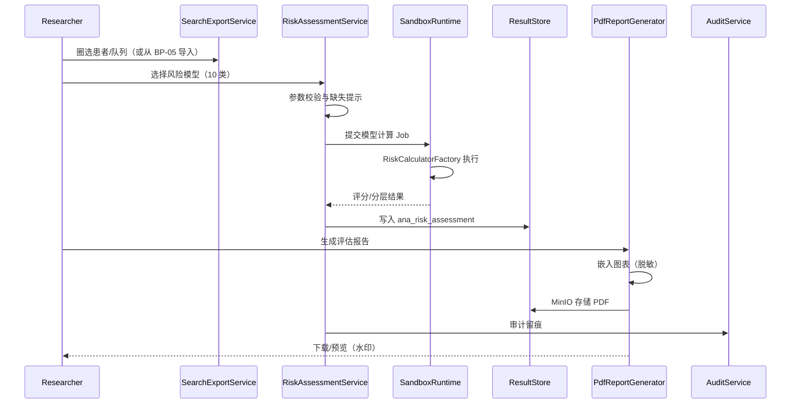

### 8.2 风险模型分支

| 模型类别 | 示例 REQ |
| --- | --- |
| 心血管 | ASCVD、Framingham、CHA₂DS₂-VASc |
| 呼吸 | GOLD、CAT、BODE |
| 代谢 | FINDRISC |
| 共病 | Charlson、Elixhauser |

### 8.3 异常分支

| 异常 | 处理 |
| --- | --- |
| 必填参数缺失 | 422，高亮缺失字段 |
| 模型不适用 | 提示病种/人群不匹配 |
| 计算超时 | Job Failed，支持重试 |
| PDF 生成失败 | 保留数值结果，报告状态 Failed |

---

## 9. BP-08 外部集成与结果回传

### 9.1 主流程

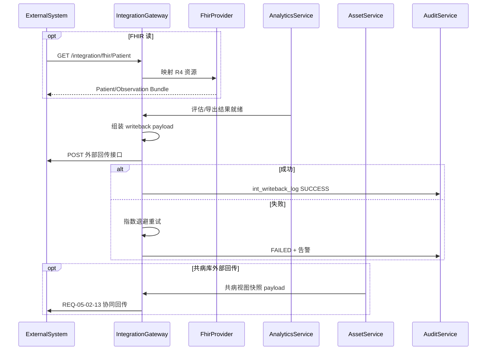

### 9.2 集成类型分支

| 类型 | 方向 | 说明 |
| --- | --- | --- |
| 分中心 upload | 入 | Excel → Staging（衔接 BP-01） |
| FHIR R4 读 | 出（对外提供） | Patient、Observation |
| 评估结果 writeback | 出 | 风险报告、导出摘要 |
| 共病回传 | 出 | 物化视图快照 |

### 9.3 异常分支

| 异常 | 处理 |
| --- | --- |
| 外部系统不可达 | 重试队列，达上限告警 |
| FHIR 映射错误 | 400 + 结构化 OperationOutcome |
| 回传鉴权失败 | 401/403，审计 |
| payload 校验失败 | 拒绝发送，保留草稿 |

---

## 10. BP-09 知识库与患者全景

### 10.1 知识库维护主流程

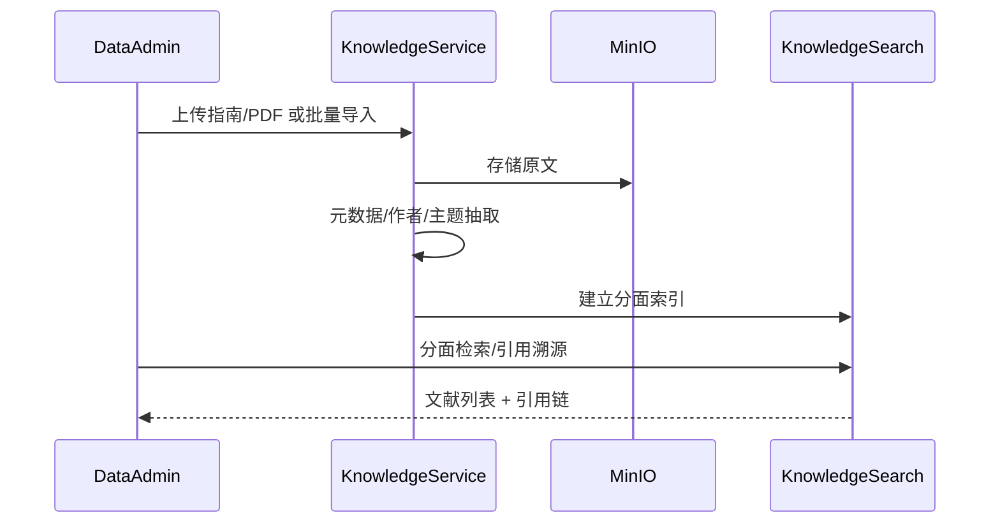

### 10.2 患者全景主流程

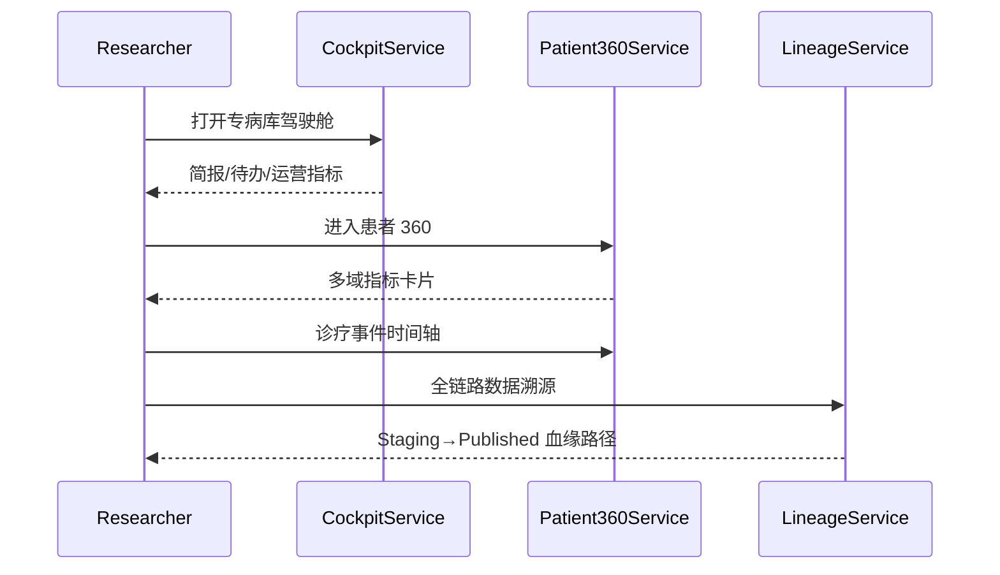

### 10.3 异常分支

| 异常 | 处理 |
| --- | --- |
| PDF 解析失败 | 标记导入失败，支持重传 |
| 无权限查看 360 | 403（含跨病种 L3 审批） |
| 溯源链断裂 | 展示最近已知节点 + 告警 |

---

## 11. 跨流程协作

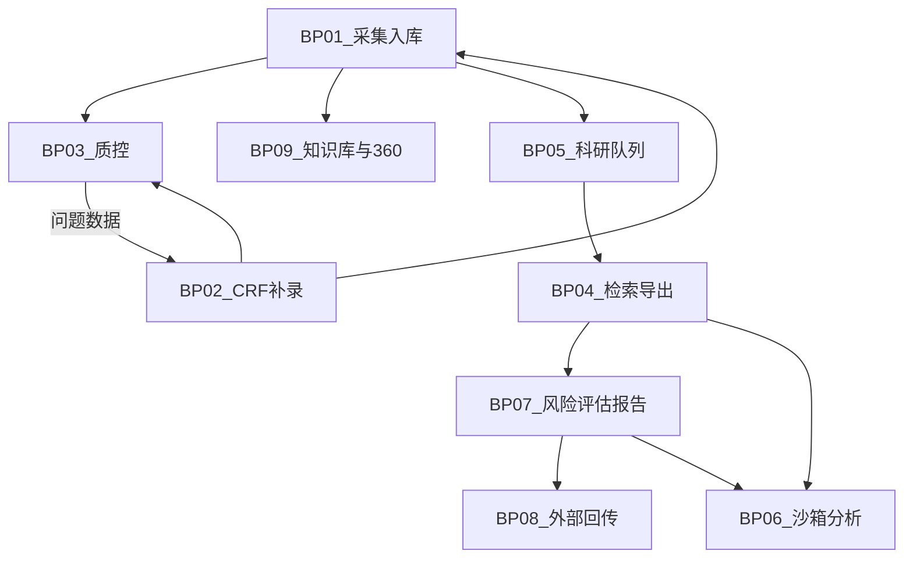

| 典型科研链路 | 流程序列 |
| --- | --- |
| 队列研究 | BP-01 → BP-05 → BP-04 → BP-07 → BP-08 |
| 探索性分析 | BP-04 → BP-06 |
| 数据治理闭环 | BP-01 → BP-03 → BP-02 → BP-01 |

---

## 12. 与需求追溯

| 流程 | 覆盖 REQ |
| --- | --- |
| BP-01 | REQ-01-01-*, REQ-01-03-*, REQ-01-04-*, REQ-05-03-*, REQ-05-07-* |
| BP-02 | REQ-01-02-*, REQ-05-06-* |
| BP-03 | REQ-05-05-* |
| BP-04 | REQ-10-01~05（含 CDISC） |
| BP-05 | REQ-17-*, REQ-18-*, REQ-19-* |
| BP-06 | REQ-11-02-*, REQ-11-03-*, REQ-14-01-01~25, REQ-14-01-26~28, REQ-14-04-* |
| BP-07 | REQ-11-01-*, REQ-13-01-01~02 |
| BP-08 | REQ-13-01-03~04, REQ-01-01-05（协同）, REQ-05-02-13（协同） |
| BP-09 | REQ-05-01-*, REQ-05-02-19~29 |

---

## 13. 修订记录

| 版本 | 日期 | 说明 |
| --- | --- | --- |
| V1.0 | 2026-05-27 | 初版：6 条 BP |
| V2.0 | 2026-05-27 | 扩展 9 条 BP；增补 MQ/ES/协作；重绘跨流程图 |
