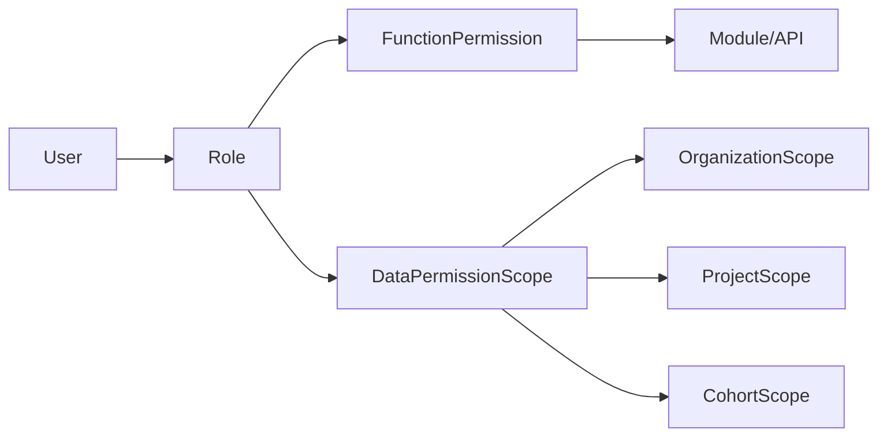
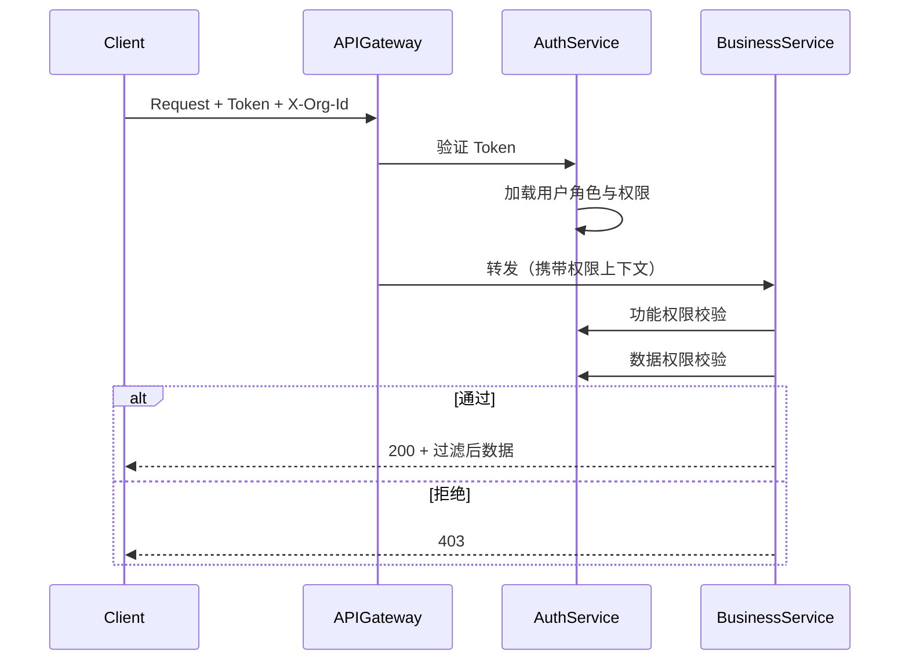
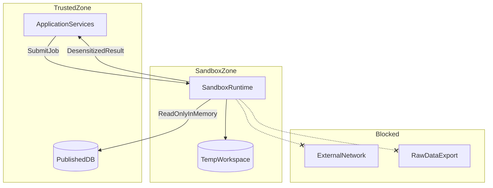

# 安全与权限设计

> **文档编号**：FD-06  
> **上游文档**：[05-业务流程设计](./05-业务流程设计.md)

---

## 1. 安全设计目标

1. 满足医疗科研数据的分级保护与合规审计要求
2. 实现功能权限与数据权限双重隔离
3. 保障原始数据不出库、分析过程可审计
4. 支持多中心场景下的机构级数据隔离

---

## 2. 权限模型

### 2.1 RBAC 架构



- **功能权限**：控制可访问的模块与 API 操作（读/写/删/审核/导出）
- **数据权限**：控制可访问的数据范围（机构/项目/队列/患者）

### 2.2 预置角色

| 角色 | 功能权限 | 数据权限 | 覆盖 BR |
| --- | --- | --- | --- |
| 系统管理员 | 全部模块 | 全机构 | BR-20-01 |
| 数据管理员 | 采集/字典/入库/元数据/清洗 | 本机构及下级 | BR-01-*, BR-05-07 |
| 质控审核员 | 质控/补录审核 | 本机构队列 | BR-05-09, BR-05-10 |
| 科研项目负责人 | 项目/队列/随访/导出申请 | 所属项目队列 | BR-17~19 |
| 科研人员 | 检索/分析/报告 | 授权项目/队列 | BR-10~14 |
| 临床录入员 | CRF/补录/随访执行 | 本机构患者 | BR-01-02, BR-05-10 |
| 分中心协调员 | 上传/本分中心补录 | 本分中心 | BR-01-01, BR-05-10 |

### 2.3 功能权限矩阵（节选）

| 模块 | 系统管理员 | 数据管理员 | 质控员 | 项目负责人 | 科研人员 | 录入员 | 分中心 |
| --- | --- | --- | --- | --- | --- | --- | --- |
| 机构用户管理 | RW | — | — | — | — | — | — |
| 数据源配置 | RW | RW | R | — | — | — | — |
| 字典维护 | RW | RW | R | — | — | — | — |
| CRF 设计 | RW | RW | R | RW | R | R | — |
| CRF 录入 | RW | RW | R | RW | R | RW | RW |
| 质控复核 | RW | R | RW | R | R | — | — |
| 数据导出 | RW | R | R | RW | RW* | — | — |
| 统计分析 | RW | R | R | RW | RW | — | — |
| 项目管理 | RW | R | R | RW | R | — | — |

> RW*=需审核通过后导出；R=只读

### 2.4 数据权限规则

| 规则 | 说明 |
| --- | --- |
| DR-01 | 用户默认只能访问 `X-Org-Id` 所属机构数据 |
| DR-02 | 中心用户可访问下级分中心数据（可配置） |
| DR-03 | 分中心用户不可访问其他分中心数据 |
| DR-04 | 项目成员只能访问项目关联队列的患者 |
| DR-05 | 导出权限独立于查询权限，需单独授权 |
| DR-06 | 解密查看 L2/L3 数据需额外 decrypt 权限 |

### 2.5 权限校验流程



---

## 3. 加密与脱敏

### 3.1 加密分级

| 级别 | 算法 | 字段类型 | 解密权限 |
| --- | --- | --- | --- |
| L0 | 无加密 | 非敏感统计字段 | 授权用户 |
| L1 | AES-256 | 身份证、电话、住址 | 数据管理员+ |
| L2 | SM4 | 专科敏感（基因/介入/胰岛素等） | 临床科研授权 |
| L3 | SM4 + 访问日志 | 跨病种联合敏感数据 | 严格审批 |

### 3.2 密钥管理

- 主密钥（MK）由 SecurityService 统一管理
- 数据密钥（DK）按级别隔离，支持自动轮换
- 密钥访问本身记入审计日志
- 生产环境密钥不可明文存储于配置文件

### 3.3 脱敏策略

| 场景 | 策略 |
| --- | --- |
| 列表展示 | 姓名掩码、身份证中间位隐藏 |
| 导出（无明文权限） | 可逆脱敏或不可逆哈希 |
| 分析结果 | 仅聚合数据，不含个体标识 |
| 报告 | 按角色决定明文/脱敏 |

### 3.4 传输安全

- 全链路 HTTPS
- 跨机构：VPN 专线 + 双向证书认证
- 接口调用完整性校验（防篡改）
- 敏感 API 额外请求签名（可选）

---

## 4. 审计设计

### 4.1 审计范围

| 操作类型 | 记录内容 |
| --- | --- |
| QUERY | 查询人、条件摘要、结果数量 |
| EXPORT | 导出人、患者数、字段范围、文件哈希 |
| UPDATE | 修改人、修改前后值 |
| DELETE | 删除人、删除对象 |
| DECRYPT | 解密人、解密字段、业务理由 |
| LOGIN/LOGOUT | 用户、IP、时间 |
| SANDBOX_RUN | 分析人、脚本 ID、输入摘要 |

### 4.2 审计存储

- append-only，不可 UPDATE/DELETE
- 定期归档，保留期按合规要求配置
- 支持按用户/资源/时间范围查询

### 4.3 审计拦截点

```
API Gateway → 认证审计
Business Service → 数据操作审计（AOP/中间件）
Export Service → 导出专项审计
Security Service → 解密专项审计
Sandbox → 分析作业审计
```

---

## 5. 沙箱安全边界

### 5.1 隔离模型



### 5.2 沙箱约束

| 编号 | 约束 |
| --- | --- |
| SB-01 | 无原始数据 download/export API |
| SB-02 | 网络出站白名单（仅内部服务） |
| SB-03 | CPU/内存/执行时间配额 |
| SB-04 | Python 脚本上传前静态安全扫描 |
| SB-05 | 结果必须经过脱敏网关 |
| SB-06 | 每次执行生成独立 audit 记录 |

### 5.3 防泄露措施

- 动态水印（用户 ID + 时间戳）
- 防浏览器调试（前端层）
- 截屏审计（可选）
- 分析结果不可批量复制原始明细

---

## 6. 多中心隔离

### 6.1 机构隔离

- 所有 Published 数据带 `org_id`
- 查询/导出自动注入 org 过滤条件
- 跨机构访问需显式授权（中心用户）

### 6.2 项目隔离

- 队列成员与项目绑定
- 未授权项目不可检索其队列患者

---

## 7. 合规对照

| 需求 | 设计对策 | REQ |
| --- | --- | --- |
| 功能权限控制 | RBAC + API 级校验 | REQ-05-07-01 |
| 数据权限分配 | 机构/项目/队列三维 | REQ-05-07-02 |
| L1 加密 | AES-256 | REQ-05-07-03 |
| L2 专科加密 | SM4 | REQ-05-07-04~06 |
| L3 共病交叉 | SM4 + 访问日志 | REQ-05-07-07 |
| 传输安全 | HTTPS + VPN + 双向认证 | REQ-05-07-08 |
| 全过程审计 | append-only audit_log | REQ-05-07-09 |
| 数据不出库 | 沙箱隔离 | NFR-02 |
| 补录权限 | 分中心定向 | REQ-05-06-04~05 |

---

## 8. 安全异常处理

| 场景 | 响应 |
| --- | --- |
| Token 过期 | 401，引导刷新 |
| 权限不足 | 403，不泄露资源存在性（敏感资源） |
| 暴力破解 | 账户锁定 + 告警 |
| 异常大量导出 | 限流 + 告警 |
| 沙箱逃逸尝试 | 终止作业 + 安全告警 |
| 密钥轮换失败 | 告警，旧密钥短期并存 |

---

## 9. 与需求追溯

| 章节 | 覆盖 BR/REQ |
| --- | --- |
| §2 RBAC | BR-20-01, REQ-05-07-01~02, REQ-05-06-04~05 |
| §3 加密 | REQ-05-07-03~07 |
| §4 审计 | REQ-05-07-09, REQ-10-05-05 |
| §5 沙箱 | BR-11-03, REQ-11-03-*, REQ-14-04-* |
