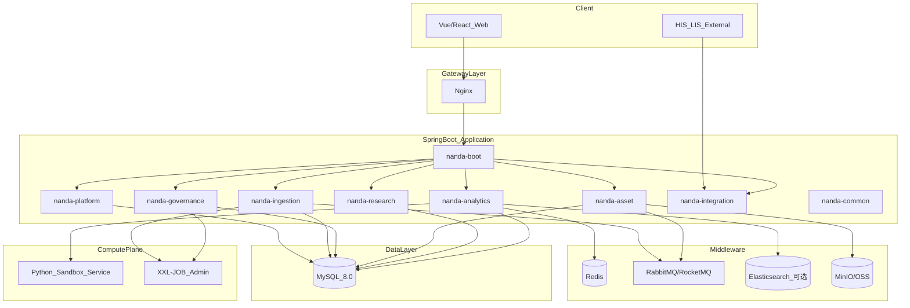
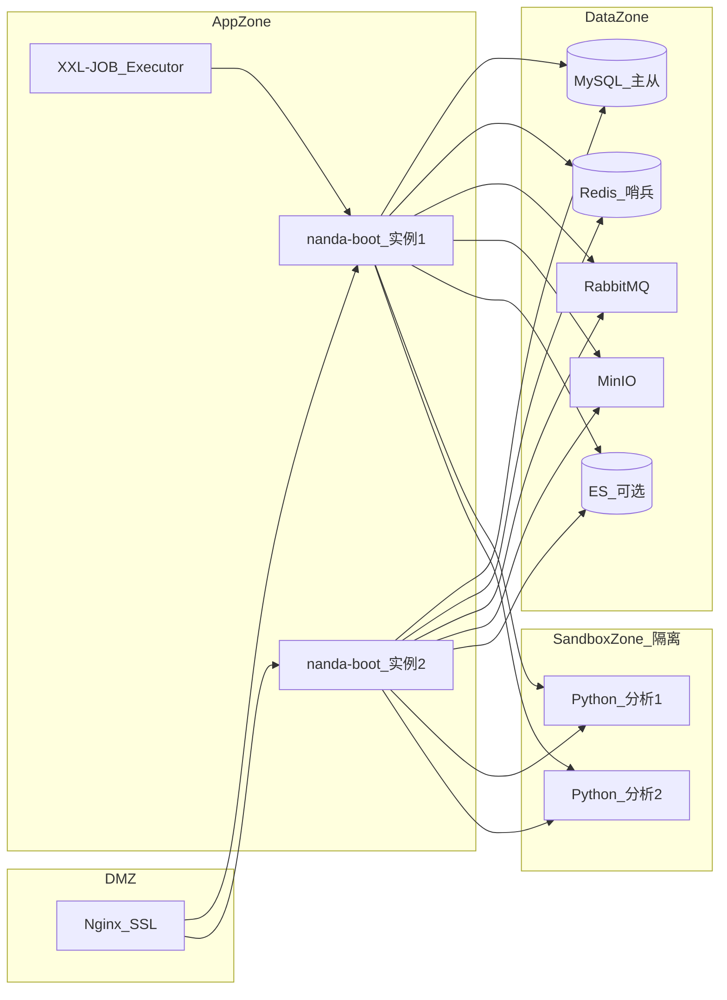

# 技术架构推荐

> **文档编号**：FD-08  
> **技术基线**：Spring Boot 2.7.x · Java 8 · MySQL 8.0  
> **上游文档**：[01-总体架构设计](./01-总体架构设计.md) · [03-数据架构设计](./03-数据架构设计.md)

---

## 1. 文档说明

本文档在 [功能设计体系](./00-功能设计总览.md)（技术无关）基础上，给出 **Spring Boot + Java 8 + MySQL** 的技术落地推荐，包括：

- 工程结构与模块划分
- 技术组件选型及与逻辑子系统的映射
- 数据库与中间件部署建议
- 关键非功能需求的技术对策

### 1.1 版本约束说明

| 约束 | 推荐版本 | 说明 |
| --- | --- | --- |
| JDK | **1.8（Java 8）** | 用户指定基线 |
| Spring Boot | **2.7.18** | 2.x 末代版本，官方仍支持 Java 8；**不可使用 Spring Boot 3.x**（需 Java 17+） |
| Spring Framework | 5.3.x | 随 Boot 2.7 自带 |
| MySQL | **8.0.x** | 支持 JSON 列、窗口函数；兼容 5.7 但建议 8.0 |
| Maven | 3.6+ | 构建工具 |

---

## 2. 总体技术架构

### 2.1 架构风格

**推荐：模块化单体（Modular Monolith）**

| 方案 | 结论 | 理由 |
| --- | --- | --- |
| 模块化单体 | **推荐（首期）** | Java 8 团队交付快、运维简单、事务一致性好，符合 233 REQ 首期落地 |
| 微服务 | 上线后按需拆分 | 检索/沙箱/采集可独立扩容时再拆 |
| 纯单体 | 不推荐 | 模块边界不清，后期难维护 |



### 2.2 逻辑子系统 → Java 模块映射

| 逻辑子系统（FD-01） | Maven 模块 | 主要包路径 |
| --- | --- | --- |
| OrganizationService / AuthService / AuditService / SecurityService | `nanda-platform` | `com.nanda.platform.*` |
| IngestionService | `nanda-ingestion` | `com.nanda.ingestion.*` |
| CRFService / DictionaryService / CleaningService / PublishingService / MetadataService | `nanda-governance` | `com.nanda.governance.*` |
| EMPIService / SpecialtyDatabaseService / ComorbidityDatabaseService / KnowledgeBaseService / QualityControlService | `nanda-asset` | `com.nanda.asset.*` |
| ProjectService / CohortService / FollowUpService / MultiProjectService | `nanda-research` | `com.nanda.research.*` |
| SearchExportService / StatisticsService / RiskAssessmentService / ReportService / DashboardService | `nanda-analytics` | `com.nanda.analytics.*` |
| FHIR / Upload / Writeback | `nanda-integration` | `com.nanda.integration.*` |
| 公共组件 | `nanda-common` | `com.nanda.common.*` |
| 启动聚合 | `nanda-boot` | `com.nanda.NandaApplication` |

---

## 3. 工程结构推荐

```
server/
├── pom.xml                          # 父 POM，统一依赖管理
├── nanda-common/                    # 公共模块
│   └── src/main/java/com/nanda/common/
│       ├── core/                    # 统一响应、分页、异常
│       ├── security/                # JWT 工具、权限注解
│       ├── crypto/                  # AES/SM4 加密封装
│       └── util/
├── nanda-platform/
│   └── .../platform/
│       ├── org/                     # 机构
│       ├── user/                    # 用户角色
│       ├── auth/                    # 认证授权
│       └── audit/                   # 审计日志
├── nanda-ingestion/
│   └── .../ingestion/
│       ├── datasource/              # 数据源配置
│       ├── sync/                    # 同步任务
│       ├── staging/                 # Staging 层
│       └── adapter/                 # HL7/FHIR/JDBC 适配器
├── nanda-governance/
│   └── .../governance/
│       ├── crf/                     # CRF 表单引擎
│       ├── dictionary/              # 字典术语
│       ├── cleaning/                # 清洗规则
│       ├── publish/                 # 入库发布
│       └── metadata/                # 元数据血缘
├── nanda-asset/
│   └── .../asset/
│       ├── empi/                    # 主索引
│       ├── specialty/               # 专病库
│       ├── comorbidity/             # 共病库
│       ├── quality/                 # 质控
│       └── knowledge/               # 知识库
├── nanda-research/
│   └── .../research/
│       ├── project/
│       ├── cohort/
│       └── followup/
├── nanda-analytics/
│   └── .../analytics/
│       ├── search/                  # 检索导出
│       ├── statistics/              # 统计分析
│       ├── risk/                    # 风险模型
│       ├── report/                  # PDF 报告
│       └── dashboard/               # 驾驶舱
├── nanda-integration/
│   └── .../integration/
│       ├── upload/                  # 分中心上传
│       ├── writeback/               # 外部回写
│       └── fhir/                    # FHIR 适配
├── nanda-boot/                      # 启动模块
│   └── src/main/
│       ├── java/.../NandaApplication.java
│       └── resources/
│           ├── application.yml
│           ├── application-dev.yml
│           └── db/migration/        # Flyway 脚本
└── doc/                             # 需求与设计文档
```

### 3.1 分层规范（模块内）

```
controller/     → REST API（对应 FD-04）
service/        → 业务逻辑
manager/        → 跨领域编排（可选）
mapper/         → MyBatis 数据访问
domain/         → 实体、枚举、DTO、VO
job/            → 定时/XXL-JOB 任务
listener/       → MQ 消费者
config/         → Spring 配置
```

---

## 4. 核心技术选型

### 4.1 基础框架

| 类别 | 推荐组件 | 版本建议 | 用途 |
| --- | --- | --- | --- |
| Web | spring-boot-starter-web | 2.7.18 | REST API |
| 校验 | spring-boot-starter-validation | 2.7.18 | JSR-303 参数校验 |
| AOP | spring-boot-starter-aop | 2.7.18 | 审计、权限切面 |
| 配置 | spring-boot-configuration-processor | 2.7.18 | 配置元数据 |

### 4.2 安全

| 类别 | 推荐组件 | 说明 |
| --- | --- | --- |
| 认证授权 | **Spring Security 5.7** + JWT | 对应 FD-06 RBAC |
| Token | jjwt 0.11.x | Java 8 兼容 |
| 加密 | **Bouncy Castle** bcprov-jdk15on | AES-256、**SM4 国密** |
| 传输 | HTTPS + 网关层双向认证 | Nginx / F5 |

```java
// 权限注解示例（推荐在 common 模块定义）
@PreAuthorize("hasAuthority('specialty:read')")
@DataScope(orgAlias = "o")  // 自定义数据权限切面
public PageResult<SpecialtyPatientVO> listPatients(...) { }
```

### 4.3 数据访问

| 类别 | 推荐组件 | 说明 |
| --- | --- | --- |
| ORM | **MyBatis-Plus 3.5.x** | 复杂 SQL、动态字段、分页；医疗项目常用 |
| 连接池 | HikariCP | Spring Boot 默认 |
| 数据库驱动 | mysql-connector-j 8.0.x | MySQL 8 |
| 迁移 | **Flyway** | 版本化 DDL，脚本放 `nanda-boot/resources/db/migration` |
| 多数据源 | dynamic-datasource-spring-boot-starter | Staging / Published 可分库（可选） |

**MyBatis-Plus 选型理由**：

- `extended_fields` JSON 字段读写灵活
- 共病/检索等复杂 SQL 可控
- 与 Java 8 兼容良好

**JSON 字段示例**：

```sql
-- MySQL 8.0
ALTER TABLE specialty_patient_record
  ADD COLUMN extended_fields JSON COMMENT '动态扩展字段';
```

```java
@TableName("specialty_patient_record")
public class SpecialtyPatientRecord {
    @TableField(typeHandler = JacksonTypeHandler.class)
    private Map<String, Object> extendedFields;
}
```

### 4.4 缓存与会话

| 类别 | 推荐组件 | 说明 |
| --- | --- | --- |
| 缓存 | **Redis 6.x** + spring-boot-starter-data-redis | 字典缓存、Token 黑名单、检索热点 |
| 序列化 | Jackson | JSON 序列化 |

> Redis 非用户指定基线，但 **NFR-01（300 并发）** 与字典/权限缓存强烈建议引入；首期可用本地 Caffeine 过渡，上线前切 Redis。

### 4.5 消息与异步

| 类别 | 推荐组件 | 用途 |
| --- | --- | --- |
| 消息队列 | **RabbitMQ** 或 RocketMQ | DataPublished 事件、索引同步、共病视图刷新 |
| Spring 集成 | spring-amqp | 与 Boot 2.7 集成 |
| 异步 | @Async + 线程池 | 非核心异步任务 |

**事件示例**：

| 事件 | 生产者 | 消费者 |
| --- | --- | --- |
| StagingBatchReceived | nanda-ingestion | nanda-governance（清洗） |
| DataPublished | nanda-governance | nanda-asset（共病刷新）、nanda-analytics（索引） |
| ExportApproved | nanda-analytics | nanda-platform（审计） |

### 4.6 任务调度

| 类别 | 推荐组件 | 用途 |
| --- | --- | --- |
| 分布式调度 | **XXL-JOB 2.4.x** | T+7/T+1 同步、入库、质控月报、共病视图刷新 |
| 本地调度 | @Scheduled | 轻量补偿任务 |

对应 REQ-01-01-07~09、REQ-05-03-05。

### 4.7 检索

| 阶段 | 方案 | 说明 |
| --- | --- | --- |
| MVP | MySQL 索引 + 条件 SQL | 满足基础检索 REQ-10-01 |
| 增强 | **Elasticsearch 7.17.x** | 复杂嵌套检索、全文、聚合；Java 8 兼容 |
| 同步 | MQ 消费 + ES Bulk API | 从 Published 层异步同步（FD-03 §12） |

### 4.8 文件与报表

| 类别 | 推荐组件 | 用途 |
| --- | --- | --- |
| 对象存储 | **MinIO** 或 阿里云 OSS | CRF 附件、知识库 PDF、导出文件 |
| 文件接口 | spring 封装 S3 协议 | 统一 FileStorageService |
| PDF | **Apache PDFBox 2.x** 或 iText 7 | 风险评估报告 REQ-13-01-01 |
| Excel | **EasyExcel 3.x** | 导入导出、分中心模板 |

### 4.9 医疗互操作

| 协议 | 推荐组件 | 模块 |
| --- | --- | --- |
| HL7 v2 | **HAPI HL7 2.x** | nanda-ingestion |
| FHIR R4 | **HAPI FHIR 5.x**（DSTU3/R4） | nanda-integration |
| JDBC 源 | 动态数据源 + 自定义 Adapter | nanda-ingestion |

### 4.10 沙箱 Web IDE（ComputePlane）

Java 8 主应用 **不内嵌 Python**；沙箱以 **混合式 Web IDE** 交付（MVP 范围，见 [FD-09](./09-沙箱WebIDE设计.md)）：

| 组件 | 说明 |
| --- | --- |
| Python 服务 | FastAPI + Kernel WebSocket + subprocess 执行器 |
| Web IDE | Vue 3 + Monaco + ECharts，Notebook/Script 双模式 |
| Java BFF | `SandboxBffController` 鉴权/审计/数据集挂载 |
| 通信 | OkHttp 调 Python 内网 API；前端 WS 经 BFF 转发 |
| 隔离 | Docker sandbox_zone，无出站互联网 |
| 存储 | MinIO：脱敏 Parquet + 用户 Workspace |
| 队列 | RabbitMQ + Kernel 池排队（300 并发） |

统计类简单模型（t 检验、描述统计）可用 **Apache Commons Math** 在 Java 内实现，减少沙箱调用。

---

## 5. MySQL 数据库设计建议

### 5.1 库/schema 划分

**推荐方案 A（首期）**：单库多表，前缀区分数据层

| 前缀 | 对应层（FD-03） | 示例表 |
| --- | --- | --- |
| `stg_` | Staging | stg_batch, stg_record |
| `gov_` | Governance | gov_cleaning_rule, gov_crf_form |
| `pub_` | Published | pub_specialty_patient, pub_lab_exam |
| `idx_` | Index 元数据 | idx_sync_checkpoint |
| `sys_` | 系统 | sys_org, sys_user, sys_audit_log |

**推荐方案 B（规模化）**：三库分离

| 数据库 | 内容 |
| --- | --- |
| `nanda_staging` | Staging + Governance 中间 |
| `nanda_core` | Published 专病/共病/EMPI |
| `nanda_system` | 平台、科研、审计 |

### 5.2 关键表设计要点

| 设计点 | MySQL 实现 |
| --- | --- |
| 动态字段 | `JSON` 类型列 + 虚拟列索引（常用字段） |
| 专病分库 | `specialty_type` 字段 + 联合索引，非物理分库 |
| 审计不可篡改 | 独立表 + 禁止 UPDATE/DELETE 触发器或应用层只 INSERT |
| 敏感字段 | 密文 VARCHAR + `id_hash` 索引列 |
| 大文本病历 | TEXT + 可选 ES 全文 |
| 分页 | MyBatis-Plus Pagination + 覆盖索引 |

### 5.3 索引建议

```sql
-- EMPI 精确匹配
CREATE INDEX idx_empi_id_hash ON empi_identifier(id_type, id_hash);

-- 专病库查询
CREATE INDEX idx_specialty_org_type ON pub_specialty_patient(org_id, specialty_type, updated_at);

-- 共病视图
CREATE INDEX idx_comorbidity_view_rule ON pub_comorbidity_view(rule_id, empi_id);

-- 审计查询
CREATE INDEX idx_audit_user_time ON sys_audit_log(user_id, created_at);
```

### 5.4 Flyway 迁移规范

```
db/migration/
├── V1.0.0__init_system.sql        # 机构用户权限
├── V1.1.0__init_staging.sql
├── V1.2.0__init_governance.sql
├── V1.3.0__init_asset.sql
├── V1.4.0__init_research.sql
└── V1.5.0__init_audit.sql
```

---

## 6. API 层实现建议

对应 [04-接口设计.md](./04-接口设计.md)：

| 约定 | Spring Boot 实现 |
| --- | --- |
| 统一响应 | `Result<T>` + `@RestControllerAdvice` 全局异常 |
| 分页 | `PageQuery` + MyBatis-Plus `Page` |
| 鉴权 | `JwtAuthenticationFilter` + SecurityContext |
| 数据权限 | MyBatis 拦截器注入 `org_id` 条件 |
| 审计 | `@AuditLog` AOP 切面 |
| API 文档 | **Knife4j 3.x**（Swagger 增强，Java 8 可用） |
| 参数校验 | `@Valid` + `@NotNull` 等 |

```java
@RestController
@RequestMapping("/api/v1/specialty/{type}/patients")
public class SpecialtyPatientController {

    @GetMapping
    @PreAuthorize("hasAuthority('specialty:patient:list')")
    public Result<PageResult<SpecialtyPatientVO>> list(
            @PathVariable SpecialtyType type,
            @Valid PatientQuery query) {
        return Result.ok(specialtyPatientService.page(type, query));
    }
}
```

---

## 7. 非功能需求技术对策

| NFR | 技术对策 |
| --- | --- |
| NFR-01 300 并发 | HikariCP 连接池调优 + Redis 缓存 + 分析任务 MQ 排队 + 沙箱水平扩展 |
| NFR-02 数据不出库 | 沙箱独立部署；Java 侧禁止导出原始明细 API |
| NFR-03 AES/SM4 | Bouncy Castle + 字段级 `@EncryptField` 拦截 |
| NFR-04 审计 | sys_audit_log 只 INSERT + AOP |
| NFR-05 EMPI ≥99.8% | 精确匹配 SQL + 加权评分 Java 算法 + 人工确认工作流 |
| NFR-06 质控阈值 | 定时 Job + 告警（邮件/站内信） |
| NFR-09 动态字段 | MySQL JSON + disease_template 驱动校验 |
| NFR-10 CDISC | 导出适配层 EasyExcel/自定义 CDISC ODM XML |

### 7.1 连接池参考配置

```yaml
spring:
  datasource:
    hikari:
      maximum-pool-size: 50
      minimum-idle: 10
      connection-timeout: 30000
      idle-timeout: 600000
      max-lifetime: 1800000
```

### 7.2 线程池

```yaml
async:
  core-pool-size: 8
  max-pool-size: 32
  queue-capacity: 500
```

---

## 8. 部署架构推荐



| 环境 | 建议 |
| --- | --- |
| 开发 | 单机 MySQL + 嵌入式 Redis（可选）+ 单实例 Boot |
| 测试 | MySQL + Redis + RabbitMQ + MinIO |
| 生产 | Boot 双实例 + MySQL 主从 + Redis 哨兵 + 沙箱隔离区 |

打包方式：`spring-boot-maven-plugin` 可执行 JAR，或 Docker 镜像部署。

---

## 9. 父 POM 依赖管理参考

```xml
<parent>
    <groupId>org.springframework.boot</groupId>
    <artifactId>spring-boot-starter-parent</artifactId>
    <version>2.7.18</version>
</parent>

<properties>
    <java.version>1.8</java.version>
    <mybatis-plus.version>3.5.5</mybatis-plus.version>
    <knife4j.version>3.0.3</knife4j.version>
    <jjwt.version>0.11.5</jjwt.version>
    <easyexcel.version>3.3.4</easyexcel.version>
    <hapi.fhir.version>5.7.9</hapi.fhir.version>
</properties>
```

---

## 10. 一期落地建议（全量）

> 不分二期/三期，**233 REQ 一期全量交付**。分期主表见 [FD-10 一期实施设计](./10-分期实施设计.md)。

| 模块 | 技术交付 |
| --- | --- |
| nanda-platform | Spring Security + JWT + RBAC + 审计 + L0~L3 加密 + 共病 L3 审批 |
| nanda-ingestion | JDBC/文件/HL7 + T+1/T+7 + 历史批量 + 准实时 Webhook + DICOM |
| nanda-governance | CRF + 字典 + 清洗 + 发布 + 元数据血缘 |
| nanda-asset | EMPI + 三类专病 + 共病库 + 知识库 + 驾驶舱/360 + 质控/补录 |
| nanda-research | 项目 + 队列 + 随访 + 多项目协作 |
| nanda-analytics | ES 检索 + 风险模型 + PDF + 统计/业务分析/仪表盘 + CDISC 导出 |
| nanda-integration | 分中心 upload + FHIR R4 + writeback |
| sandbox | K8s Pod 隔离 Web IDE（`sandbox/` + FD-09） |
| 中间件 | MySQL（可选读写分离/三库）+ Redis + MinIO + ES + RabbitMQ + XXL-JOB + HAPI FHIR |

---

## 11. 逻辑设计 → 技术组件速查

| FD 文档 | 技术落地 |
| --- | --- |
| FD-01 逻辑子系统 | §3 Maven 模块 |
| FD-02 领域模型 | domain 包 + MyBatis-Plus 实体 |
| FD-03 四层存储 | 表前缀 / 多库 + Flyway |
| FD-04 REST API | @RestController + Knife4j |
| FD-05 业务流程 | Service 编排 + MQ + XXL-JOB |
| FD-06 安全 | Spring Security + BC 加密 + AOP 审计 |
| FD-07 模块功能 | 按模块 package 划分 |

---

## 12. 风险与注意事项

| 风险 | 建议 |
| --- | --- |
| Java 8 已 EOL | 首期按用户要求使用；规划升级 Java 17 + Boot 3 路线 |
| Spring Boot 2.7 维护截止 | 关注 CVE，2.7.18 为 2.x 最终社区版 |
| JSON 字段查询性能 | 热点字段提取虚拟列或冗余列 |
| 沙箱安全 | 必须物理/网络隔离，禁止与主库同进程 |
| SM4 国密 | 统一封装 CryptoService，密钥走配置中心/KMS |
| 300 并发 | 压测验证连接池、Redis、MQ；分析任务必须异步 |

---

## 13. 文档关系

```
doc/design/00~07  功能设计（技术无关）
        ↓
doc/design/08-技术架构推荐.md  本文档
        ↓
（后续）详细设计 / 数据库 DDL / 接口 Swagger / 代码实现
```
