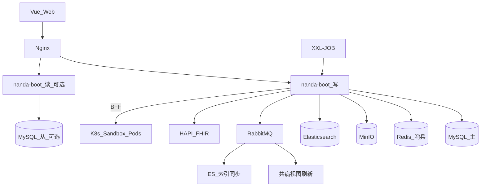

# 一期实施设计（全量）

> **文档编号**：FD-10  
> **上游**：[08-技术架构推荐 §10](./08-技术架构推荐.md) · [业务功能需求.md](../业务功能需求.md)  
> **下游 LLD**：[06-一期详细设计](../detail/06-一期详细设计.md)

---

## 1. 文档说明

本文档为 **233 REQ / 30 BR** 的**一期全量实施主数据源**：不分二期、三期，所有能力在**一期**内交付。

| 项 | 说明 |
| --- | --- |
| **交付目标** | 可上线完整闭环：采集（含 HL7/准实时）→ 治理（含元数据血缘）→ 三类专病+共病入库 → 科研协作 → ES 检索与 CDISC 导出 → 风险/PDF/知识库/驾驶舱 → K8s 沙箱 Web IDE |
| **REQ 覆盖** | **233 REQ 全量**（100%） |
| **与 PRD 优先级** | PRD 附录中的 P0/P1/P2 表示需求重要度，**不表示实施分期**；排期以本文档「一期交付」为准 |

**沙箱 Web IDE**：一期交付生产级能力（[FD-09](./09-沙箱WebIDE设计.md) / [DD-sandbox](../detail/DD-sandbox.md)），含 K8s Pod 隔离与 300 并发。

---

## 2. 目标架构（一期）



| 中间件 | 一期 |
| --- | --- |
| MySQL | 主库 + 可选读写分离/三库拆分（staging/core/system） |
| Redis | 会话/缓存/哨兵 |
| MinIO | 附件/导出/知识库 PDF/沙箱数据集 |
| Elasticsearch | 检索增强（与 MySQL idx 双写或切换） |
| RabbitMQ | 领域事件全量 |
| XXL-JOB | T+1、T+7、共病刷新、索引重建等 |
| Python Sandbox | K8s 每会话 Pod + Web IDE + 算法库 |
| HAPI FHIR | R4 读接口 + 回写 |

---

## 3. REQ 实施范围总表（一期全量）

### 3.1 platform（16 REQ）

| REQ 范围 | 模块 |
| --- | --- |
| REQ-20-01-01~03 | nanda-platform |
| REQ-20-02-01~04 | nanda-platform |
| REQ-05-07-01~09 | nanda-platform（含共病交叉 L3 审批 REQ-05-07-07） |

### 3.2 ingestion（9 REQ）

| REQ | 说明 |
| --- | --- |
| REQ-01-01-01~03 | JDBC/文件/ETL |
| REQ-01-01-04 | 历史批量回顾 |
| REQ-01-01-05 | 多中心（协同 integration API） |
| REQ-01-01-06 | 同步调度 |
| REQ-01-01-07 | T+7 + HL7 v2 |
| REQ-01-01-08 | T+1 |
| REQ-01-01-09 | 准实时 Webhook |

### 3.3 governance（43 REQ）

| REQ 范围 |
| --- |
| REQ-01-02-01~11 |
| REQ-01-03-01~23 |
| REQ-05-03-01~06 |
| REQ-05-04-01~03（元数据/血缘） |

### 3.4 asset（57 REQ）

| REQ 范围 | 说明 |
| --- | --- |
| REQ-01-04-01~05 | EMPI |
| REQ-05-02-01~03 | 代谢专病库 |
| REQ-05-02-04~06 | 心脑血管专病 |
| REQ-05-02-07~09 | 呼吸专病 |
| REQ-05-02-10~18 | 共病库（含外部回传协同 integration） |
| REQ-05-01-01~06 | 知识库 |
| REQ-05-02-19~29 | 驾驶舱/360/洞察/溯源 |
| REQ-05-05-01~09 | 质控 |
| REQ-05-06-01~08 | 补录 |

### 3.5 research（22 REQ）

| REQ 范围 |
| --- |
| REQ-17-01-01~06 |
| REQ-18-01-01~04 |
| REQ-18-02-01~05 |
| REQ-18-03-01~04 |
| REQ-19-01-01~03（多项目协作） |

### 3.6 analytics（84 REQ）

| REQ 范围 | 说明 |
| --- | --- |
| REQ-10-01-01~03 | 检索（MySQL + ES） |
| REQ-10-02-01~07 | 高级检索 |
| REQ-10-03-01~02 | 结果处理 |
| REQ-10-04-01~03 | 提取任务 |
| REQ-10-05-01~06 | 导出 Excel/CSV/CDISC |
| REQ-11-01-01~10 | 10 风险模型 |
| REQ-11-02-01~05 | 共病网络/因果 |
| REQ-11-03-01~04 | 沙箱算法进库 |
| REQ-13-01-01~02 | PDF 报告 |
| REQ-14-01-01~28 | 统计工作台 + 个性化脚本 |
| REQ-14-02-01~07 | 业务分析场景 |
| REQ-14-03-01~02 | 仪表盘 |
| REQ-14-04-01~05 | 安全分析环境（K8s 沙箱） |

### 3.7 integration（2 主责 REQ + 协同）

| REQ | 说明 |
| --- | --- |
| REQ-01-01-05（API） | 分中心 Excel upload |
| REQ-13-01-03 | 外部回传 |
| REQ-13-01-04 | FHIR R4 读接口 |
| REQ-05-02-13（协同） | 共病回传 payload |

### 3.8 REQ 统计

| 项 | 数量 |
| --- | ---: |
| 一期交付 REQ | **233** |
| 占比 | **100%** |

---

## 4. BR 交付矩阵（一期）

| BR | 名称 | 一期 |
| --- | --- | --- |
| BR-20-01 | 机构与用户 | ● |
| BR-01-01~04 | 采集/CRF/字典/EMPI | ●（含 HL7/T+7/准实时） |
| BR-05-01 | 知识库 | ● |
| BR-05-02~04 | 三类专病 | ● |
| BR-05-05 | 共病库 | ● |
| BR-05-06 | 驾驶舱/360/洞察 | ● |
| BR-05-07~10 | 入库/质控/补录/血缘 | ● |
| BR-05-11 | 安全合规 | ●（含 L3 共病） |
| BR-10-01~02 | 检索导出 | ●（MySQL + ES + CDISC） |
| BR-11-01~02 | 风险/共病分析 | ● |
| BR-11-03 | 沙箱 | ● K8s Web IDE |
| BR-13-01 | 报告 | ● PDF |
| BR-14-01~04 | 统计/脚本/业务分析/仪表盘 | ● |
| BR-17~18 | 项目/队列/随访 | ● |
| BR-19-01 | 多项目协作 | ● |

---

## 5. 里程碑（一期工作包）

| 里程碑 | 交付物 | 验收 |
| --- | --- | --- |
| M1 | 平台 + 采集 + 治理 + 三类专病 + EMPI | BP-01/02 闭环 |
| M2 | 共病库 + MQ 事件 + ES 检索 | BP-01 增强、共病视图 |
| M3 | 科研 + 检索导出 + CDISC + 统计 | BP-04/05 闭环 |
| M4 | 风险模型 + PDF + FHIR + 知识库/驾驶舱 | BP-04 增强 |
| M5 | K8s 沙箱 + 脚本模板 + 准实时/DICOM | BP-06、NFR-01/02/10 |

> 里程碑为**实施顺序**，非多期发布；一期验收以 **233 REQ 全量** 为准。

---

## 6. 风险与依赖

| 风险 | 缓解 |
| --- | --- |
| 全量中间件联调复杂 | 按 M1→M5 工作包递进；dev 环境 Docker Compose 一键起全栈 |
| Java 8 EOL | 一期按用户要求使用 2.7.18；上线后规划 Boot 3 升级 |
| 沙箱与 Java 双栈 | BFF 网关统一鉴权；内网 Token；K8s NetworkPolicy |
| 300 并发沙箱 | K8s HPA + 压测门禁 |

---

## 7. 文档关系

```
FD-10（本文档）REQ 一期全量主表
    ↓
detail/06-一期详细设计.md
    ↓
DD-* 模块详设 + PRD + FD-05 业务流程
```

---

## 8. 修订记录

| 版本 | 日期 | 说明 |
| --- | --- | --- |
| V1.0 | 2026-05-27 | 初版：233 REQ 三期总表 + 架构演进 |
| V2.0 | 2026-05-27 | 合并为单期：233 REQ 全量一期交付 |
