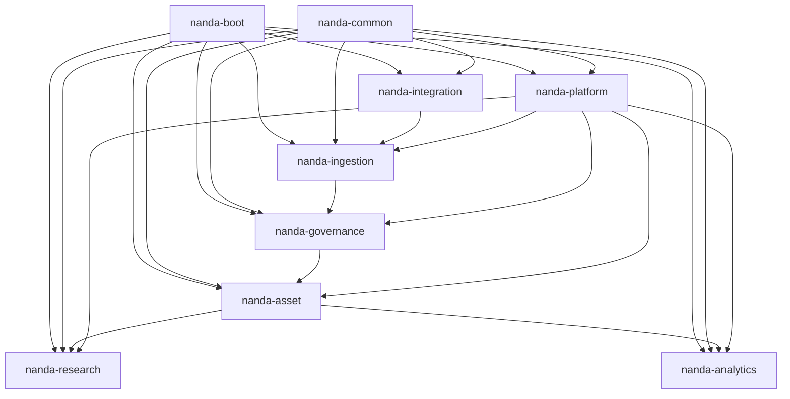

# 详细设计总览

> **文档版本**：V1.0 · **状态**：Draft  
> **上游**：[PRD 总览](../prd/00-PRD总览.md) · [技术架构推荐](../design/08-技术架构推荐.md)  
> **追溯**：233 REQ · ~212 API · 90+ 数据表

---

## 1. 文档说明

本目录为共病专病科研平台的**详细设计（LLD）**，在 PRD 与功能设计基础上，下沉到 **Java 类、MySQL 表、API DTO、状态机、领域事件** 等可编码粒度。

| 读者 | 用途 |
| --- | --- |
| 后端开发 | 包结构、类职责、Service 编排、Mapper SQL |
| DBA | 表结构、索引、约束、分层前缀 |
| 测试 | REQ→类/表/API 追溯矩阵 |

**技术基线**：Spring Boot 2.7.18 · Java 8 · MyBatis-Plus 3.5 · MySQL 8.0 · Redis · RabbitMQ · XXL-JOB

**不包含**：Java 源码、Flyway 脚本文件、OpenAPI YAML（DDL 以文档内 SQL 片段呈现）。

---

## 2. 文档关系链

```
功能要求.md → 功能需求清单.md (REQ-*)
        ↓
业务功能需求.md (BR-*)
        ↓
doc/design/ (FD-00~08 功能设计)
        ↓
doc/prd/ (模块 PRD)
        ↓
doc/detail/ (本详细设计)  ← 当前
        ↓
（后续）Flyway DDL / Maven 工程 / 代码实现
```

---

## 3. 文档索引

| 编号 | 文档 | 内容 |
| --- | --- | --- |
| 00 | [详细设计总览](./00-详细设计总览.md) | 本文档 |
| 01 | [公共模块与 Boot 设计](./01-公共模块与Boot设计.md) | nanda-common、nanda-boot |
| 02 | [数据库设计说明](./02-数据库设计说明.md) | 全库表清单、ER、命名规范 |
| 03 | [API 与错误码规范](./03-API与错误码规范.md) | Result、分页、错误码段 |
| 04 | [领域事件与异步设计](./04-领域事件与异步设计.md) | MQ、XXL-JOB、状态机总表 |
| 05 | [模块业务规则与流程总览](./05-模块业务规则与流程总览.md) | 181 规则 + 33 流程 + 9 条 BP 索引 |
| — | [DD-platform](./DD-platform.md) | 平台/安全/审计 |
| — | [DD-ingestion](./DD-ingestion.md) | 采集/Staging |
| — | [DD-governance](./DD-governance.md) | CRF/字典/清洗/发布 |
| — | [DD-asset](./DD-asset.md) | EMPI/专病/共病/质控/知识库 |
| — | [DD-research](./DD-research.md) | 项目/队列/随访 |
| — | [DD-analytics](./DD-analytics.md) | 检索/统计/沙箱/报告 |
| — | [DD-sandbox](./DD-sandbox.md) | Python ComputePlane + Web IDE |
| — | [DD-integration](./DD-integration.md) | 上传/回写/FHIR |
| 06 | [一期详细设计（全量）](./06-一期详细设计.md) | 233 REQ 一期交付边界、架构、里程碑 |

---

## 4. 模块与 REQ 分配

| 详细设计 | Maven 模块 | REQ 数 | PRD |
| --- | --- | ---: | --- |
| DD-platform | `nanda-platform` | 16 | [PRD-platform](../prd/PRD-platform.md) |
| DD-ingestion | `nanda-ingestion` | 9 | [PRD-ingestion](../prd/PRD-ingestion.md) |
| DD-governance | `nanda-governance` | 43 | [PRD-governance](../prd/PRD-governance.md) |
| DD-asset | `nanda-asset` | 57 | [PRD-asset](../prd/PRD-asset.md) |
| DD-research | `nanda-research` | 22 | [PRD-research](../prd/PRD-research.md) |
| DD-analytics | `nanda-analytics` | 84 | [PRD-analytics](../prd/PRD-analytics.md) |
| DD-integration | `nanda-integration` | 2 | [PRD-integration](../prd/PRD-integration.md) |

**合计**：233 REQ（各模块 DD §12 追溯矩阵全覆盖）

---

## 5. 编码约定

| 项 | 约定 |
| --- | --- |
| 包名 | `com.nanda.{module}.{layer}`，如 `com.nanda.platform.auth.controller` |
| 表前缀 | `sys_` 平台 · `stg_` Staging · `gov_` 治理 · `pub_` Published · `idx_` 索引 · `int_` 集成 |
| 主键 | `BIGINT` 雪花 ID 或 `VARCHAR(32)` UUID，统一字段名 `id` |
| 公共字段 | `org_id`, `created_by`, `created_at`, `updated_by`, `updated_at`, `deleted` (TINYINT 逻辑删) |
| API 前缀 | `/api/v1/` |
| 权限码 | `{module}:{resource}:{action}`，如 `asset:empi:match` |

---

## 6. 模块依赖



---

## 7. 统一模块 DD 章节

每份 `DD-*.md` 含 **15 章**：文档信息 → 模块架构 → 类设计 → 数据库 → API → 核心逻辑 → 状态机 → 安全 → 缓存 → 领域事件 → 时序 → **§13 业务规则** → **§14 业务流程图** → §15 REQ 矩阵。

业务规则与流程索引见 [05-模块业务规则与流程总览](./05-模块业务规则与流程总览.md)。

---

## 8. 后续衔接

| LLD 产出 | 下一步 |
| --- | --- |
| 表 DDL 片段 | 汇总为 Flyway `V1.x__*.sql` |
| 类清单 | Maven 多模块骨架 + 接口/空实现 |
| API DTO | Knife4j 注解或 OpenAPI 生成 |
| REQ 矩阵 | 测试用例 ID 映射 |

---

## 9. 修订记录

| 版本 | 日期 | 说明 |
| --- | --- | --- |
| V1.0 | 2026-05-27 | 初版：11 份 LLD + 233 REQ 追溯 |
| V1.1 | 2026-05-27 | 增 05 总览 + 各 DD §13 业务规则 + §14 流程图 |
| V1.2 | 2026-05-27 | 合并二/三期为 06 一期全量 LLD |
| V1.3 | 2026-05-27 | FD-05 扩展 9 条 BP；DD-05 33 子流程 |
