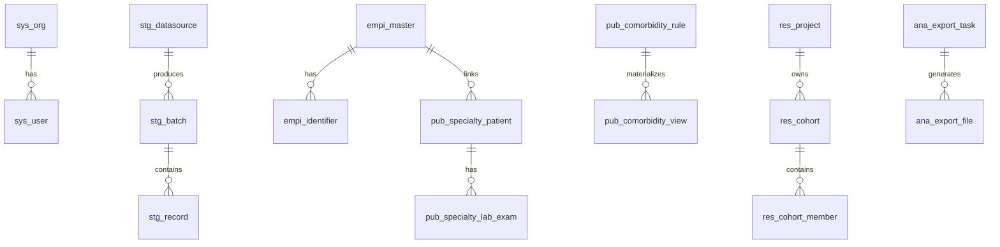

# 数据库设计说明

> **文档编号**：DD-02  
> **上游**：[FD-03 数据架构设计](../design/03-数据架构设计.md)

---

## 1. 设计原则

| 原则 | 说明 |
| --- | --- |
| 单库多表 | 首期 `nanda` 单库，前缀区分数据层 |
| 逻辑删除 | `deleted TINYINT DEFAULT 0` |
| 机构隔离 | 业务表含 `org_id BIGINT NOT NULL` |
| JSON 扩展 | `extended_fields JSON` + 热点虚拟列 |
| 审计只增 | `sys_audit_log` 禁止 UPDATE/DELETE |

---

## 2. 公共字段模板

```sql
`id` BIGINT NOT NULL COMMENT '主键',
`org_id` BIGINT DEFAULT NULL COMMENT '机构ID',
`created_by` BIGINT DEFAULT NULL,
`created_at` DATETIME NOT NULL DEFAULT CURRENT_TIMESTAMP,
`updated_by` BIGINT DEFAULT NULL,
`updated_at` DATETIME NOT NULL DEFAULT CURRENT_TIMESTAMP ON UPDATE CURRENT_TIMESTAMP,
`deleted` TINYINT NOT NULL DEFAULT 0,
PRIMARY KEY (`id`)
```

---

## 3. 全库表清单

### 3.1 平台层 sys_*（DD-platform）

| 表名 | 说明 |
| --- | --- |
| sys_org | 机构 |
| sys_org_relation | 机构关系 |
| sys_user | 用户 |
| sys_user_org | 用户-机构绑定 |
| sys_role | 角色 |
| sys_permission | 权限 |
| sys_role_permission | 角色-权限 |
| sys_user_role | 用户-角色 |
| sys_audit_log | 审计日志 |
| sys_crypto_key | 密钥版本 |

### 3.2 Staging 层 stg_*（DD-ingestion）

| 表名 | 说明 |
| --- | --- |
| stg_datasource | 数据源配置 |
| stg_sync_job | 同步任务 |
| stg_sync_log | 同步执行日志 |
| stg_batch | 批次 |
| stg_record | 原始记录 |

### 3.3 治理层 gov_*（DD-governance）

| 表名 | 说明 |
| --- | --- |
| gov_crf_form | CRF 表单定义 |
| gov_crf_response | CRF 答卷 |
| gov_crf_attachment | CRF 附件 |
| gov_cleaning_rule | 清洗规则 |
| gov_cleaning_rule_template | 规则模板 |
| gov_cleaning_execution | 清洗执行记录 |
| gov_dict_diagnosis | 诊断字典 |
| gov_dict_treatment | 治疗字典 |
| gov_dict_lab_exam | 检验字典 |
| gov_dict_symptom | 症状字典 |
| gov_dict_field_metadata | 字段元数据 |
| gov_terminology | 病种术语 |
| gov_term_mapping | 术语映射 |
| gov_term_synonym | 同义词 |
| gov_publish_rule | 入库规则 |
| gov_publish_task | 发布任务 |
| gov_publish_log | 发布日志 |
| gov_field_mapping | 字段映射 |
| gov_subject_domain | 主题域 |
| gov_metadata_catalog | 元数据目录 |
| gov_metadata_lineage_edge | 血缘边 |

### 3.4 Published 层 pub_* / empi_*（DD-asset）

| 表名 | 说明 |
| --- | --- |
| empi_master | 主索引 |
| empi_identifier | 患者标识 |
| empi_match_candidate | 匹配候选 |
| empi_match_rule | 匹配规则 |
| pub_specialty_patient | 专病患者主记录 |
| pub_specialty_medical_record | 病历 |
| pub_specialty_lab_exam | 检验 |
| pub_specialty_treatment | 治疗 |
| pub_specialty_follow_up | 随访 |
| pub_specialty_template | 专病模板 |
| pub_specialty_attachment | 附件 |
| pub_comorbidity_rule | 共病规则 |
| pub_comorbidity_view | 共病物化视图 |
| pub_knowledge_document | 知识库文档 |
| pub_knowledge_citation | 引用 |
| pub_knowledge_author | 作者 |
| pub_knowledge_tag | 标签 |
| qc_metric_snapshot | 质控指标快照 |
| qc_sample_batch | 抽样批次 |
| qc_sample_record | 抽样记录 |
| qc_review_task | 复核任务 |
| qc_monthly_report | 月报 |
| pub_data_change_log | 补录变更日志 |

### 3.5 科研层 res_*（DD-research）

| 表名 | 说明 |
| --- | --- |
| res_project | 科研项目 |
| res_project_member | 项目成员 |
| res_project_archive | 归档 |
| res_cohort | 队列 |
| res_cohort_member | 队列成员 |
| res_cohort_inclusion_rule | 纳排规则 |
| res_randomization_record | 随机分组 |
| res_follow_up_plan | 随访计划 |
| res_follow_up_stage | 随访阶段 |
| res_follow_up_task | 随访任务 |
| res_follow_up_crf_binding | 阶段-CRF 绑定 |

### 3.6 分析层 ana_* / idx_*（DD-analytics）

| 表名 | 说明 |
| --- | --- |
| ana_search_query | 检索条件保存 |
| ana_export_task | 导出任务 |
| ana_export_file | 导出文件 |
| ana_analytics_job | 分析任务 |
| ana_analytics_result | 分析结果 |
| ana_risk_assessment | 风险评估记录 |
| ana_report | 报告 |
| ana_dashboard | 仪表盘 |
| ana_algorithm_registry | 算法注册 |
| idx_search_document | 检索索引文档 |
| idx_sync_checkpoint | 索引同步位点 |

### 3.7 集成层 int_*（DD-integration）

| 表名 | 说明 |
| --- | --- |
| int_endpoint_config | 外部端点配置 |
| int_upload_batch | 上传批次 |
| int_upload_error | 上传错误行 |
| int_writeback_log | 回写日志 |

**合计**：约 **90** 张表

---

## 4. ER 关系（摘要）



---

## 5. 索引策略

| 场景 | 索引示例 |
| --- | --- |
| 机构+时间 | `idx_org_updated (org_id, updated_at)` |
| EMPI 精确匹配 | `uk_id_type_hash (id_type, id_hash)` |
| 专病列表 | `idx_specialty_org (specialty_type, org_id, deleted)` |
| 审计查询 | `idx_audit_user_time (user_id, created_at)` |
| JSON 热点 | 虚拟列 + INDEX，如 `hba1c_val` GENERATED FROM `core_fields` |

---

## 6. JSON 列与虚拟列示例

```sql
ALTER TABLE pub_specialty_patient
  ADD COLUMN core_fields JSON COMMENT '核心字段',
  ADD COLUMN hba1c_val DECIMAL(5,2) AS (JSON_UNQUOTE(JSON_EXTRACT(core_fields, '$.hba1c'))) VIRTUAL,
  ADD INDEX idx_hba1c (hba1c_val);
```

---

## 7. 分模块 DDL 索引

| 模块 | DDL 详设 |
| --- | --- |
| platform | [DD-platform §4](./DD-platform.md) |
| ingestion | [DD-ingestion §4](./DD-ingestion.md) |
| governance | [DD-governance §4](./DD-governance.md) |
| asset | [DD-asset §4](./DD-asset.md) |
| research | [DD-research §4](./DD-research.md) |
| analytics | [DD-analytics §4](./DD-analytics.md) |
| integration | [DD-integration §4](./DD-integration.md) |
