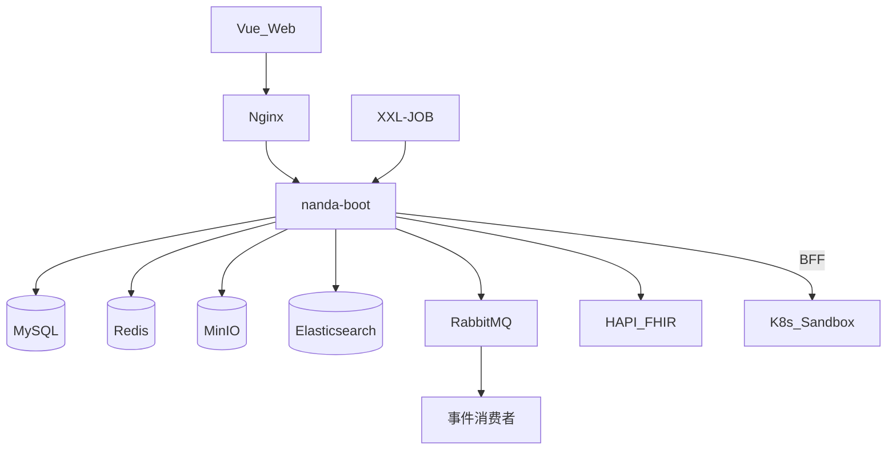

# 一期详细设计（全量）

> **文档编号**：DD-06  
> **分期**：一期 · 全量（233 REQ）  
> **上游**：[FD-10 一期实施设计](../design/10-分期实施设计.md) · [08-技术架构 §10](../design/08-技术架构推荐.md)

---

## 1. 文档说明与前置依赖

| 项 | 内容 |
| --- | --- |
| 目标 | **完整可上线**闭环：多源采集（含 HL7/准实时）→ 治理（含元数据血缘）→ 三类专病+共病入库 → 科研协作 → ES 检索与 CDISC 导出 → 风险/PDF/知识库/驾驶舱 → K8s 沙箱 Web IDE |
| 前置 | 功能设计 FD-00~09、模块 DD-platform~integration、DD-sandbox |
| REQ | **233 REQ 全量**，详见 [FD-10 §3](../design/10-分期实施设计.md#3-req-实施范围总表一期全量) |

---

## 2. 范围与模块交付

### 2.1 模块交付

| 模块 | Maven | 一期交付 | DD |
| --- | --- | --- | --- |
| platform | nanda-platform | 机构/用户/RBAC/JWT/审计/加密 L0~L3、共病 L3 审批 | [DD-platform](./DD-platform.md) |
| ingestion | nanda-ingestion | JDBC/文件/HL7/T+1/T+7/历史批量/准实时 Webhook/DICOM | [DD-ingestion](./DD-ingestion.md) |
| governance | nanda-governance | CRF/字典/清洗/发布/元数据血缘 | [DD-governance](./DD-governance.md) |
| asset | nanda-asset | EMPI + **三类专病** + 共病库 + 知识库 + 质控 + 补录 + 驾驶舱/360 | [DD-asset](./DD-asset.md) |
| research | nanda-research | 项目/队列/随访/多项目协作 | [DD-research](./DD-research.md) |
| analytics | nanda-analytics | ES 检索、风险模型、共病网络、PDF、统计、业务分析、仪表盘、CDISC | [DD-analytics](./DD-analytics.md) |
| integration | nanda-integration | 分中心 upload、FHIR R4、writeback | [DD-integration](./DD-integration.md) |
| sandbox | sandbox/ | K8s Web IDE + 算法库 + 脚本模板 | [DD-sandbox](./DD-sandbox.md) |

### 2.2 中间件（一期全栈）

MySQL 8（主从/三库可选）· Redis 哨兵 · MinIO · Elasticsearch · RabbitMQ · XXL-JOB · HAPI FHIR · K8s Sandbox

---

## 3. BR/REQ 矩阵

233 REQ 全量覆盖，按模块见 [FD-10 §3](../design/10-分期实施设计.md#3-req-实施范围总表一期全量)。核心域：

- **platform**：REQ-20-*、REQ-05-07-01~09
- **ingestion**：REQ-01-01-01~09
- **governance**：REQ-01-02/03、REQ-05-03、REQ-05-04
- **asset**：REQ-01-04、REQ-05-01、REQ-05-02、REQ-05-05、REQ-05-06
- **research**：REQ-17/18/19
- **analytics**：REQ-10/11/13/14 全量
- **integration**：upload、FHIR、writeback、共病回传协同

---

## 4. 架构

---

## 5. 模块交付矩阵

| 能力 | 类/服务 | 表/API |
| --- | --- | --- |
| 登录鉴权 | AuthService, JwtFilter | sys_* · POST /auth/login |
| 采集 | SyncJobService, Hl7Adapter, WebhookAdapter, DicomAdapter | stg_* · XXL syncJobT1/T7 |
| CRF/清洗/发布/血缘 | CRFDesignService, PublishingPipeline, MetadataService | gov_* · BP-01 |
| EMPI | EmpiMatchService | empi_* · FLOW-AST-001 |
| 三类专病 | SpecialtyPatientService | pub_specialty_*（METABOLIC/CARDIO/RESPIRATORY） |
| 共病库 | ComorbidityRuleEngine, ViewRefreshJob | pub_comorbidity_* |
| 知识库 | KnowledgeDocumentService | pub_knowledge_* |
| 驾驶舱/360 | CockpitController, Patient360Service | REQ-05-02-19~29 |
| 质控/补录 | QcService, SupplementService | qc_* · BP-02/03 |
| 科研协作 | ProjectService, CohortService, CollaborationService | res_* · BP-05 |
| ES 检索 | SearchExecutorEs, IndexSyncConsumer | idx_* · ES `nanda-search-{orgId}` |
| 导出/CDISC | ExportApprovalService, CdiscExportAdapter | ana_* · BP-04 |
| 风险/PDF | RiskCalculatorFactory, PdfReportGenerator | ana_risk_assessment, ana_report |
| 统计/仪表盘 | StatMethodRegistry, DashboardService | REQ-14-* |
| 沙箱 IDE | SandboxBffController, K8sKernelOperator | ana_sandbox_* · FD-09 |
| FHIR/回写 | FhirResourceProvider, WritebackClient | int_* |

---

## 6. 数据库（一期全表）

| 前缀 | 一期启用 | 说明 |
| --- | --- | --- |
| sys_* | 全部 | 平台 |
| stg_* | 全部 | Staging（含 webhook_subscription） |
| gov_* | 全部 | 含 gov_metadata_* 血缘 |
| empi_* | 全部 | EMPI |
| pub_specialty_* | 全部 | 三类专病 |
| pub_comorbidity_* | 全部 | 共病规则/视图 |
| pub_knowledge_* | 全部 | 知识库 |
| qc_* / pub_data_change_log | 全部 | 质控/补录 |
| res_* | 全部 | 科研 |
| ana_* / idx_* | 全部 | 含 report/dashboard/risk/script_template |
| ana_sandbox_* | 全部 | 沙箱会话/数据集 |
| int_* | 全部 | upload/FHIR/writeback/endpoint |

详见 [02-数据库设计说明 §3](./02-数据库设计说明.md)。可选三库拆分：`nanda_staging` / `nanda_core` / `nanda_system`。

---

## 7. API（一期全量）

| FD-04 章节 | API |
| --- | --- |
| §4.1 | /auth/*, /orgs/*, /users/* |
| §4.2~4.4 | /ingestion/*, /staging/*, /ingestion/webhook/*, /ingestion/dicom/* |
| §4.7~4.8 | /dictionaries/*, /crf/*, /cleaning/*, /publish/*, /metadata/* |
| §4.6/§4.9 | /empi/*, /specialty/patients/*, /comorbidity/*, /knowledge/* |
| §4.10~4.11 | /cockpit/*, /patients/{id}/360, /timeline, /qc/*, /supplement/* |
| §4.12~4.22 | /search/*, /export/*（含 CDISC）, /risk-models/*, /reports/*, /dashboards/*, /analytics/*, /sandbox/* |
| §4.19 | /integration/upload, /integration/fhir/*, /integration/writeback |
| §4.17 | /projects/*, /cohorts/*, /follow-ups/* |

---

## 8. 领域事件与 Job（一期）

**RabbitMQ 全量启用** [DD-04 §2](./04-领域事件与异步设计.md)：

| 事件 | 一期 |
| --- | --- |
| StagingBatchReceived → CleaningCompleted | ● |
| DataPublished → ComorbidityViewRefresh | ● |
| DataPublished → IndexSyncRequired | ● |
| DictionaryChanged | ● |
| ExportSubmitted/Approved | ● |
| RealtimeBatchReceived | ● |

**XXL-JOB**：syncJobT1, syncJobT7, publishRetryJob, qcMonthlyReport, cohortDynamicSync, followUpReminder, comorbidityFullRefresh, indexFullRebuild

---

## 9. 业务流程可用性

| BP | 一期能力 |
| --- | --- |
| BP-01 | ● 多源采集（含 HL7/准实时）→ 清洗 → EMPI → 三类专病+共病入库 + MQ 异步 |
| BP-02 | ● CRF 录入 + 双屏补录 |
| BP-03 | ● 六维质控 + 跨专病比对 + 复核闭环 |
| BP-04 | ● ES 检索 + 导出审核（Excel/CSV/CDISC） |
| BP-05 | ● 项目/队列/随访 + 多项目协作 |
| BP-06 | ● K8s 沙箱 Web IDE + 共病网络/因果 + 脚本模板 |
| BP-07 | ● 10 类风险模型 + PDF 评估报告 |
| BP-08 | ● FHIR R4 读 + 外部回传 + 共病 payload |
| BP-09 | ● 知识库 + 驾驶舱/360/时间轴/溯源 |

---

## 10. 部署与环境

| 环境 | 配置 |
| --- | --- |
| dev | Docker Compose：MySQL + Redis + MinIO + ES + MQ + Boot + Sandbox |
| test | + XXL-JOB + FHIR + K8s Sandbox Namespace |
| prod | Boot 多实例 + Nginx + MySQL 主从 + ES 集群 + MQ 镜像队列 + K8s Pod 隔离 |

---

## 11. 验收标准

- [ ] **233 REQ** 全量测试通过
- [ ] BP-01~09 主路径演示（含 科研→检索→风险报告→外部回传 链路）
- [ ] ES 检索与 MySQL 结果一致性
- [ ] 共病规则刷新延迟 < 5min（MQ）
- [ ] 10 风险模型抽样验证
- [ ] CDISC ODM 样例文件验证
- [ ] K8s 沙箱逃逸测试 + 300 并发压测
- [ ] FHIR Patient/Observation 联调
- [ ] 三类专病 + 共病库数据闭环

---

## 12. 里程碑与排期

| 序号 | 工作包 | 依赖 | FD-10 里程碑 |
| --- | --- | --- | --- |
| W1 | platform + common + boot | — | M1 |
| W2 | ingestion + governance | W1 | M1 |
| W3 | asset（EMPI+三类专病+共病+知识库） | W2 | M1~M2 |
| W4 | MQ + ES + 索引同步 | W3 | M2 |
| W5 | research + analytics 检索导出 + CDISC | W4 | M3 |
| W6 | 风险/PDF/业务分析/仪表盘 | W5 | M4 |
| W7 | integration FHIR/writeback | W3 | M4 |
| W8 | K8s 沙箱 + 脚本模板 + 准实时/DICOM | W5 | M5 |
| W9 | 全链路联调与压测 | W1~W8 | 一期验收 |

---

## 13. 修订记录

| 版本 | 日期 | 说明 |
| --- | --- | --- |
| V1.0 | 2026-05-27 | 初版（P0 MVP 子集） |
| V2.0 | 2026-05-27 | 合并原二/三期：233 REQ 全量一期 |
