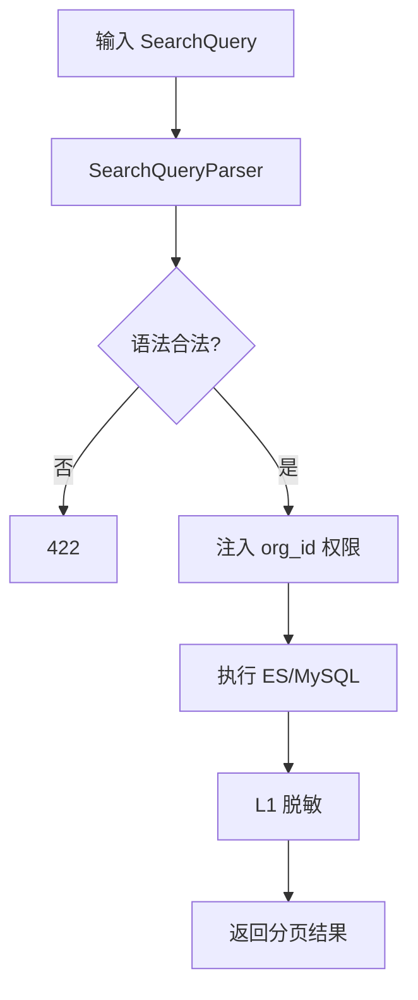
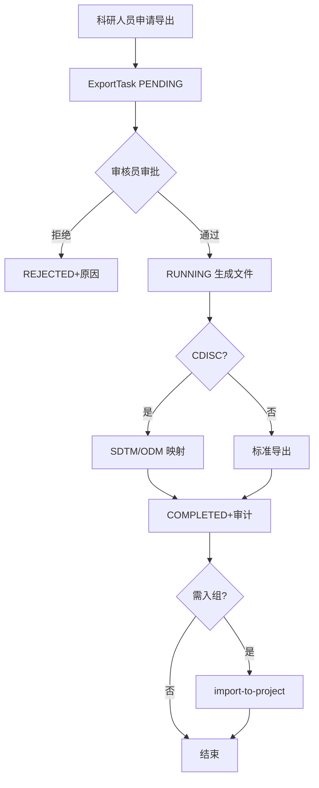
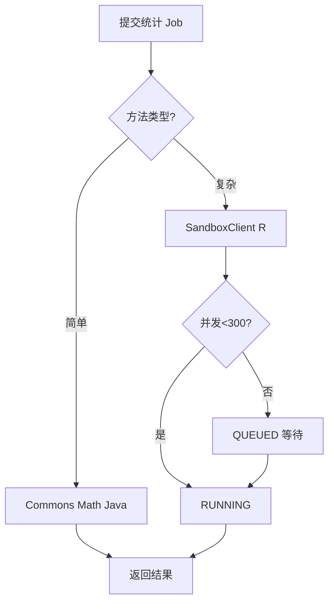
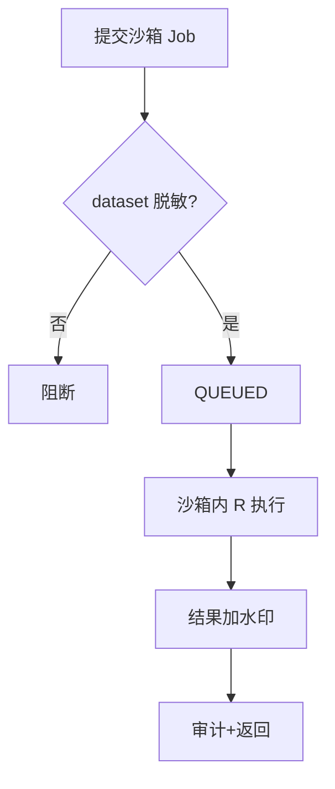
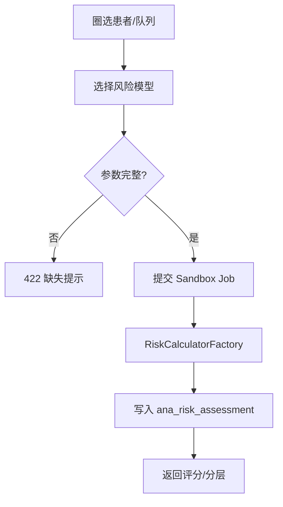
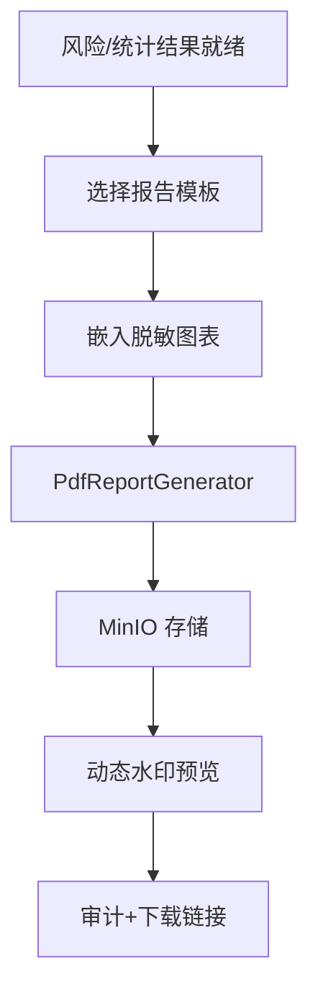

# 详细设计：分析应用模块（nanda-analytics）

> **PRD**：[PRD-analytics](../prd/PRD-analytics.md) · **REQ**：84

---

## 1. 模块架构

```
com.nanda.analytics/
├── search/       SearchController, SearchQueryParser, SearchExecutor
├── export/       ExportController, ExportApprovalService
├── statistics/   StatisticsController, StatMethodRegistry
├── risk/         RiskModelController, RiskCalculatorFactory
├── sandbox/      SandboxController, SandboxClient, AlgorithmRegistry
├── report/       ReportController, PdfReportGenerator
├── dashboard/    DashboardController
└── index/        IndexSyncWorker, SearchDocumentBuilder
```

---

## 2. 类设计

| 类 | 职责 |
| --- | --- |
| SearchQueryParser | query_json DSL → SQL/ES Query |
| SearchExecutor | MVP MySQL；P1 Elasticsearch |
| ExportApprovalService | 提交→审核→生成文件 |
| StatMethodRegistry | 25+ 统计方法注册与路由 |
| RiskCalculatorFactory | PREVENT/ASCVD/Framingham 等 10 模型 |
| SandboxClient | RestTemplate 调用 Python 沙箱 |
| PdfReportGenerator | PDFBox 报告 + 图表嵌入 |

---

## 3. 数据库设计

```sql
CREATE TABLE ana_search_query (
  id BIGINT NOT NULL PRIMARY KEY,
  query_name VARCHAR(128),
  query_json JSON NOT NULL,
  scope VARCHAR(32) COMMENT 'ALL/ORG/PROJECT/COHORT',
  scope_id BIGINT,
  user_id BIGINT NOT NULL,
  org_id BIGINT,
  created_at DATETIME NOT NULL DEFAULT CURRENT_TIMESTAMP
);

CREATE TABLE ana_export_task (
  id BIGINT NOT NULL PRIMARY KEY,
  search_query_id BIGINT,
  export_format VARCHAR(16) COMMENT 'CSV/EXCEL/CDISC/ODM',
  export_scope_json JSON,
  status VARCHAR(32) DEFAULT 'DRAFT',
  approver_id BIGINT,
  approved_at DATETIME,
  user_id BIGINT NOT NULL,
  org_id BIGINT NOT NULL,
  KEY idx_status (status, created_at)
);

CREATE TABLE idx_search_document (
  id BIGINT NOT NULL PRIMARY KEY,
  empi_id BIGINT NOT NULL,
  org_id BIGINT NOT NULL,
  specialty_types JSON,
  diagnosis_codes JSON,
  lab_values JSON,
  demographics JSON,
  completeness_score DECIMAL(5,2),
  updated_at DATETIME,
  KEY idx_org (org_id),
  KEY idx_empi (empi_id)
);

CREATE TABLE ana_analytics_job (
  id BIGINT NOT NULL PRIMARY KEY,
  job_type VARCHAR(32) COMMENT 'STAT/SANDBOX/RISK',
  method_code VARCHAR(64),
  input_json JSON,
  status VARCHAR(16) DEFAULT 'QUEUED',
  sandbox_job_id VARCHAR(64),
  user_id BIGINT,
  org_id BIGINT,
  KEY idx_queue (status, created_at)
);

CREATE TABLE ana_analytics_result (
  id BIGINT NOT NULL PRIMARY KEY,
  job_id BIGINT NOT NULL,
  result_json JSON,
  chart_refs JSON,
  created_at DATETIME NOT NULL
);

CREATE TABLE ana_risk_assessment (
  id BIGINT NOT NULL PRIMARY KEY,
  empi_id BIGINT,
  model_code VARCHAR(32),
  input_json JSON,
  result_json JSON,
  risk_level VARCHAR(16),
  assessed_at DATETIME
);
```

---

## 4. API 详细设计

### 4.1 检索（FD-04 §12）

**POST /api/v1/search/execute**

Request `query_json` 结构：
```json
{
  "operator": "AND",
  "conditions": [
    {"field": "diagnosis_code", "op": "eq", "value": "E11"},
    {"field": "hba1c", "op": "gte", "value": 7.0}
  ],
  "nested": []
}
```

**POST /api/v1/search/count-nodes** — 各节点患者数（REQ-10-02-07）

### 4.2 导出（FD-04 §12）

| 路径 | 说明 |
| --- | --- |
| POST /export/tasks | 创建 |
| POST /export/tasks/{id}/submit | 提交审核 |
| POST /export/tasks/{id}/approve | 审批 |
| GET /export/tasks/{id}/download | 下载（审计） |

### 4.3 统计（FD-04 §13）

**POST /api/v1/analytics/statistics/{method}**

method 枚举：`descriptive_continuous`, `t_test_independent`, `chi_square`, `kaplan_meier`, `cox_regression` 等（REQ-14-01-01~25）。

### 4.4 风险模型（FD-04 §14）

**POST /api/v1/risk-models/{modelCode}/assess**

modelCode: `prevent`, `ascvd`, `framingham`, `cha2ds2vasc`, `gold`, `cat`, `bode`, `findrisc`, `charlson`, `elixhauser`

### 4.5 沙箱 Web IDE（FD-04 §15 · FD-09）

| 路径 | 说明 |
| --- | --- |
| POST /sandbox/sessions | 创建 IDE 会话 |
| GET/PUT /sandbox/notebooks/{id} | Notebook CRUD |
| WS /sandbox/ws | Kernel 执行（BFF 转发 Python） |
| POST /sandbox/datasets/mount | 挂载脱敏数据集 |
| POST /sandbox/jobs | 提交分析 |
| GET /sandbox/algorithms | 算法包列表 |

**SandboxBffController** 代理内网 Python；**DatasetMountService** 写 MinIO Parquet；**SandboxClient** OkHttp 调用 ComputePlane。

IDE 嵌入：主应用 `/analytics/sandbox` iframe → `sandbox/frontend`。详见 [DD-sandbox](./DD-sandbox.md)。

---

## 5. 核心业务逻辑

### 5.1 SearchQuery DSL → SQL（MVP）

```java
// MyBatis 动态 SQL + 参数绑定，防注入
// 跨病种：JOIN pub_specialty_patient + pub_comorbidity_view
```

### 5.2 统计方法注册表

```java
public interface StatMethod {
    String code();
    StatResult execute(StatInput input);
}
// Spring 注入 List<StatMethod> → StatMethodRegistry
```

简单统计 Java（Commons Math）；生存/Cox 等复杂方法走沙箱。

### 5.3 沙箱安全（REQ-14-04-*）

- 300 并发：`ana_analytics_job` QUEUED + 线程池
- 数据不出库：沙箱仅接收聚合/脱敏数据集 ID
- 水印：结果 PDF/图表嵌入 userId+timestamp
- 审核导出：BP-04

### 5.4 索引同步

`DataPublished` → `SearchDocumentBuilder` → UPSERT `idx_search_document` → P1 同步 ES。

---

## 6. 状态机

- **ExportTask**：见 [04-领域事件 §4.2](./04-领域事件与异步设计.md)
- **AnalyticsJob**：QUEUED → RUNNING → SUCCEEDED/FAILED

---

## 7. 安全

- 导出独立权限 DR-05
- 科研人员 RW* 需审核
- `analytics:search:execute`, `analytics:export:approve`

---

## 8. 缓存

| Key | TTL |
| --- | --- |
| `search:suggest:{prefix}` | 10min |
| `stat:result:{jobId}` | 1h |

---

## 13. 业务规则详述

### 13.1 检索

| 规则编号 | 场景 | 前置条件 | 规则描述 | 后置/状态 | 异常处理 | 关联 REQ |
| --- | --- | --- | --- | --- | --- | --- |
| RULE-ANL-001 | SearchQuery DSL | 合法 JSON | 支持 term/range/bool/nested；解析→ES/MySQL | 查询结果 | 422 语法错误 | REQ-10-01-01~06 |
| RULE-ANL-002 | 高级检索 | 科研人员 | 组合条件+保存模板 | 模板持久化 | — | REQ-10-02-01~04 |
| RULE-ANL-003 | 联想/热词 | prefix 输入 | suggest 缓存 10min | 联想列表 | — | REQ-10-02-05~07 |
| RULE-ANL-004 | 数据权限 | org_id 过滤 | DR-04 注入 scope | 过滤后结果 | 403 | REQ-10-01-07 |

### 13.2 导出

| 规则编号 | 场景 | 前置条件 | 规则描述 | 后置/状态 | 异常处理 | 关联 REQ |
| --- | --- | --- | --- | --- | --- | --- |
| RULE-ANL-005 | 导出申请 | RW* 角色 | 创建 ExportTask PENDING | 待审核 | — | REQ-10-03-01~03 |
| RULE-ANL-006 | 导出审核 | 审核员 | 通过→RUNNING；拒绝→REJECTED | BP-04 | 审计 | REQ-10-03-04~06 |
| RULE-ANL-007 | CDISC | 导出格式 CDISC | SDTM/ODM 映射 | 文件生成 | 422 字段缺失 | REQ-10-04-01~04 |
| RULE-ANL-008 | 入组联动 | 导出完成 | import-to-project 调用 research | 批量入组 | — | REQ-10-05-06 |

### 13.3 统计与风险

| 规则编号 | 场景 | 前置条件 | 规则描述 | 后置/状态 | 异常处理 | 关联 REQ |
| --- | --- | --- | --- | --- | --- | --- |
| RULE-ANL-009 | 统计方法 | method 注册 | StatMethodRegistry 路由 Java/沙箱 | 结果 job | 不支持 422 | REQ-14-01-01~28 |
| RULE-ANL-010 | 风险计算 | 模型配置 | RiskCalculatorFactory 多模型 | 风险评分 | — | REQ-11-01-01~10 |
| RULE-ANL-011 | 业务分析 | 预设模板 | 专病/共病分析模板 | 报表 | — | REQ-14-02-01~07 |
| RULE-ANL-012 | 仪表盘 | 运营角色 | 指标聚合+刷新 | Dashboard | — | REQ-14-03-01~02 |

### 13.4 沙箱

| 规则编号 | 场景 | 前置条件 | 规则描述 | 后置/状态 | 异常处理 | 关联 REQ |
| --- | --- | --- | --- | --- | --- | --- |
| RULE-ANL-013 | 并发限制 | 300 并发 | QUEUED 排队+线程池 | RUNNING | 429 排队 | REQ-14-04-01 |
| RULE-ANL-014 | 数据不出库 | 沙箱 Job | 仅聚合/脱敏 datasetId | 沙箱内计算 | 阻断原始导出 | REQ-14-04-02 |
| RULE-ANL-015 | 水印 | 结果输出 | PDF/图表嵌入 userId+timestamp | 水印文件 | — | REQ-14-04-03~05 |
| RULE-ANL-016 | 共病分析 | 沙箱 R | 复杂统计走 SandboxClient | SUCCEEDED | 失败重试 | REQ-11-02-01~05 |

> RULE-ANL-017~035 覆盖报告生成、索引同步、检索权限细分等，与上述规则组合覆盖 analytics 84 项 REQ。

---

## 14. 业务流程图

> 衔接 [BP-04 检索与数据导出](../design/05-业务流程设计.md#5-bp-04-检索与数据导出)、[BP-06 沙箱分析](../design/05-业务流程设计.md#7-bp-06-沙箱分析)、[BP-07 风险评估与评估报告](../design/05-业务流程设计.md#8-bp-07-风险评估与评估报告)。

### 14.1 FLOW-ANL-001 检索构建



### 14.2 FLOW-ANL-002 导出审核 BP-04



### 14.3 FLOW-ANL-003 统计执行



### 14.4 FLOW-ANL-004 沙箱分析 BP-06



### 14.5 FLOW-ANL-005 风险模型执行 BP-07



### 14.6 FLOW-ANL-006 PDF 报告生成 BP-07



---

## 15. REQ 追溯矩阵（84 项）

| 子域 | REQ | 实现 |
| --- | --- | --- |
| 检索 | REQ-10-01-01 ~ REQ-10-02-07 | SearchQueryParser |
| 导出 | REQ-10-03-01 ~ REQ-10-05-06 | ExportApprovalService |
| 风险 | REQ-11-01-01~10 | RiskCalculatorFactory |
| 共病分析 | REQ-11-02-01~05 | SandboxClient |
| 沙箱 | REQ-11-03-01~04, REQ-14-04-01~05 | SandboxController |
| 报告 | REQ-13-01-01~02 | PdfReportGenerator |
| 统计 | REQ-14-01-01~28 | StatMethodRegistry |
| 业务分析 | REQ-14-02-01~07 | 预设模板 |
| 仪表盘 | REQ-14-03-01~02 | DashboardController |

REQ-13-01-03/04 见 DD-integration。完整列表见 [PRD-analytics 附录 A](../prd/PRD-analytics.md)。
