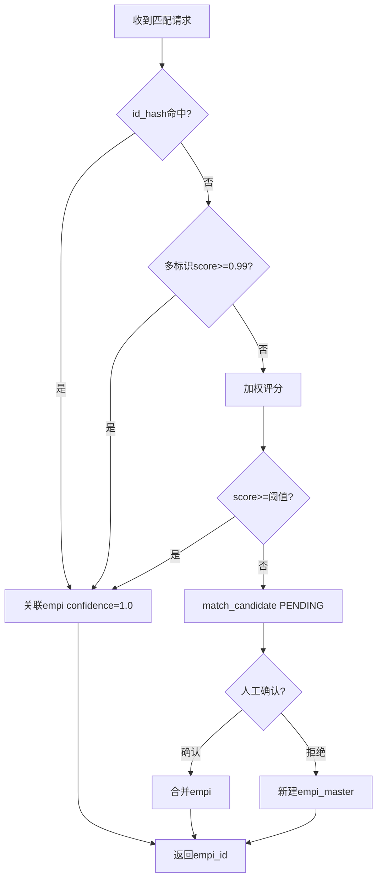
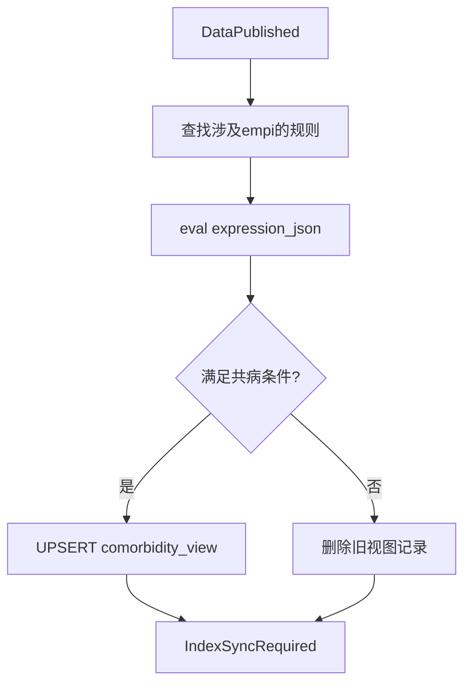
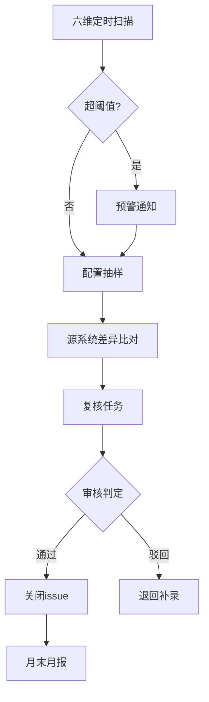
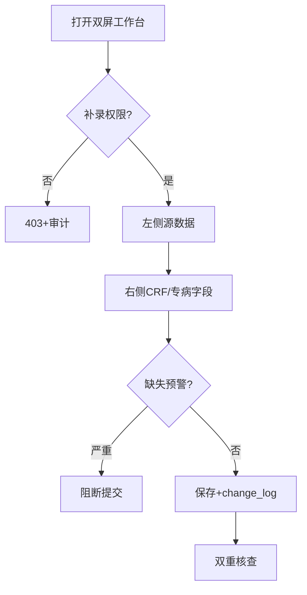
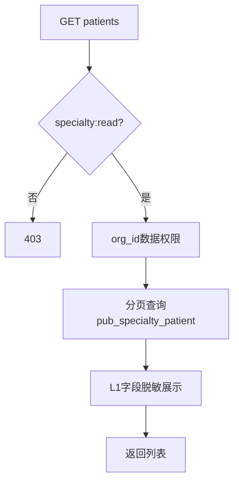
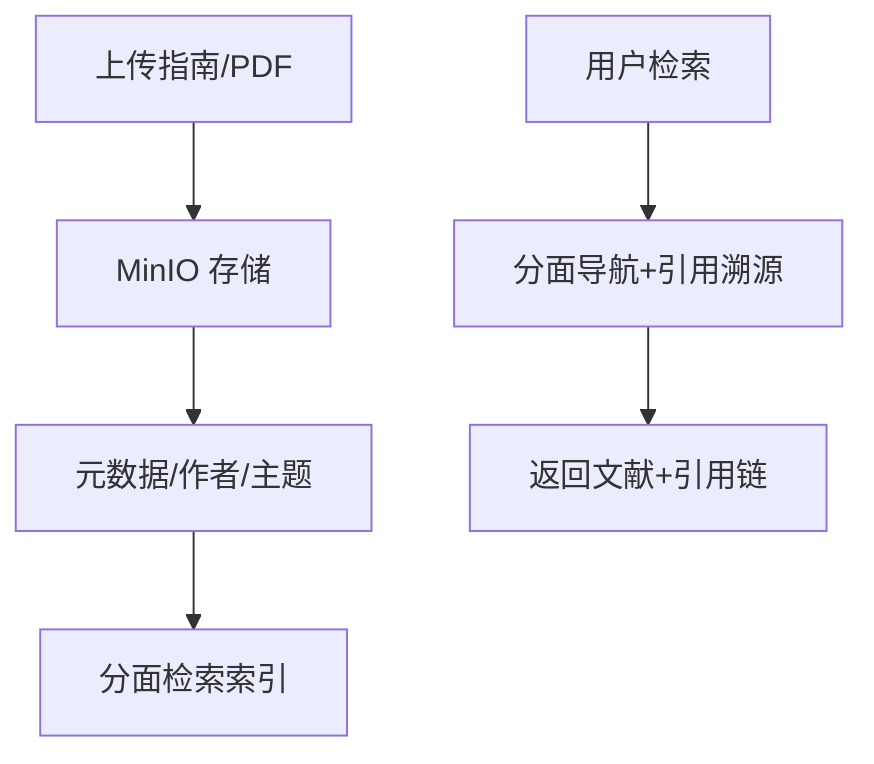
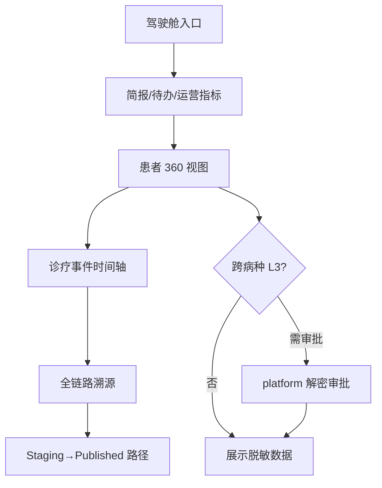

# 详细设计：数据资产模块（nanda-asset）

> **PRD**：[PRD-asset](../prd/PRD-asset.md) · **REQ**：57

---

## 1. 模块架构

```
com.nanda.asset/
├── empi/           EmpiController, EmpiMatchService, MatchScoreCalculator
├── specialty/      SpecialtyPatientController, SpecialtyOverviewService
├── comorbidity/    ComorbidityController, ComorbidityViewRefresher
├── knowledge/      KnowledgeController, KnowledgeImportService
├── quality/        QualityController, QcSampleService, QcReviewService
├── supplement/     SupplementController, DualScreenEntryService
└── listener/       DataPublishedListener, ComorbidityRefreshListener
```

---

## 2. 类设计

| 类 | 职责 |
| --- | --- |
| EmpiMatchService | 精确 id_hash → 加权模糊 → 候选队列 |
| MatchScoreCalculator | 姓名+生日+电话+地址权重，阈值可配置 |
| SpecialtyPatientService | 专病 CRUD、360、时间轴 |
| ComorbidityViewRefresher | 规则求值 + 物化 pub_comorbidity_view |
| QcSampleService | 六维指标、抽样、源系统比对 |
| SupplementService | 双屏补录、变更日志 pub_data_change_log |

---

## 3. 数据库设计

### 3.1 EMPI

```sql
CREATE TABLE empi_master (
  id BIGINT NOT NULL PRIMARY KEY,
  display_name VARCHAR(64),
  gender VARCHAR(8),
  birth_date DATE,
  merge_status VARCHAR(16) DEFAULT 'ACTIVE',
  merged_to_id BIGINT,
  match_confidence DECIMAL(5,4),
  org_id BIGINT,
  created_at DATETIME NOT NULL DEFAULT CURRENT_TIMESTAMP,
  KEY idx_merge (merge_status)
);

CREATE TABLE empi_identifier (
  id BIGINT NOT NULL PRIMARY KEY,
  empi_id BIGINT NOT NULL,
  id_type VARCHAR(32) NOT NULL,
  id_value_enc VARCHAR(512) NOT NULL,
  id_hash VARCHAR(64) NOT NULL,
  source_system VARCHAR(64),
  is_primary TINYINT DEFAULT 0,
  UNIQUE KEY uk_type_hash (id_type, id_hash),
  KEY idx_empi (empi_id)
);

CREATE TABLE empi_match_candidate (
  id BIGINT NOT NULL PRIMARY KEY,
  source_record_id BIGINT,
  candidate_empi_id BIGINT,
  match_score DECIMAL(5,4),
  match_features JSON,
  review_status VARCHAR(16) DEFAULT 'PENDING',
  reviewer_id BIGINT,
  KEY idx_pending (review_status, created_at)
);
```

### 3.2 专病库

```sql
CREATE TABLE pub_specialty_patient (
  id BIGINT NOT NULL PRIMARY KEY,
  empi_id BIGINT NOT NULL,
  specialty_type VARCHAR(32) NOT NULL,
  org_id BIGINT NOT NULL,
  template_id BIGINT,
  core_fields JSON,
  extended_fields JSON,
  status VARCHAR(16) DEFAULT 'ACTIVE',
  first_diagnosis_date DATE,
  created_at DATETIME NOT NULL DEFAULT CURRENT_TIMESTAMP,
  updated_at DATETIME NOT NULL DEFAULT CURRENT_TIMESTAMP ON UPDATE CURRENT_TIMESTAMP,
  deleted TINYINT NOT NULL DEFAULT 0,
  KEY idx_empi_type (empi_id, specialty_type),
  KEY idx_org_type (org_id, specialty_type, deleted)
);
```

子域表：`pub_specialty_medical_record`, `pub_specialty_lab_exam`, `pub_specialty_treatment`, `pub_specialty_follow_up`, `pub_specialty_template`, `pub_specialty_attachment`。

### 3.3 共病库

```sql
CREATE TABLE pub_comorbidity_rule (
  id BIGINT NOT NULL PRIMARY KEY,
  rule_name VARCHAR(128) NOT NULL,
  expression_json JSON NOT NULL,
  time_window_json JSON,
  status VARCHAR(16) DEFAULT 'ACTIVE'
);

CREATE TABLE pub_comorbidity_view (
  id BIGINT NOT NULL PRIMARY KEY,
  rule_id BIGINT NOT NULL,
  empi_id BIGINT NOT NULL,
  specialty_record_ids JSON,
  comorbidity_labels JSON,
  refresh_version INT,
  refreshed_at DATETIME,
  UNIQUE KEY uk_rule_empi (rule_id, empi_id)
);
```

### 3.4 质控与补录

`qc_metric_snapshot`, `qc_sample_batch`, `qc_sample_record`, `qc_review_task`, `qc_monthly_report`, `pub_data_change_log`。

### 3.5 知识库

`pub_knowledge_document`, `pub_knowledge_citation`, `pub_knowledge_author`, `pub_knowledge_tag`。

---

## 4. API 详细设计（FD-04 §6、§9~11）

| 分组 | 路径示例 | 说明 |
| --- | --- | --- |
| EMPI | GET /empi/patients/{id}/timeline | 就诊时间轴 |
| EMPI | POST /empi/match-candidates/{id}/confirm | 人工确认 |
| 专病 | GET /specialty/{type}/patients | 分页列表 |
| 专病 | GET /specialty/{type}/patients/{id}/360 | 360 视图 |
| 专病 | GET /specialty/cockpit/summary | 驾驶舱 |
| 共病 | GET /comorbidity/views | 规则视图列表 |
| 质控 | GET /quality/dashboard | 六维仪表盘 |
| 补录 | POST /quality/supplement/dual-screen | 双屏录入 |

**type 枚举**：`metabolic` | `cardio_cerebrovascular` | `respiratory`

---

## 5. 核心业务逻辑

### 5.1 EMPI 匹配（≥99.8%）

```
1. id_hash 精确 → confidence=1.0, 直接关联
2. 多标识交叉（身份证+姓名+生日）→ ≥0.99
3. 加权模糊 → score = w1*name + w2*phone + w3*address
4. score < threshold → empi_match_candidate PENDING
5. 无匹配 → 新建 empi_master
```

权重配置：`empi_match_rule.rule_json`。

### 5.2 共病视图刷新

- 监听 `DataPublished`
- 对 empi_id 涉及规则增量 eval `expression_json`
- UPSERT `pub_comorbidity_view`

### 5.3 质控 BP-03

六维指标 → 抽样 → 源系统 diff → 复核任务 → 月报 Job。

### 5.4 补录 BP-02

双屏：左侧源数据，右侧 CRF；变更写 `pub_data_change_log` + 审计。

---

## 6. 状态机

- **empi_match_candidate**：PENDING → CONFIRMED/REJECTED
- **qc_review_task**：OPEN → IN_REVIEW → CLOSED
- **empi_master.merge_status**：ACTIVE → MERGED

---

## 7. 安全

| 字段 | 级别 |
| --- | --- |
| empi_identifier.id_value_enc | L1 |
| core_fields 内基因/介入等 | L2 |
| 跨病种联合查询 | L3 + 审批 |

权限：`asset:empi:*`, `asset:specialty:*`, `asset:qc:*`, `asset:supplement:*`

---

## 8. 缓存

| Key | 内容 |
| --- | --- |
| `specialty:overview:{type}:{orgId}` | 概览统计 5min |
| `empi:rules` | 匹配规则 1h |

---

## 9. 领域事件

| 发布 | 说明 |
| --- | --- |
| ComorbidityViewRefresh | 共病刷新 |
| QualityIssueDetected | 质控问题 |
| IndexSyncRequired | 触发 analytics 索引 |

---

## 13. 业务规则详述

### 13.1 EMPI

| 规则编号 | 场景 | 前置条件 | 规则描述 | 后置/状态 | 异常处理 | 关联 REQ |
| --- | --- | --- | --- | --- | --- | --- |
| RULE-AST-001 | 精确匹配 | id_hash 命中 | confidence=1.0，直接关联 empi_id | MATCHED | — | REQ-01-04-03 |
| RULE-AST-002 | 多标识交叉 | 身份证+姓名+生日 | score≥0.99 自动关联 | MATCHED | — | REQ-01-04-03 |
| RULE-AST-003 | 模糊匹配 | 加权特征 | score≥阈值自动；否则候选队列 | PENDING/ MATCHED | — | REQ-01-04-04 |
| RULE-AST-004 | 人工确认 | candidate PENDING | 确认→合并；拒绝→新建 empi | CONFIRMED/REJECTED | — | REQ-01-04-04 |
| RULE-AST-005 | 准确率 | 标准测试集 | 匹配准确率 ≥99.8% | 监控指标 | 调权重 | REQ-01-04-01,05 |
| RULE-AST-006 | 全景时间轴 | empi_id 有效 | 聚合多源就诊事件按时间排序 | timeline API | — | REQ-01-04-02 |

### 13.2 专病库

| 规则编号 | 场景 | 前置条件 | 规则描述 | 后置/状态 | 异常处理 | 关联 REQ |
| --- | --- | --- | --- | --- | --- | --- |
| RULE-AST-007 | 专病写入 | DataPublished | core_fields+extended_fields 按 template 校验 | pub_specialty_patient | 422 校验失败 | REQ-05-02-01~09 |
| RULE-AST-008 | 专病查询 | org_id+specialty_type | 数据权限过滤；列表分页 | 200 | 403 | REQ-05-02-02 |
| RULE-AST-009 | 360/时间轴 | record_id 存在 | 聚合子域表+溯源链路 | 360 视图 | 404 | REQ-05-02-19~29 |
| RULE-AST-010 | 驾驶舱 | 运营角色 | 简报/待办/导出审计/指标四模块 | 统计数据 | — | REQ-05-02-19~22 |

### 13.3 共病库

| 规则编号 | 场景 | 前置条件 | 规则描述 | 后置/状态 | 异常处理 | 关联 REQ |
| --- | --- | --- | --- | --- | --- | --- |
| RULE-AST-011 | 规则定义 | expression_json 合法 | 支持 AND/OR/时间窗 | rule ACTIVE | 422 | REQ-05-02-10 |
| RULE-AST-012 | 视图刷新 | DataPublished | 增量刷新涉及 empi 的 comorbidity_view | refreshed_at 更新 | 异步重试 | REQ-05-02-11 |
| RULE-AST-013 | 跨病种详情 | 共病 empi | 联邦查询各 specialty 子表 | 详情页 | — | REQ-05-02-17~18 |
| RULE-AST-014 | 外部回传 | 评估完成 | 脱敏摘要经 integration writeback | 回写日志 | — | REQ-05-02-13 |

### 13.4 质控

| 规则编号 | 场景 | 前置条件 | 规则描述 | 后置/状态 | 异常处理 | 关联 REQ |
| --- | --- | --- | --- | --- | --- | --- |
| RULE-AST-015 | 六维扫描 | 定时 Job | 完整率<92%等阈值预警 | qc_metric_snapshot | 通知质控员 | REQ-05-05-01~02 |
| RULE-AST-016 | 抽样 | 策略配置 | 按比例/随机生成样本集 | qc_sample_batch | — | REQ-05-05-03~04 |
| RULE-AST-017 | 差异比对 | 样本选定 | 专病库 vs 源系统并列高亮 | diff 标记 | — | REQ-05-05-05~06 |
| RULE-AST-018 | 复核闭环 | 差异存在 | 在线审核→关闭 issue→月报 | CLOSED | — | REQ-05-05-07~09 |

### 13.5 补录与知识库

| 规则编号 | 场景 | 前置条件 | 规则描述 | 后置/状态 | 异常处理 | 关联 REQ |
| --- | --- | --- | --- | --- | --- | --- |
| RULE-AST-019 | 双屏补录 | 录入员+org 权限 | 左源右表；缺失预警 | 补录数据 | 403 越权 | REQ-05-06-01~03 |
| RULE-AST-020 | 补录追溯 | 任何补录写 | pub_data_change_log+审计；双重核查 | 可追溯 | — | REQ-05-06-06~08 |
| RULE-AST-021 | 补录权限 | 分中心/中心 | 分中心仅本 org；精细化字段级 | — | 403 | REQ-05-06-04~05 |
| RULE-AST-022 | 知识库 | 指南导入 | PDF 入库+引用溯源+分面检索 | knowledge_document | — | REQ-05-01-01~06 |

> RULE-AST-023~045 覆盖三类专病详情、洞察分析、谱系/画像等，与 RULE-AST-007~010 组合覆盖 REQ-05-02 全系列。

---

## 14. 业务流程图

> 衔接 [BP-02](../design/05-业务流程设计.md#3-bp-02-crf-录入与补录)、[BP-03 §4](../design/05-业务流程设计.md#4-bp-03-质控复核闭环)。

### 14.1 FLOW-AST-001 EMPI 患者匹配



### 14.2 FLOW-AST-002 共病视图刷新



### 14.3 FLOW-AST-003 质控复核闭环 BP-03



### 14.4 FLOW-AST-004 双屏补录 BP-02



### 14.5 FLOW-AST-005 专病库患者查询



### 14.6 FLOW-AST-006 知识库导入与检索 BP-09



### 14.7 FLOW-AST-007 患者 360/时间轴/溯源 BP-09



---

## 15. REQ 追溯矩阵（57 项）

| 子域 | REQ | 实现 |
| --- | --- | --- |
| EMPI | REQ-01-04-01~05 | EmpiMatchService, empi_* |
| 知识库 | REQ-05-01-01~06 | KnowledgeController |
| 代谢/心脑血管/呼吸 | REQ-05-02-01~09 | SpecialtyPatientService |
| 共病 | REQ-05-02-10~18 | ComorbidityViewRefresher |
| 驾驶舱/360 | REQ-05-02-19~29 | SpecialtyOverviewService |
| 质控 | REQ-05-05-01~09 | QcSampleService |
| 补录 | REQ-05-06-01~08 | SupplementService |

完整列表见 [PRD-asset 附录 A](../prd/PRD-asset.md)。
