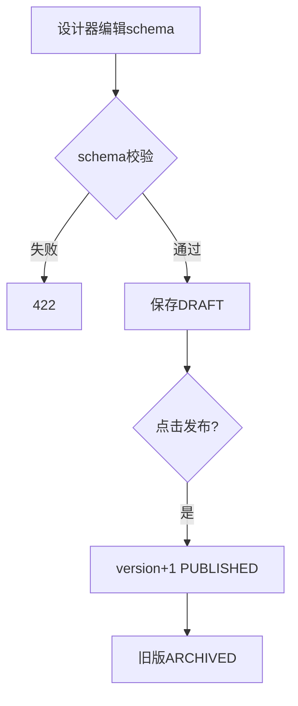
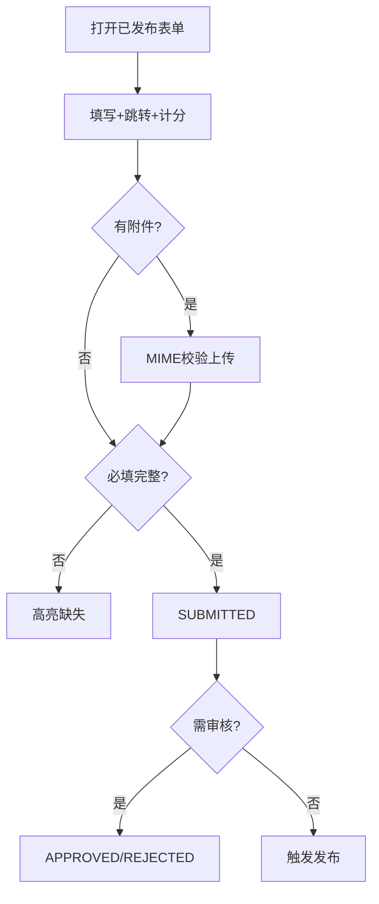
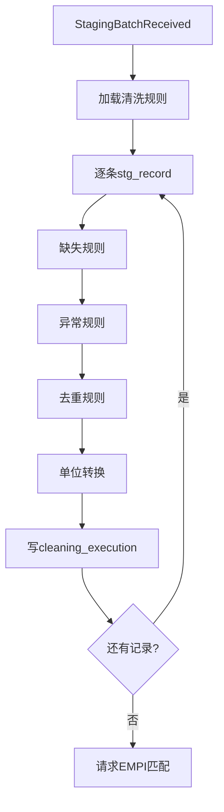
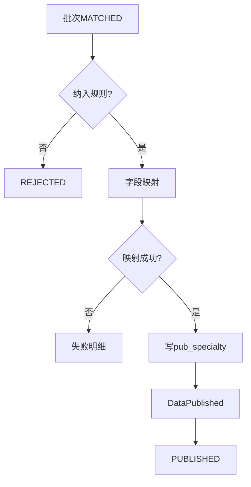

# 详细设计：数据治理模块（nanda-governance）

> **PRD**：[PRD-governance](../prd/PRD-governance.md) · **REQ**：43

---

## 1. 模块架构

```
com.nanda.governance/
├── crf/         CRFDesignController, CRFResponseController, CRFScoreEngine
├── dictionary/  DictionaryController, TerminologyService
├── cleaning/    CleaningRuleController, CleaningEngine
├── publish/     PublishController, PublishingPipeline
├── metadata/    MetadataController, LineageService
└── listener/    StagingBatchListener
```

---

## 2. 类设计

| 类 | 职责 |
| --- | --- |
| CRFScoreEngine | 解析 score_rules_json，计算 CAT/mMRC 等 |
| VisibilityRuleEngine | 逻辑跳转表达式 eval |
| CleaningEngine | 四类规则执行：缺失/异常/重复/单位 |
| TermMappingService | 术语归一化、同义词 |
| PublishingPipeline | 清洗→EMPI→规则校验→写 pub_* |
| PublishRuleEvaluator | publish_rule JSON 求值 |

---

## 3. 数据库设计（核心表）

```sql
CREATE TABLE gov_crf_form (
  id BIGINT NOT NULL PRIMARY KEY,
  form_code VARCHAR(64) NOT NULL,
  form_name VARCHAR(128) NOT NULL,
  specialty_type VARCHAR(32),
  version INT NOT NULL DEFAULT 1,
  schema_json JSON NOT NULL,
  score_rules_json JSON,
  status VARCHAR(16) NOT NULL DEFAULT 'DRAFT',
  published_at DATETIME,
  org_id BIGINT,
  deleted TINYINT NOT NULL DEFAULT 0,
  UNIQUE KEY uk_form_ver (form_code, version, deleted)
);

CREATE TABLE gov_crf_response (
  id BIGINT NOT NULL PRIMARY KEY,
  form_id BIGINT NOT NULL,
  form_version INT NOT NULL,
  empi_id BIGINT,
  project_id BIGINT,
  answers_json JSON,
  scores_json JSON,
  status VARCHAR(16) DEFAULT 'DRAFT',
  submitted_by BIGINT,
  approved_by BIGINT,
  org_id BIGINT NOT NULL,
  KEY idx_empi (empi_id),
  KEY idx_status (status)
);

CREATE TABLE gov_cleaning_rule (
  id BIGINT NOT NULL PRIMARY KEY,
  rule_code VARCHAR(64) NOT NULL,
  rule_type VARCHAR(32) NOT NULL COMMENT 'MISSING/ABNORMAL/DEDUP/UNIT',
  rule_config_json JSON NOT NULL,
  specialty_type VARCHAR(32),
  status VARCHAR(16) DEFAULT 'ACTIVE',
  org_id BIGINT,
  deleted TINYINT NOT NULL DEFAULT 0
);

CREATE TABLE gov_publish_rule (
  id BIGINT NOT NULL PRIMARY KEY,
  rule_name VARCHAR(128) NOT NULL,
  specialty_type VARCHAR(32) NOT NULL,
  inclusion_json JSON NOT NULL,
  field_mapping_id BIGINT,
  org_id BIGINT,
  deleted TINYINT NOT NULL DEFAULT 0
);

CREATE TABLE gov_dict_field_metadata (
  id BIGINT NOT NULL PRIMARY KEY,
  field_code VARCHAR(64) NOT NULL UNIQUE,
  field_name_zh VARCHAR(128),
  data_type VARCHAR(32),
  value_domain_json JSON,
  crf_question_type VARCHAR(32),
  specialty_types JSON,
  deleted TINYINT NOT NULL DEFAULT 0
);
```

字典表 `gov_dict_diagnosis/treatment/lab_exam/symptom`、术语表 `gov_terminology/term_mapping/term_synonym`、元数据 `gov_metadata_*` 结构见 FD-03 §5、§9。

---

## 4. API 详细设计

| FD-04 | 资源 | 核心 DTO |
| --- | --- | --- |
| §8.1 | /crf/forms | CRFSchemaDTO: groups[], questions[] |
| §8.2 | /crf/responses | CRFSubmitDTO: formId, empiId, answers |
| §7 | /dictionaries/*, /cleaning-rules | DictItemDTO, CleaningRuleDTO |
| §4 | /publish/rules, /publish/tasks | PublishRuleDTO, PublishExecuteDTO |
| §5 | /metadata/catalog, /metadata/lineage | LineageQuery |

**CRF 题型枚举**（schema_json.question.type）：single_choice, multi_choice, text, number, date, datetime, scale, matrix, attachment, calculated 等 ≥10 种。

---

## 5. 核心业务逻辑

### 5.1 清洗引擎

```
for record in batch:
  apply MISSING rules → mark/fill
  apply ABNORMAL → flag/threshold
  apply DEDUP → merge key
  apply UNIT → convert
  write gov_cleaning_execution trace
```

### 5.2 CRF 计分

```java
public Map<String, BigDecimal> calculateScores(CrfForm form, Map answers) {
  // score_rules_json: [{scale:"CAT", items:["q1","q2"], formula:"sum"}]
}
```

### 5.3 发布流水线

1. 消费 `StagingBatchReceived`
2. CleaningEngine 执行
3. 调用 asset EmpiMatchService
4. PublishRuleEvaluator 校验
5. 写 `pub_specialty_*`
6. 发布 `DataPublished`

### 5.4 字典联动

字典变更 → `DictionaryChanged` → 刷新 CRF 校验缓存、字段元数据。

---

## 6. 状态机

- **gov_crf_form**：DRAFT → PUBLISHED → ARCHIVED
- **gov_crf_response**：DRAFT → SUBMITTED → APPROVED/REJECTED
- **stg_batch**（协同）：见 DD-ingestion

---

## 7. 安全

| 权限码 | 角色 |
| --- | --- |
| governance:crf:design | 数据管理员、PI |
| governance:crf:entry | 录入员 |
| governance:dict:write | 数据管理员 |
| governance:publish:execute | 数据管理员 |

---

## 8. 领域事件

| 发布 | 订阅 |
| --- | --- |
| CleaningCompleted | 内部 |
| DataPublished | asset, analytics |
| DictionaryChanged | asset, self |

---

## 13. 业务规则详述

### 13.1 CRF 表单

| 规则编号 | 场景 | 前置条件 | 规则描述 | 后置/状态 | 异常处理 | 关联 REQ |
| --- | --- | --- | --- | --- | --- | --- |
| RULE-GOV-001 | 表单设计 | schema_json 合法 | 题型 ≥10 种；layout single/two_column | DRAFT | 422  schema 无效 | REQ-01-02-06,10 |
| RULE-GOV-002 | 专病指标 | specialty_type 匹配 | 字段须存在于 dict_field_metadata | 校验通过 | 缺失字段提示 | REQ-01-02-02~05 |
| RULE-GOV-003 | 逻辑跳转 | visibility_rule 表达式 | 不满足条件题目隐藏且非必填 | 动态 UI | 表达式错误 422 | REQ-01-02-09 |
| RULE-GOV-004 | 量表计分 | score_rules_json 配置 | 提交时实时计算 CAT/mMRC 等 | scores_json 写入 | 计分异常记录 | REQ-01-02-11 |
| RULE-GOV-005 | 附件 | MIME 白名单 | 支持 ≥18 种格式；单文件 ≤50MB | MinIO 存储 | 拒绝上传 | REQ-01-02-07 |
| RULE-GOV-006 | 发布表单 | 设计完成 | DRAFT→PUBLISHED；版本号+1 | 旧版 ARCHIVED | — | REQ-01-02-01,08 |
| RULE-GOV-007 | 答卷提交 | 必填项完整 | DRAFT→SUBMITTED；触发校验 | SUBMITTED | 422 缺必填 | REQ-01-02-01 |
| RULE-GOV-008 | 答卷审核 | 补录/质控场景 | SUBMITTED→APPROVED/REJECTED | 通过后发布 | 驳回退回 | REQ-01-02-01 |

### 13.2 字典与清洗

| 规则编号 | 场景 | 前置条件 | 规则描述 | 后置/状态 | 异常处理 | 关联 REQ |
| --- | --- | --- | --- | --- | --- | --- |
| RULE-GOV-009 | 缺失值规则 | rule_type=MISSING | 按分级填充/标记/阻断 | cleaning_execution | — | REQ-01-03-01 |
| RULE-GOV-010 | 异常值规则 | rule_type=ABNORMAL | 超阈值 flag 或剔除 | 同上 | — | REQ-01-03-02 |
| RULE-GOV-011 | 去重规则 | rule_type=DEDUP | 按 merge_key 保留最新 | 同上 | — | REQ-01-03-03 |
| RULE-GOV-012 | 单位转换 | rule_type=UNIT | 按模板换算为标准单位 | 同上 | 映射失败记录 | REQ-01-03-04 |
| RULE-GOV-013 | 术语归一化 | term_synonym 命中 | 非标准词映射标准词；目标 ≥95% | 清洗后值 | 人工映射 | REQ-01-03-14~16 |
| RULE-GOV-014 | 字典变更 | dict 增删改 | 发布 DictionaryChanged；5s 内刷新缓存 | CRF 校验更新 | — | REQ-01-03-23 |
| RULE-GOV-015 | 四类字典 | diagnosis/treatment/lab/symptom | 编码唯一；支持 ICD/LOINC 对照 | ACTIVE | 409 重复 | REQ-01-03-17~20 |

### 13.3 入库与元数据

| 规则编号 | 场景 | 前置条件 | 规则描述 | 后置/状态 | 异常处理 | 关联 REQ |
| --- | --- | --- | --- | --- | --- | --- |
| RULE-GOV-016 | 纳入标准 | publish_rule.inclusion_json | 全部条件 AND 满足才发布 | READY_TO_PUBLISH | REJECTED+原因 | REQ-05-03-01~02 |
| RULE-GOV-017 | 字段映射 | field_mapping 完整 | 源字段→目标 core/extended | 映射成功 | 失败明细可重试 | REQ-05-03-04 |
| RULE-GOV-018 | 发布执行 | EMPI 已匹配 | 写 pub_specialty_*；发 DataPublished | PUBLISHED | 事务回滚 | REQ-05-03-05~06 |
| RULE-GOV-019 | 元数据版本 | catalog 变更 | version+1；支持 compare API | 新版本生效 | — | REQ-05-04-01~02 |
| RULE-GOV-020 | 血缘 | lineage_edge | 源系统字段→目标字段可追溯 | 图查询可用 | — | REQ-05-04-03 |

> 规则 RULE-GOV-021~035 覆盖术语库(08~13)、规则模板(07)、质量概览(05~06)、主题域(03)等，详见 [PRD-governance §6](../prd/PRD-governance.md)，实现类 CleaningEngine / TermMappingService / MetadataService。

---

## 14. 业务流程图

> 衔接 [BP-01 多源采集与入库](../design/05-业务流程设计.md#2-bp-01-多源采集与入库)、[BP-02 CRF 录入与补录](../design/05-业务流程设计.md#3-bp-02-crf-录入与补录)。

### 14.1 FLOW-GOV-001 CRF 表单设计发布



### 14.2 FLOW-GOV-002 CRF 录入与提交



### 14.3 FLOW-GOV-003 清洗规则执行



### 14.4 FLOW-GOV-004 入库发布流水线



---

## 15. REQ 追溯矩阵（43 项）

| REQ 范围 | 实现 |
| --- | --- |
| REQ-01-02-01~11 | CRFDesignController, CRFScoreEngine, gov_crf_* |
| REQ-01-03-01~23 | CleaningEngine, DictionaryController, gov_dict_*, gov_term_* |
| REQ-05-03-01~06 | PublishingPipeline, gov_publish_* |
| REQ-05-04-01~03 | MetadataController, gov_metadata_* |

完整 REQ 列表见 [PRD-governance 附录 A](../prd/PRD-governance.md)。
