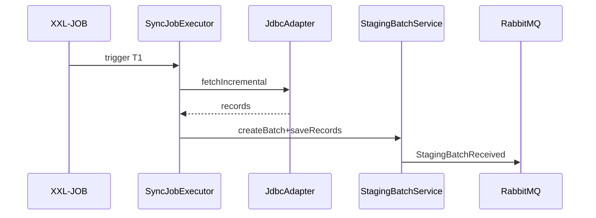
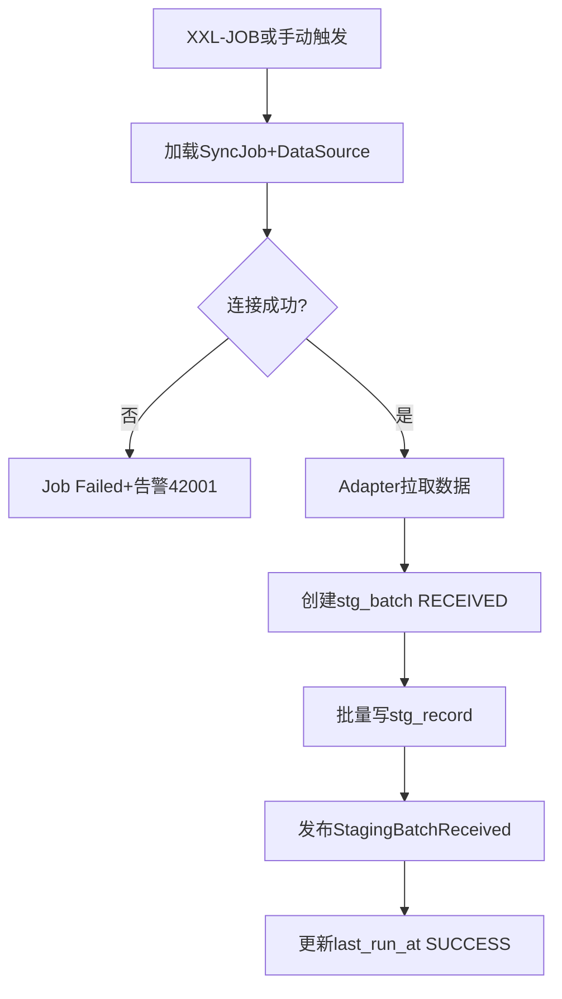
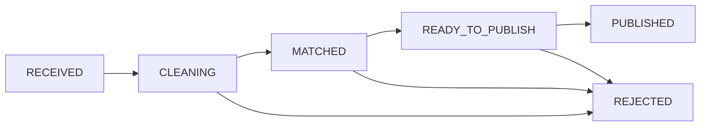
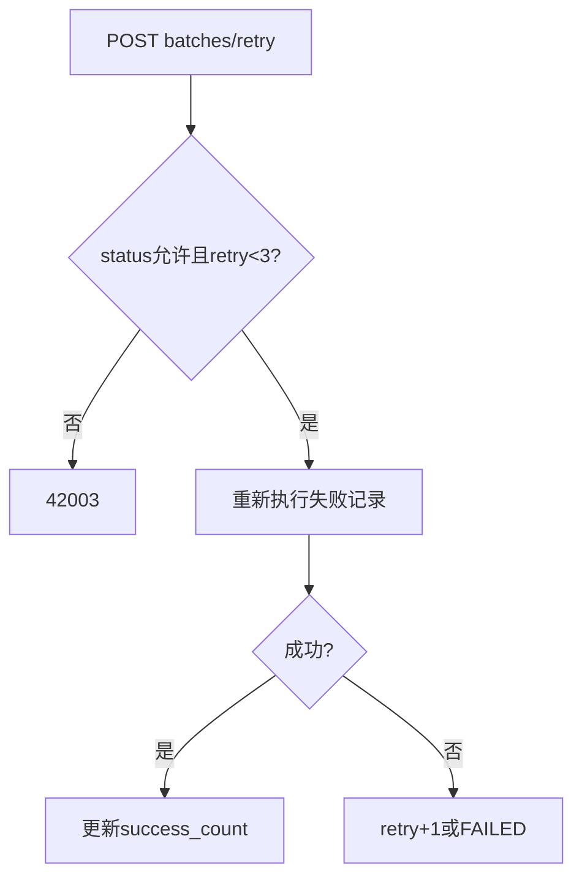

# 详细设计：数据采集模块（nanda-ingestion）

> **PRD**：[PRD-ingestion](../prd/PRD-ingestion.md) · **REQ**：9

---

## 1. 模块架构

```
com.nanda.ingestion/
├── adapter/     DataSourceAdapter(interface), JdbcAdapter, Hl7Adapter, FileAdapter
├── datasource/  DataSourceController, DataSourceService
├── sync/        SyncJobController, SyncJobExecutor, XxlSyncJobHandler
├── staging/     StagingBatchService, StagingRecordMapper
└── job/         SyncJobScheduler
```

---

## 2. 类设计

| 类 | 职责 |
| --- | --- |
| DataSourceAdapter | `testConnection()`, `fetchIncremental()`, `fetchBatch()` |
| JdbcAdapter | HIS/LIS JDBC 拉取 |
| FileAdapter | Excel/CSV 解析 |
| SyncJobExecutor | 执行同步，写 stg_batch/stg_record |
| StagingBatchService | 批次状态机、重试 |
| XxlSyncJobHandler | T+7/T+1/NEAR_RT Cron 入口 |

---

## 3. 数据库设计

```sql
CREATE TABLE stg_datasource (
  id BIGINT NOT NULL PRIMARY KEY,
  source_code VARCHAR(64) NOT NULL,
  source_name VARCHAR(128) NOT NULL,
  protocol VARCHAR(32) NOT NULL COMMENT 'JDBC/HL7/FHIR/FILE/API',
  config_json JSON NOT NULL COMMENT '连接配置',
  org_id BIGINT NOT NULL,
  status VARCHAR(16) DEFAULT 'ACTIVE',
  created_at DATETIME NOT NULL DEFAULT CURRENT_TIMESTAMP,
  deleted TINYINT NOT NULL DEFAULT 0,
  UNIQUE KEY uk_source_code (source_code, org_id, deleted)
);

CREATE TABLE stg_sync_job (
  id BIGINT NOT NULL PRIMARY KEY,
  source_id BIGINT NOT NULL,
  schedule_type VARCHAR(16) NOT NULL COMMENT 'T7/T1/NEAR_RT/MANUAL',
  cron_expr VARCHAR(64),
  last_run_at DATETIME,
  last_status VARCHAR(16),
  org_id BIGINT NOT NULL,
  deleted TINYINT NOT NULL DEFAULT 0,
  KEY idx_source (source_id)
);

CREATE TABLE stg_batch (
  id BIGINT NOT NULL PRIMARY KEY,
  source_id BIGINT NOT NULL,
  job_id BIGINT,
  org_id BIGINT NOT NULL,
  received_at DATETIME NOT NULL,
  record_count INT DEFAULT 0,
  success_count INT DEFAULT 0,
  fail_count INT DEFAULT 0,
  status VARCHAR(32) NOT NULL COMMENT 'RECEIVED/CLEANING/MATCHED/READY_TO_PUBLISH/PUBLISHED/REJECTED',
  error_message TEXT,
  KEY idx_status_time (status, received_at),
  KEY idx_org (org_id)
);

CREATE TABLE stg_record (
  id BIGINT NOT NULL PRIMARY KEY,
  batch_id BIGINT NOT NULL,
  domain VARCHAR(32) NOT NULL COMMENT 'PATIENT/ENCOUNTER/LAB/ORDER/IMAGE/OTHER',
  raw_payload JSON,
  source_ref VARCHAR(128) NOT NULL,
  parse_status VARCHAR(16) DEFAULT 'OK',
  parse_error TEXT,
  KEY idx_batch (batch_id),
  KEY idx_source_ref (source_ref, batch_id)
);
```

---

## 4. API 详细设计（FD-04 §3）

| 分组 | 路径 | DTO |
| --- | --- | --- |
| 数据源 | POST /datasources | DataSourceCreateDTO: sourceCode, protocol, configJson |
| 测试 | POST /datasources/{id}/test-connection | — → {success, message} |
| 任务 | POST /sync-jobs | SyncJobCreateDTO: sourceId, scheduleType, cronExpr |
| 执行 | POST /sync-jobs/{id}/start | — |
| Staging | GET /staging/batches | page, status, dateFrom |
| 重试 | POST /staging/batches/{id}/retry | — |

**错误码**：42001 连接失败；42002 解析失败；42003 批次不可重试

---

## 5. 核心业务逻辑

### 5.1 同步策略

| 类型 | Cron | 行为 |
| --- | --- | --- |
| T7 | `0 0 2 ? * SUN` | 全量或增量 |
| T1 | `0 0 3 * * ?` | 日增量 snapshot |
| NEAR_RT | Webhook/短 Cron | 准实时 |

### 5.2 Adapter 插件

```java
public interface DataSourceAdapter {
    boolean supports(String protocol);
    ConnectionTestResult testConnection(DataSourceConfig config);
    List<StagingRecordDTO> fetch(DataSourceConfig config, SyncCursor cursor);
}
```

Spring `@Autowired List<DataSourceAdapter>` 按 protocol 选择。

### 5.3 批次完成后

发布 `StagingBatchReceived` → governance 清洗。

---

## 6. 状态机

见 [04-领域事件 §4.1](./04-领域事件与异步设计.md)

---

## 7. 安全

| 权限码 | 说明 |
| --- | --- |
| ingestion:datasource:read/write | 数据源 |
| ingestion:sync:execute | 执行任务 |
| ingestion:staging:read | 批次查看 |

数据权限：本机构及下级。

---

## 8. 关键时序



---

## 13. 业务规则详述

| 规则编号 | 场景 | 前置条件 | 规则描述 | 后置/状态 | 异常处理 | 关联 REQ |
| --- | --- | --- | --- | --- | --- | --- |
| RULE-ING-001 | 数据源创建 | source_code+org 唯一 | 须先 test-connection 成功方可启用 | ACTIVE | 42001 连接失败 | REQ-01-01-01 |
| RULE-ING-002 | 协议适配 | protocol 枚举 | 按 JDBC/HL7/FILE 选择 Adapter | 拉取成功 | 不支持协议 422 | REQ-01-01-01 |
| RULE-ING-003 | 临床域分类 | 写入 stg_record | domain 必须为 PATIENT/ENCOUNTER/LAB 等 | parse_status=OK | PARSE_ERROR | REQ-01-01-02 |
| RULE-ING-004 | 禁止直写 Published | 任何采集路径 | **禁止** INSERT/UPDATE pub_* 表 | 仅写 stg_* | 架构违规告警 | REQ-01-01-03 |
| RULE-ING-005 | 历史批量 | 回顾性导入 | 大批量分批 commit，单批 ≤5 万 | 多 stg_batch | 超时拆分 | REQ-01-01-04 |
| RULE-ING-006 | 多中心 | org_id 绑定 | 批次/记录带 org_id；分中心仅见本 org | — | 见 integration | REQ-01-01-05 |
| RULE-ING-007 | 调度 T+7 | schedule_type=T7 | Cron 周级；支持全量/增量 | stg_batch | Job Failed 告警 | REQ-01-01-07 |
| RULE-ING-008 | 调度 T+1 | schedule_type=T1 | Cron 日级增量 snapshot | stg_batch | 同上 | REQ-01-01-08 |
| RULE-ING-009 | 准实时 | NEAR_RT | Webhook/短 Cron；延迟目标 <5min | stg_batch | 积压告警 | REQ-01-01-09 |
| RULE-ING-010 | 批次完成 | record_count>0 | 发布 StagingBatchReceived 事件 | status=RECEIVED | — | REQ-01-01-06 |
| RULE-ING-011 | 解析失败 | 单条 PARSE_ERROR | 默认跳过该条，计入 fail_count | 批次可继续 | 人工修正后重试 | REQ-01-01-02 |
| RULE-ING-012 | 失败重试 | batch 可重试状态 | 最多 3 次指数退避 | RETRY 或 FAILED | 42003 不可重试 | REQ-01-01-06 |

---

## 14. 业务流程图

> 衔接 [BP-01 多源采集与入库](../design/05-业务流程设计.md#2-bp-01-多源采集与入库)。

### 14.1 FLOW-ING-001 同步任务执行



### 14.2 FLOW-ING-002 Staging 批次状态流转



### 14.3 FLOW-ING-003 失败批次重试



---

## 15. REQ 追溯矩阵

| REQ | 类/表 | API/Job |
| --- | --- | --- |
| REQ-01-01-01 | DataSourceAdapter | /datasources |
| REQ-01-01-02 | StagingRecord.domain | stg_record |
| REQ-01-01-03 | 禁止直写 pub_* | 架构约束 |
| REQ-01-01-04 | FileAdapter 批量 | FileAdapter |
| REQ-01-01-05 | integration upload | 见 DD-integration |
| REQ-01-01-06 | SyncJobExecutor | /sync-jobs |
| REQ-01-01-07 | scheduleType=T7 | XxlSyncJobHandler |
| REQ-01-01-08 | scheduleType=T1 | XxlSyncJobHandler |
| REQ-01-01-09 | NEAR_RT | WebhookAdapter |
