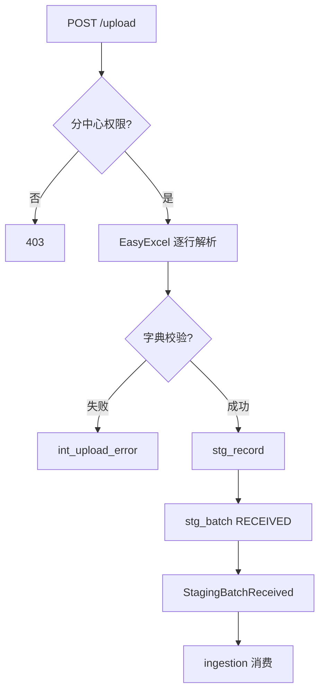
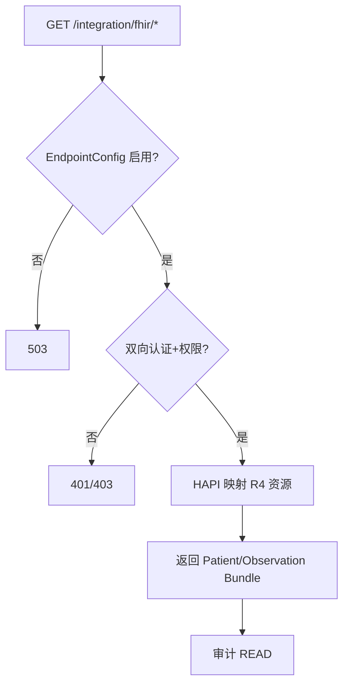

# 详细设计：外部集成模块（nanda-integration）

> **PRD**：[PRD-integration](../prd/PRD-integration.md) · **REQ**：2（主责）+ 2（协同）

---

## 1. 模块架构

```
com.nanda.integration/
├── upload/     UploadController, ExcelTemplateParser, UploadBatchService
├── writeback/  WritebackController, WritebackClient
├── fhir/       FhirPatientController, FhirObservationController (预留)
└── config/     EndpointConfigService
```

---

## 2. 类设计

| 类 | 职责 |
| --- | --- |
| ExcelTemplateParser | EasyExcel 解析 + 行级校验 |
| UploadBatchService | 写 stg_batch + int_upload_batch，触发 StagingBatchReceived |
| WritebackClient | HTTPS 调用外部系统，重试 3 次 |
| EndpointConfigService | 外部 URL、证书、API Key |
| FhirResourceProvider | HAPI FHIR 读 Patient/Observation（P1 Mock） |

---

## 3. 数据库设计

```sql
CREATE TABLE int_endpoint_config (
  id BIGINT NOT NULL PRIMARY KEY,
  endpoint_code VARCHAR(64) NOT NULL,
  endpoint_type VARCHAR(32) COMMENT 'WRITEBACK/FHIR',
  base_url VARCHAR(512),
  auth_type VARCHAR(32) COMMENT 'MTLS/API_KEY',
  auth_config_json JSON,
  org_id BIGINT,
  status VARCHAR(16) DEFAULT 'ACTIVE',
  deleted TINYINT NOT NULL DEFAULT 0
);

CREATE TABLE int_upload_batch (
  id BIGINT NOT NULL PRIMARY KEY,
  template_type VARCHAR(32) NOT NULL,
  file_name VARCHAR(256),
  file_ref VARCHAR(512) COMMENT 'MinIO path',
  stg_batch_id BIGINT,
  org_id BIGINT NOT NULL,
  total_rows INT,
  success_rows INT,
  fail_rows INT,
  status VARCHAR(16) DEFAULT 'PROCESSING',
  client_request_id VARCHAR(64),
  UNIQUE KEY uk_client_req (client_request_id, org_id),
  created_at DATETIME NOT NULL DEFAULT CURRENT_TIMESTAMP
);

CREATE TABLE int_upload_error (
  id BIGINT NOT NULL PRIMARY KEY,
  upload_batch_id BIGINT NOT NULL,
  row_num INT NOT NULL,
  error_message VARCHAR(512),
  row_data_json JSON
);

CREATE TABLE int_writeback_log (
  id BIGINT NOT NULL PRIMARY KEY,
  endpoint_id BIGINT,
  payload_json JSON,
  response_status INT,
  response_body TEXT,
  retry_count INT DEFAULT 0,
  status VARCHAR(16),
  created_at DATETIME NOT NULL DEFAULT CURRENT_TIMESTAMP
);
```

---

## 4. API 详细设计（FD-04 §19）

### 4.1 POST /api/v1/integration/upload

**Content-Type**：`multipart/form-data`

| 字段 | 类型 | 必填 |
| --- | --- | --- |
| file | File | 是 |
| templateType | string | 是 |
| clientRequestId | string | 建议（幂等） |

**Response**：
```json
{
  "uploadBatchId": 123,
  "stgBatchId": 456,
  "totalRows": 1000,
  "successRows": 980,
  "failRows": 20,
  "errors": [{"row": 5, "message": "诊断编码无效"}]
}
```

**错误码**：47001 模板不匹配；47002 文件过大；47003 重复 requestId

### 4.2 GET /api/v1/integration/upload/templates/{type}

返回 Excel 模板流（Content-Disposition: attachment）。

### 4.3 POST /api/v1/integration/writeback

**鉴权**：API Key + IP 白名单 或 mTLS（非用户 JWT）

Request：
```json
{
  "empiId": 123,
  "assessmentType": "ASCVD",
  "resultSummary": {"riskLevel": "HIGH", "score": 15.2},
  "reportUrl": "https://internal/reports/xxx"
}
```

### 4.4 FHIR 预留（REQ-13-01-04）

| 方法 | 路径 | P1 行为 |
| --- | --- | --- |
| GET | /integration/fhir/Patient/{id} | 返回 FHIR R4 Patient JSON |
| GET | /integration/fhir/Observation | search by patient |

MVP：接口契约 + Mock 数据；生产启用需 EndpointConfig。

---

## 5. 核心业务逻辑

### 5.1 上传流程

```
1. 校验 templateType + org_id 权限（分中心协调员）
2. EasyExcel 逐行解析 → 字典校验
3. 成功行 → stg_record；失败行 → int_upload_error
4. 创建 stg_batch(status=RECEIVED)
5. 发布 StagingBatchReceived
```

### 5.2 Writeback

- 仅脱敏摘要，不含原始明细
- 失败指数退避重试；全记录 int_writeback_log + sys_audit_log

### 5.3 协同 REQ

| REQ | 职责 |
| --- | --- |
| REQ-01-01-05 | 本模块 Upload API；ingestion 消费 Staging |
| REQ-05-02-13 | asset 组装 payload；本模块 WritebackClient |

---

## 6. 安全

- 外部接口独立 `IntegrationAuthFilter`
- 分中心仅 `org_id = X-Org-Id`
- 传输 HTTPS + 双向认证

---

## 13. 业务规则详述

| 规则编号 | 场景 | 前置条件 | 规则描述 | 后置/状态 | 异常处理 | 关联 REQ |
| --- | --- | --- | --- | --- | --- | --- |
| RULE-INT-001 | Excel 上传 | 分中心协调员 | 校验 templateType+org_id 权限 | stg_batch RECEIVED | 403 越权 | REQ-01-01-05 |
| RULE-INT-002 | 模板校验 | 行解析 | EasyExcel 逐行→字典校验 | 成功→stg_record | 失败→int_upload_error | REQ-01-01-05 |
| RULE-INT-003 | Staging 发布 | 批次完成 | 发布 StagingBatchReceived→ingestion 消费 | 事件 | — | REQ-01-01-05 |
| RULE-INT-004 | Writeback 脱敏 | 评估完成 | 仅脱敏摘要，不含原始明细 | int_writeback_log | — | REQ-05-02-13, REQ-13-01-03 |
| RULE-INT-005 | Writeback 幂等 | clientRequestId | 重复请求返回原结果 | 幂等 | — | REQ-13-01-03 |
| RULE-INT-006 | Writeback 重试 | 外部失败 | 指数退避；全记录 audit | 重试/FAILED | 告警 | REQ-13-01-03 |
| RULE-INT-007 | FHIR 接口 | EndpointConfig 启用 | R4 Patient/Observation JSON | Mock/生产 | 503 未启用 | REQ-13-01-04 |
| RULE-INT-008 | 外部认证 | IntegrationAuthFilter | HTTPS+双向认证；分中心 org 隔离 | — | 401/403 | REQ-13-01-03~04 |

---

## 14. 业务流程图

> 衔接 [BP-01 多源采集与入库](../design/05-业务流程设计.md#2-bp-01-多源采集与入库)、[BP-08 外部集成与结果回传](../design/05-业务流程设计.md#9-bp-08-外部集成与结果回传)。

### 14.1 FLOW-INT-001 Excel 上传



### 14.2 FLOW-INT-002 Writeback 重试

```mermaid
flowchart TD
  req[POST /writeback] --> idem{clientRequestId 重复?}
  idem -->|是| cached[返回原结果]
  idem -->|否| desens[组装脱敏摘要]
  desens --> call[调用外部 API]
  call --> ok{成功?}
  ok -->|是| log[int_writeback_log SUCCESS]
  ok -->|否| retry[指数退避重试]
  retry --> max{超限?}
  max -->|是| fail[FAILED+告警]
  max -->|否| call
  log --> audit[sys_audit_log]
  fail --> audit
```

### 14.3 FLOW-INT-003 FHIR R4 读接口 BP-08



---

## 15. REQ 追溯矩阵

| REQ | 类/表 | API |
| --- | --- | --- |
| REQ-13-01-03 | WritebackClient, int_writeback_log | POST /writeback |
| REQ-13-01-04 | FhirResourceProvider | GET /fhir/* |
| REQ-01-01-05 | UploadBatchService | POST /upload |
| REQ-05-02-13 | WritebackClient（协同 asset） | POST /writeback |
