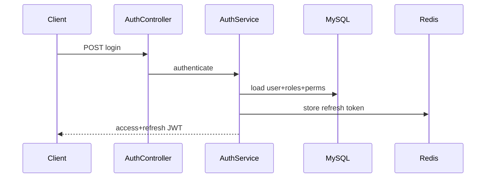
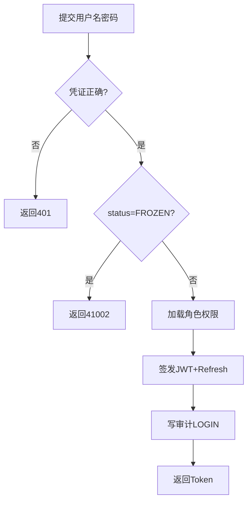
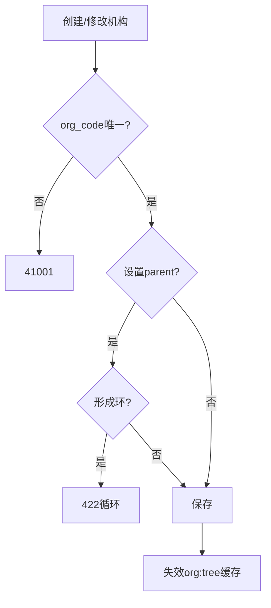
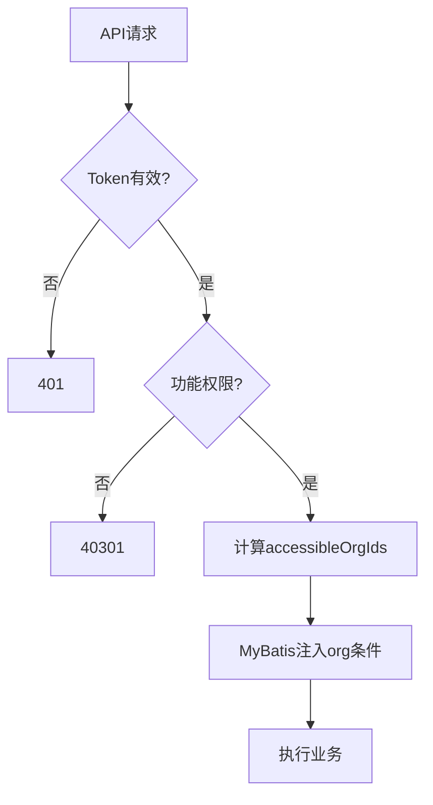
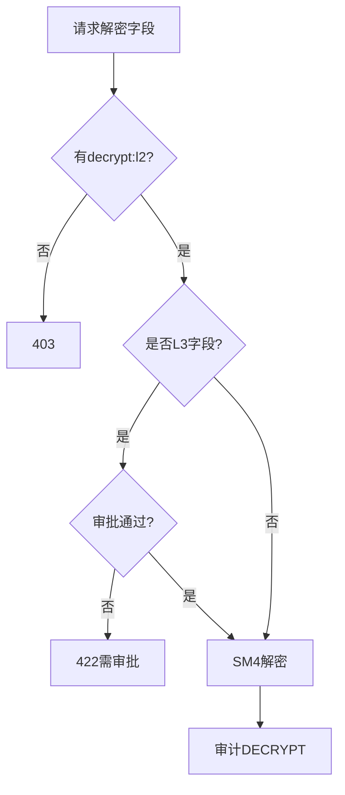

# 详细设计：平台模块（nanda-platform）

> **PRD**：[PRD-platform](../prd/PRD-platform.md) · **REQ**：16

---

## 1. 模块架构

```
com.nanda.platform/
├── auth/       AuthController, AuthService, JwtAuthenticationFilter
├── org/        OrgController, OrgService, OrgMapper
├── user/       UserController, UserService, RoleService
├── security/   CryptoKeyService, DataPermissionService
└── audit/      AuditLogController, AuditLogAspect
```

**依赖**：`nanda-common`；被全部业务模块依赖。

---

## 2. 类设计

| 类 | 职责 | 关键方法 |
| --- | --- | --- |
| AuthController | 登录/登出/刷新/me | login(), refresh(), me() |
| AuthService | Token 签发与校验 | authenticate(), buildToken(), loadPermissions() |
| OrgController/Service | 机构 CRUD、树、关系 | create(), getTree(), setParent() |
| UserController/Service | 用户/角色 | create(), assignRoles(), bindOrgs() |
| DataPermissionService | DR-01~06 规则 | filterOrgIds(), canAccessProject() |
| AuditLogAspect | AOP 审计 | @Around @AuditLog |
| CryptoKeyService | 密钥轮换 | getActiveKey(), rotate() |

---

## 3. 数据库设计

### sys_org

```sql
CREATE TABLE sys_org (
  id BIGINT NOT NULL PRIMARY KEY,
  org_code VARCHAR(64) NOT NULL,
  org_name VARCHAR(128) NOT NULL,
  org_type VARCHAR(32) NOT NULL COMMENT 'CENTER/SUB_CENTER',
  parent_id BIGINT DEFAULT NULL,
  level_type VARCHAR(32) COMMENT 'PROVINCE/CITY/DISTRICT',
  status VARCHAR(16) NOT NULL DEFAULT 'ACTIVE',
  org_id BIGINT DEFAULT NULL,
  created_by BIGINT, created_at DATETIME NOT NULL DEFAULT CURRENT_TIMESTAMP,
  updated_by BIGINT, updated_at DATETIME NOT NULL DEFAULT CURRENT_TIMESTAMP ON UPDATE CURRENT_TIMESTAMP,
  deleted TINYINT NOT NULL DEFAULT 0,
  UNIQUE KEY uk_org_code (org_code, deleted),
  KEY idx_parent (parent_id)
) COMMENT='机构';
```

### sys_user / sys_role / sys_permission / sys_audit_log

| 表 | 关键字段 |
| --- | --- |
| sys_user | username UK, password_hash, primary_org_id, status(ENABLED/DISABLED/FROZEN) |
| sys_user_org | user_id, org_id UK |
| sys_role | role_code, role_name, data_scope(ALL/ORG/ORG_AND_CHILD/CUSTOM) |
| sys_permission | perm_code UK, perm_name, module |
| sys_user_role | user_id, role_id |
| sys_role_permission | role_id, perm_id |
| sys_audit_log | user_id, action, resource_type, resource_id, detail_json, ip — **仅 INSERT** |
| sys_crypto_key | key_id, algorithm, key_version, status, effective_from |

---

## 4. API 详细设计（FD-04 §2、§18）

### 4.1 POST /api/v1/auth/login

**Request**：
```json
{"username": "admin", "password": "***"}
```
**Response data**：
```json
{"accessToken": "...", "refreshToken": "...", "expiresIn": 7200, "user": {...}, "permissions": [...]}
```
**错误码**：40101 用户名密码错误；41002 账号冻结

### 4.2 机构/用户 CRUD

| 方法 | 路径 | 权限 | 校验 |
| --- | --- | --- | --- |
| GET | /api/v1/orgs/tree | platform:org:read | — |
| POST | /api/v1/orgs | platform:org:write | orgCode @NotBlank @Pattern |
| PUT | /api/v1/users/{id}/roles | platform:user:write | roleIds @NotEmpty |
| GET | /api/v1/audit/logs | platform:audit:read | page, userId, dateRange |

---

## 5. 核心业务逻辑

### 5.1 JWT

- Access Token：JWT HS256，claims：`userId`, `username`, `orgId`, `exp`
- Refresh Token：Redis `refresh:{userId}:{tokenId}` TTL 7d
- 黑名单：logout 写入 `token:blacklist:{jti}`

### 5.2 数据权限 DR-01~06

MyBatis `DataScopeInterceptor` 注入 SQL：

```sql
AND org_id IN (#{accessibleOrgIds})
```

### 5.3 加密 L1~L3

| 级别 | 算法 | 拦截 |
| --- | --- | --- |
| L1 | AES-256 | `@EncryptField(L1)` TypeHandler |
| L2/L3 | SM4 | Bouncy Castle + 解密审计 |

---

## 6. 状态机

- **User.status**：ENABLED ↔ DISABLED ↔ FROZEN
- **Org.status**：ACTIVE ↔ INACTIVE（有下级/用户时禁止删除）

---

## 7. 缓存

| Key | TTL | 内容 |
| --- | --- | --- |
| `perm:user:{userId}` | 30min | 权限码集合 |
| `org:tree` | 1h | 机构树 JSON |
| `token:blacklist:{jti}` | token 剩余 TTL | 注销 |

---

## 8. 关键时序：登录



---

## 13. 业务规则详述

### 13.1 机构管理

| 规则编号 | 场景 | 前置条件 | 规则描述 | 后置/状态 | 异常处理 | 关联 REQ |
| --- | --- | --- | --- | --- | --- | --- |
| RULE-PLT-001 | 创建机构 | 用户有 platform:org:write | org_code 全局唯一（deleted=0） | ACTIVE | 重复返回 41001 | REQ-20-01-01 |
| RULE-PLT-002 | 设置上级 | 目标 parent_id 存在 | 禁止形成环（祖先链校验） | 树结构有效 | 422 循环引用 | REQ-20-01-02 |
| RULE-PLT-003 | 删除机构 | 无下级机构且无绑定用户 | 逻辑删除 deleted=1 | INACTIVE | 422 存在依赖 | REQ-20-01-01 |
| RULE-PLT-004 | 机构关系 | relation_type 合法 | 支持隶属/协作等类型配置 | 关系生效 | — | REQ-20-01-03 |

### 13.2 用户与角色

| 规则编号 | 场景 | 前置条件 | 规则描述 | 后置/状态 | 异常处理 | 关联 REQ |
| --- | --- | --- | --- | --- | --- | --- |
| RULE-PLT-005 | 创建用户 | username 未占用 | 密码 ≥8 位含大小写数字；BCrypt 存储 | ENABLED | 409 用户名重复 | REQ-20-02-02 |
| RULE-PLT-006 | 分配角色 | 角色存在且启用 | 多角色权限取并集 | user_role 更新 | — | REQ-20-02-03 |
| RULE-PLT-007 | 多中心绑定 | 用户绑定多 org | 请求须带 X-Org-Id 切换上下文 | AuthContext.orgId 更新 | 403 未绑定机构 | REQ-20-02-04 |
| RULE-PLT-008 | 冻结账号 | 管理员操作 | status→FROZEN，清 Token 黑名单 | 禁止登录 | — | REQ-20-02-02 |

### 13.3 认证与权限

| 规则编号 | 场景 | 前置条件 | 规则描述 | 后置/状态 | 异常处理 | 关联 REQ |
| --- | --- | --- | --- | --- | --- | --- |
| RULE-PLT-009 | 登录 | 凭证正确且 ENABLED | 签发 access 2h + refresh 7d | Token 有效 | 401/41002 | REQ-20-02-01 |
| RULE-PLT-010 | 功能权限 | 每个 API | @PreAuthorize 校验 perm_code | 200 或 403 | 40301 | REQ-05-07-01 |
| RULE-PLT-011 | 数据权限 DR-01 | 业务查询 | 默认仅 X-Org-Id 机构数据 | SQL 注入 org 条件 | — | REQ-05-07-02 |
| RULE-PLT-012 | 数据权限 DR-02 | 中心用户 | 可访问下级分中心（role.data_scope） | orgIds 扩展 | — | REQ-05-07-02 |
| RULE-PLT-013 | 数据权限 DR-03 | 分中心用户 | 禁止访问其他分中心 | 403 | 审计 | REQ-05-07-02 |
| RULE-PLT-014 | 导出权限 DR-05 | 导出 API | 独立于查询权限，需 export 授权 | 审核流触发 | 403 | REQ-05-07-02 |

### 13.4 加密与审计

| 规则编号 | 场景 | 前置条件 | 规则描述 | 后置/状态 | 异常处理 | 关联 REQ |
| --- | --- | --- | --- | --- | --- | --- |
| RULE-PLT-015 | L1 加密 | 身份证/电话/住址写入 | AES-256 密文 + id_hash 索引 | 库内无明文 | — | REQ-05-07-03 |
| RULE-PLT-016 | L2 加密 | 专科敏感字段 | SM4 加密；解密需 security:decrypt:l2 | 解密审计 | 403 | REQ-05-07-04~06 |
| RULE-PLT-017 | L3 管控 | 跨病种联合敏感 | 需审批 + 访问日志 | 审批通过后解密 | 422 | REQ-05-07-07 |
| RULE-PLT-018 | 审计 | 查询/导出/解密/变更 | sys_audit_log 仅 INSERT | 不可改删 | — | REQ-05-07-09 |

---

## 14. 业务流程图

> 跨模块主流程见 [FD-05](../design/05-业务流程设计.md)；索引 [05-总览 §5.1](./05-模块业务规则与流程总览.md)。

### 14.1 FLOW-PLT-001 用户登录



### 14.2 FLOW-PLT-002 机构树维护



### 14.3 FLOW-PLT-003 数据权限判定



### 14.4 FLOW-PLT-004 L2 解密审批



---

## 15. REQ 追溯矩阵

| REQ | 类/表 | API |
| --- | --- | --- |
| REQ-20-01-01~03 | OrgService, sys_org | /orgs/* |
| REQ-20-02-01~04 | UserService, sys_user_org | /users/* |
| REQ-05-07-01~02 | DataPermissionService, sys_role_permission | 全局 Filter |
| REQ-05-07-03~07 | CryptoService, @EncryptField | — |
| REQ-05-07-08 | Nginx HTTPS | — |
| REQ-05-07-09 | AuditLogAspect, sys_audit_log | /audit/logs |
