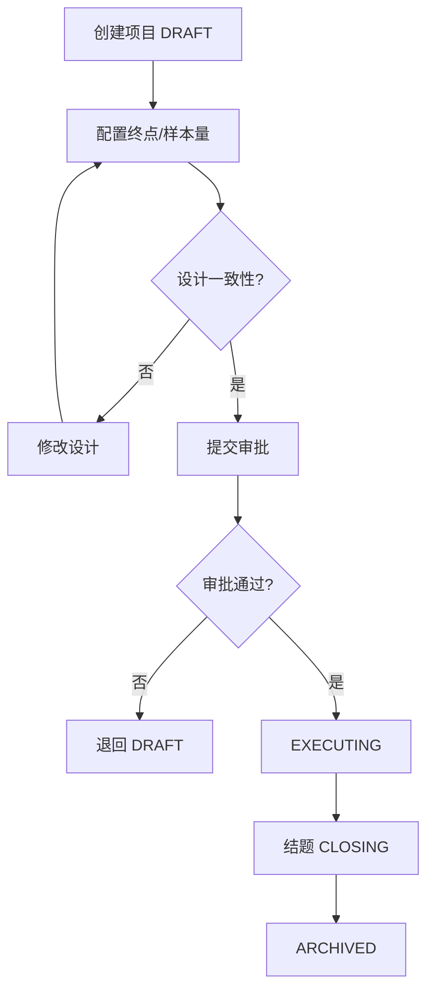
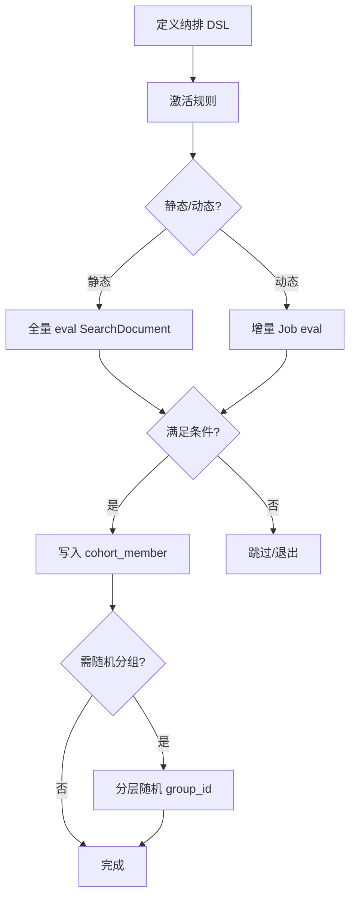
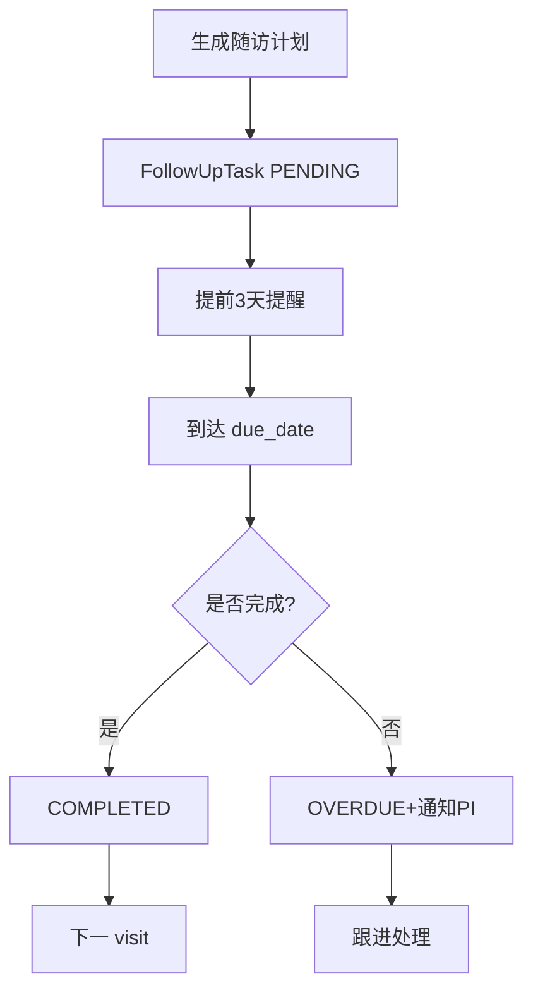
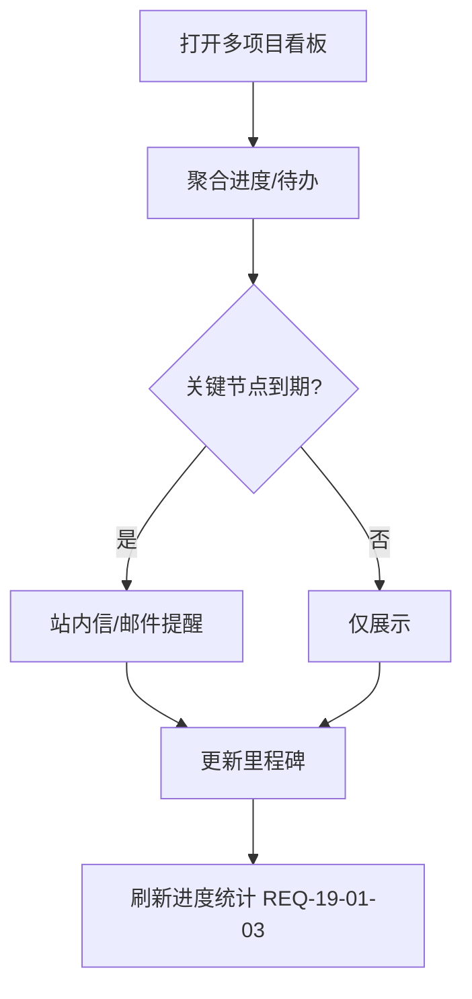

# 详细设计：科研协作模块（nanda-research）

> **PRD**：[PRD-research](../prd/PRD-research.md) · **REQ**：22

---

## 1. 模块架构

```
com.nanda.research/
├── project/    ProjectController, ProjectService, ProjectStateMachine
├── cohort/     CohortController, CohortRuleEngine, CohortSyncJob
├── followup/   FollowUpController, FollowUpTaskService
├── collab/     MultiProjectController, ProjectNotificationService
└── listener/   DataPublishedListener (cohort sync)
```

---

## 2. 类设计

| 类 | 职责 |
| --- | --- |
| ProjectService | 项目 CRUD、状态流转、归档 |
| ProjectStateMachine | DRAFT→APPROVED→EXECUTING→ARCHIVED |
| CohortRuleEngine | 纳排 JSON DSL eval |
| CohortSyncJob | 动态维护队列成员 |
| RandomizationService | 前瞻性随机分组 |
| FollowUpTaskService | 阶段任务生成、逾期提醒 |

---

## 3. 数据库设计

```sql
CREATE TABLE res_project (
  id BIGINT NOT NULL PRIMARY KEY,
  project_code VARCHAR(64) NOT NULL,
  project_name VARCHAR(256) NOT NULL,
  status VARCHAR(32) NOT NULL DEFAULT 'DRAFT',
  design_json JSON COMMENT '研究设计',
  template_code VARCHAR(64),
  pi_user_id BIGINT,
  org_id BIGINT NOT NULL,
  start_date DATE,
  end_date DATE,
  archived_at DATETIME,
  deleted TINYINT NOT NULL DEFAULT 0,
  UNIQUE KEY uk_code (project_code, deleted)
);

CREATE TABLE res_cohort (
  id BIGINT NOT NULL PRIMARY KEY,
  project_id BIGINT NOT NULL,
  cohort_name VARCHAR(128) NOT NULL,
  cohort_type VARCHAR(32) COMMENT 'INCLUSION/EXCLUSION/INTERVENTION',
  rule_json JSON,
  member_count INT DEFAULT 0,
  org_id BIGINT NOT NULL,
  KEY idx_project (project_id)
);

CREATE TABLE res_cohort_member (
  id BIGINT NOT NULL PRIMARY KEY,
  cohort_id BIGINT NOT NULL,
  empi_id BIGINT NOT NULL,
  group_label VARCHAR(64),
  enroll_date DATE,
  status VARCHAR(16) DEFAULT 'ACTIVE',
  UNIQUE KEY uk_cohort_empi (cohort_id, empi_id),
  KEY idx_empi (empi_id)
);

CREATE TABLE res_follow_up_plan (
  id BIGINT NOT NULL PRIMARY KEY,
  project_id BIGINT NOT NULL,
  plan_name VARCHAR(128),
  org_id BIGINT NOT NULL
);

CREATE TABLE res_follow_up_stage (
  id BIGINT NOT NULL PRIMARY KEY,
  plan_id BIGINT NOT NULL,
  stage_name VARCHAR(64),
  offset_days INT,
  window_days INT,
  sort_order INT
);

CREATE TABLE res_follow_up_task (
  id BIGINT NOT NULL PRIMARY KEY,
  stage_id BIGINT NOT NULL,
  cohort_member_id BIGINT NOT NULL,
  due_date DATE,
  status VARCHAR(16) DEFAULT 'PENDING',
  completed_at DATETIME,
  channel VARCHAR(32) COMMENT 'CLINIC/PHONE/WECHAT',
  KEY idx_due (status, due_date)
);
```

---

## 4. API 详细设计（FD-04 §17）

| 路径 | 方法 | DTO |
| --- | --- | --- |
| /projects | POST | ProjectCreateDTO: name, designJson, templateCode |
| /projects/{id}/transition | POST | TransitionDTO: targetStatus |
| /cohorts | POST | CohortCreateDTO: projectId, ruleJson |
| /cohorts/{id}/members | POST | MemberEnrollDTO: empiId, groupLabel |
| /cohorts/{id}/randomize | POST | RandomizeDTO: algorithm, ratio |
| /follow-ups/plans | POST | FollowUpPlanDTO |
| /follow-ups/tasks | GET | status, dueBefore |

---

## 5. 核心业务逻辑

### 5.1 纳排 DSL

```json
{
  "operator": "AND",
  "rules": [
    {"field": "diagnosis_code", "op": "in", "value": ["E11"]},
    {"field": "age", "op": "between", "value": [18, 75]}
  ]
}
```

`CohortRuleEngine.evaluate(SearchDocument doc)` → boolean。

### 5.2 设计一致性校验（REQ-17-01-06）

立项时校验：终点指标 ⊆ 可用字段；样本量 ≤ 队列上限。

### 5.3 检索入组（REQ-10-05-06）

`POST /export/tasks/{id}/import-to-project` → analytics 调用 research 批量入组。

---

## 6. 状态机

**Project**：DRAFT → APPROVED → EXECUTING → CLOSING → ARCHIVED

**FollowUpTask**：PENDING → IN_PROGRESS → COMPLETED / OVERDUE / CANCELLED

---

## 7. 安全

- 数据权限 DR-04：项目成员可见队列患者
- `research:project:write` — PI
- `research:cohort:manage` — PI、数据管理员

---

## 8. 异步

| Job | 说明 |
| --- | --- |
| cohortDynamicSync | 每日增量 eval 纳排规则 |
| followUpReminder | 提前 3 天/当天通知 |

---

## 13. 业务规则详述

### 13.1 项目管理

| 规则编号 | 场景 | 前置条件 | 规则描述 | 后置/状态 | 异常处理 | 关联 REQ |
| --- | --- | --- | --- | --- | --- | --- |
| RULE-RES-001 | 项目创建 | PI 角色 | 必填名称/终点/样本量；初始 DRAFT | res_project | — | REQ-17-01-01 |
| RULE-RES-002 | 立项审批 | DRAFT | PI 提交→审批通过→APPROVED | APPROVED | 驳回保留 DRAFT | REQ-17-01-02 |
| RULE-RES-003 | 设计一致性 | 立项提交 | 终点指标 ⊆ 可用字段；样本量 ≤ 队列上限 | 校验通过/422 | 422 阻断 | REQ-17-01-06 |
| RULE-RES-004 | 状态流转 | APPROVED | 启动→EXECUTING；结题→CLOSING→ARCHIVED | 状态机 | 非法转换 409 | REQ-17-01-03~05 |
| RULE-RES-005 | 多项目协作 | 跨中心 | 成员角色 PI/Sub-PI/录入员；数据权限 DR-04 | 成员表 | 403 | REQ-19-01-01~03 |

### 13.2 队列纳排

| 规则编号 | 场景 | 前置条件 | 规则描述 | 后置/状态 | 异常处理 | 关联 REQ |
| --- | --- | --- | --- | --- | --- | --- |
| RULE-RES-006 | 纳排 DSL | expression_json | 支持 AND/OR/比较/时间窗；eval(SearchDocument) | boolean | 422 语法错误 | REQ-18-01-01~04 |
| RULE-RES-007 | 静态入组 | 规则 ACTIVE | 批量 eval→写入 cohort_member | ENROLLED | — | REQ-18-02-01 |
| RULE-RES-008 | 动态同步 | 定时 Job | 增量 eval 新增/退出成员 | 成员变更 | 异步重试 | REQ-18-02-02~03 |
| RULE-RES-009 | 随机分组 | 分层配置 | 分层内随机；种子可复现 | group_id 分配 | — | REQ-18-02-04~05 |
| RULE-RES-010 | 检索入组 | export 完成 | analytics 调用 import-to-project 批量入组 | 批量 ENROLLED | 幂等 | REQ-10-05-06 |

### 13.3 随访

| 规则编号 | 场景 | 前置条件 | 规则描述 | 后置/状态 | 异常处理 | 关联 REQ |
| --- | --- | --- | --- | --- | --- | --- |
| RULE-RES-011 | 随访计划 | 项目 EXECUTING | 按 visit_schedule 生成任务 | PENDING | — | REQ-18-03-01 |
| RULE-RES-012 | 逾期判定 | due_date 过期 | 未 COMPLETED→OVERDUE | OVERDUE | 通知 PI | REQ-18-03-02 |
| RULE-RES-013 | 提醒 | 提前 3 天/当天 | followUpReminder Job 推送 | 通知记录 | — | REQ-18-03-03~04 |

> RULE-RES-014~020 覆盖队列导出、成员退出、协作审计等，与上述规则组合覆盖 research 模块 22 项 REQ。

---

## 14. 业务流程图

> 衔接 [BP-05 科研队列与随访](../design/05-业务流程设计.md#6-bp-05-科研队列与随访)。

### 14.1 FLOW-RES-001 项目生命周期



### 14.2 FLOW-RES-002 队列纳排



### 14.3 FLOW-RES-003 随访任务



### 14.4 FLOW-RES-004 多项目协作 BP-05



---

## 15. REQ 追溯矩阵（22 项）

| REQ | 实现 |
| --- | --- |
| REQ-17-01-01~06 | ProjectService, res_project |
| REQ-18-01-01~04 | CohortController, CohortRuleEngine |
| REQ-18-02-01~05 | CohortMemberService |
| REQ-18-03-01~04 | FollowUpTaskService |
| REQ-19-01-01~03 | MultiProjectController |

见 [PRD-research 附录 A](../prd/PRD-research.md)。
