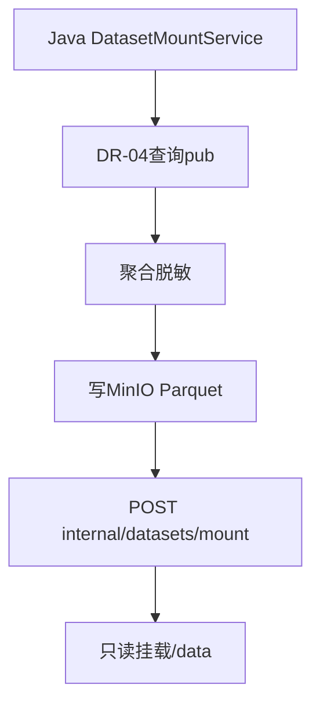

# 沙箱 ComputePlane 详细设计

> **文档编号**：DD-sandbox  
> **模块**：`sandbox/`（Python FastAPI + Web IDE SPA）  
> **上游**：[FD-09 沙箱 Web IDE 设计](../design/09-沙箱WebIDE设计.md)

---

## 1. 模块架构

```
sandbox/
├── app/
│   ├── main.py
│   ├── api/          workspace, notebook, kernel, algorithms, datasets, jobs
│   ├── executor/     KernelRunner, static_scan, resource_limits
│   ├── gateway/      desensitize
│   └── sdk/          nanda_sandbox
├── frontend/         Vue3 Web IDE
└── docker/Dockerfile
```

Java 侧 BFF 见 [DD-analytics §4.6](./DD-analytics.md)。

---

## 2. 类/模块设计

| 模块 | 职责 |
| --- | --- |
| `WorkspaceManager` | 用户工作区 CRUD、会话恢复 |
| `NotebookStore` | nbformat JSON 读写 |
| `KernelPool` | Kernel 进程池、排队 |
| `KernelRunner` | subprocess 执行 cell |
| `StaticScanner` | AST 安全扫描 SB-04 |
| `DesensitizeGateway` | 输出截断与 chart 校验 |
| `AlgorithmRegistry` | wheel 包白名单 |
| `DatasetMount` | 只读 Parquet 挂载 |
| `JobWorker` | 异步长任务 |

---

## 3. 数据库（Java 侧 ana_*）

```sql
CREATE TABLE ana_sandbox_session (
  id BIGINT NOT NULL PRIMARY KEY,
  user_id BIGINT NOT NULL,
  org_id BIGINT NOT NULL,
  workspace_id VARCHAR(64) NOT NULL,
  status VARCHAR(16) DEFAULT 'ACTIVE',
  kernel_status VARCHAR(16) DEFAULT 'IDLE',
  last_active_at DATETIME,
  KEY idx_user (user_id, status)
);

CREATE TABLE ana_sandbox_dataset (
  id BIGINT NOT NULL PRIMARY KEY,
  dataset_id VARCHAR(64) NOT NULL UNIQUE,
  org_id BIGINT NOT NULL,
  source_type VARCHAR(32),
  minio_path VARCHAR(512),
  row_count INT,
  expires_at DATETIME,
  created_at DATETIME NOT NULL
);
```

---

## 4. 内部 API（Python，仅 Java 可达）

| 方法 | 路径 | 说明 |
| --- | --- | --- |
| POST | `/internal/workspace` | 创建/恢复工作区 |
| GET | `/internal/workspace/{id}` | 工作区状态 |
| GET/PUT | `/internal/notebooks/{wsId}` | Notebook CRUD |
| WS | `/internal/kernel/ws` | Kernel 执行 |
| POST | `/internal/datasets/mount` | 挂载 datasetId |
| GET | `/internal/algorithms` | 算法列表 |
| POST | `/internal/jobs` | 提交异步作业 |
| GET | `/internal/jobs/{id}` | 作业状态 |

---

## 5. nanda_sandbox SDK

```python
import nanda_sandbox as ns

df = ns.load_dataset("ds-xxx")       # 只读
ns.plot_line(x, y, title="趋势").show()  # → ChartSpec
```

预注入 Kernel 全局 namespace；禁止覆盖 `open` 写 `/data` 路径。

---

## 6. 状态机

**SandboxSession**：CREATED → ACTIVE → IDLE → QUEUED → ACTIVE

**SandboxJob**：QUEUED → RUNNING → SUCCEEDED / FAILED / CANCELLED

---

## 7. 安全

- 请求头 `X-Internal-Token` + `X-User-Id` + `X-Org-Id`（Java BFF 注入）
- 无公网 outbound
- Console 输出 >10KB 截断

---

## 8. §13 业务规则

| 规则编号 | 场景 | 规则描述 | 关联 REQ |
| --- | --- | --- | --- |
| RULE-SBX-001 | 工作区 | 每用户独立 workspace 目录持久化 | REQ-14-04-01 |
| RULE-SBX-002 | 数据集 | 只读挂载，跨 org 403 | REQ-14-04-03 |
| RULE-SBX-003 | 扫描 | 违规则拒绝 execute_cell | REQ-14-01-28 |
| RULE-SBX-004 | 配额 | 超时/超内存 Kill | REQ-14-04-02 |
| RULE-SBX-005 | 输出 | 结果经 DesensitizeGateway | REQ-14-04-04 |
| RULE-SBX-006 | 算法 | 仅白名单包可 import | REQ-11-03-01 |
| RULE-SBX-007 | 作业 | 长任务异步，无 download | REQ-11-03-02 |
| RULE-SBX-008 | 审计 | 每次执行写 audit | SB-06 |

---

## 9. §14 业务流程

> 跨模块衔接：[BP-06 沙箱分析](../design/05-业务流程设计.md#7-bp-06-沙箱分析)（通用统计/Notebook）、[BP-07 风险评估与评估报告](../design/05-业务流程设计.md#8-bp-07-风险评估与评估报告)（结构化风险模型计算）。

### FLOW-SBX-001 Cell 执行

见 [FD-09 §4](../design/09-沙箱WebIDE设计.md#4-kernel-websocket-协议)。

### FLOW-SBX-002 数据集挂载



---

## 10. REQ 追溯

| REQ | 实现 |
| --- | --- |
| REQ-11-03-01~04 | AlgorithmRegistry + Web IDE |
| REQ-14-04-01~05 | Workspace + KernelPool + 水印 |
| REQ-14-01-26~28 | Notebook/Script + StaticScanner |

完整列表见 [PRD-analytics 附录 A](../prd/PRD-analytics.md)。
